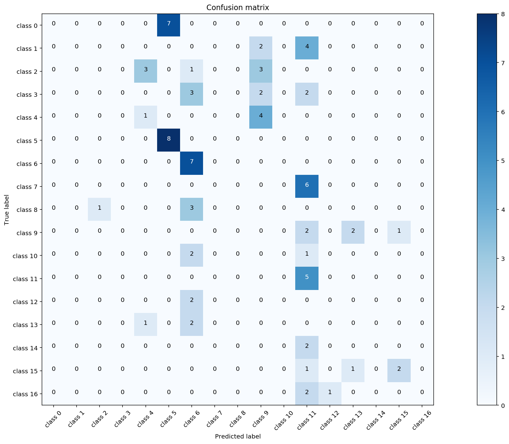

## Capstone Project: My Grocery Finder  (myGF)


## 1. Problem Statement

Do you ever remember times where you have spent a large amount of time finding a grocery that you need at a particularly large supermarket? Groceries in a supermarket are organised into rows and categories. It is often difficult to pin point the exact location of the particular grocery that you need.  

In today's technologial landscape, we are able to leverage techniques such as **deep learning** to easily classify images or even speech. For this use case, we will make use of **Convolutional Neural Networks** (CNN) and transfer learning to help with the classification of groceries. This can then add value to supermarkets in the form of helping grocers find their groceries in a shorter time. A proposal might be to add kiosks around the supermarket with the image classifer. Grocers will only need to scan a photo or image of their grocery and the kiosk will return the row and column locations of the particular grocery.


Yay, candy can now be found easily!

### 1.1 Deep learning


Deep Learning is a subfield of machine learning concerned with algorithms inspired by the structure and function of the brain called artificial neural networks. For humans, images are first processed by our eyes and the signal gets passed through a series of neurons before reaching our brain. Our brain then consolidates the image information and presents it in an understandble format for us.

Similarly for deep learning in data science, data such as images are passed through layers that recognises salient features of that particular image. These features are then condensed and used to classify an image in our case. Specifically for this project, we will use a branch of deep learning - convolutional neural network to classify our groceries.

### 1.2 Convolutional Neural Networks

In machine learning, a convolutional neural network (CNN, or ConvNet) is a class of deep, feed-forward artificial neural networks where images are broken down into number matrices and fed through layers for analysis in a forward direction.  

CNN, in a nutshell, is made up of 4 main operations:
1. Convolution
2. Non Linearity (ReLU)
3. Pooling or Sub Sampling
4. Classification (Fully Connected Layer)


#### 1.2.1 Convolution
The reason why CNN are called as such is because of the Convolution function. Images are first processed into pixel values (red, green and blue colour in the range of 0 to 255 for each colour channel). Each image is simply converted into a matrix of numbers. 

We will next define a matrix of 3x3 size with arbitrarily assigned weights to be used to slide across our image matrix. Dot products of the matrices will then be computed and this effectively reduces our original matrix into a feature map. The animation below explains how the convolution is performed and how the output is computed:

 

Depending on the weights assigned, different feature maps will be obtained. These feature maps will then be used to classify our images.

#### 1.2.2 Recitfied Linear Unit (ReLU) Activation

An additional operation called ReLU has been used after every Convolution operation. ReLU stands for Rectified Linear Unit and is a non-linear operation. It simply replaces negative values with 0.

ReLU is an element wise operation (applied per pixel) and replaces all negative pixel values in the feature map by zero. The purpose of ReLU is to introduce non-linearity in our ConvNet. We would use ReLU for images as real world images consist of mostly non-linear features. The figure below illustrates the effect of ReLU activation on a processed image.


#### 1.2.3 Pooling

Image matrices tend to be large. We would often apply pooling techniques to reduce the dimension of our feature maps. Max pooling is the typical pooling method we would use. In max pooling, we will first set a window (2x2 in this case) to slide through our feature map. Max pooling will take only the largest element for every step. Visually, the figure below shows how max pooling is performed:


#### 1.2.4 Fully Connected Layer
The Fully Connected layer is a traditional Multi Layer Perceptron that uses a softmax activation function in the output layer. The term “Fully Connected” implies that every neuron in the previous layer is connected to every neuron on the next layer. The softmax activation function helps to reassign the computed values such that it adds up to 1, while highlighting the max value.  

Fully connected layers often occur toward the end of a ConvNet. This is due to the fact that the output layer (final classification step) must be connected to all neurons of the previous layer.

### 1.3 Training the ConvNet
The ConvNet model is trained according to the following schema:

- Step1: We initialize all filters and parameters / weights with random values

- Step2: The network takes a training image as input, goes through the forward propagation step (convolution, ReLU and pooling operations along with forward propagation in the Fully Connected layer) and finds the output probabilities for each class.
    - Lets say the output probabilities for the boat image above are [0.2, 0.4, 0.1, 0.3]
    - Since weights are randomly assigned for the first training example, output probabilities are also random.  
      
      
- Step3: Calculate the total error at the output layer (summation over all 4 classes)
    - Total Error = ∑  ½ (target probability – output probability) ²  
      
      
- Step4: Use Backpropagation to calculate the gradients of the error with respect to all weights in the network and use gradient descent to update all filter values / weights and parameter values to minimize the output error.
    - The weights are adjusted in proportion to their contribution to the total error.
    - When the same image is input again, output probabilities might now be [0.1, 0.1, 0.7, 0.1], which is closer to the target vector [0, 0, 1, 0].
    - This means that the network has learnt to classify this particular image correctly by adjusting its weights / filters such that the output error is reduced.
    - Parameters like number of filters, filter sizes, architecture of the network etc. have all been fixed before Step 1 and do not change during training process – only the values of the filter matrix and connection weights get updated.  
      
      
- Step5: Repeat steps 2-4 with all images in the training set.


The above steps train the ConvNet – this essentially means that all the weights and parameters of the ConvNet have now been optimized to correctly classify images from the training set.

Visually, the training and the architecture of the ConvNet are as such:


## 2. Dataset
The dataset used for this project is the GroZi-120 database from the University of California, San Diego. [Link to dataset](http://grozi.calit2.net/grozi.html). The database consists of photographs (training set) / google images of groceries. We will be building a ConvNet to classify 17 grocery items:
1. Wiggly double mint
2. Big red - gum
3. Lays classic chips
4. Pepperidge farm milano cookies
5. Starbucks frappucino
6. Oberto beef jerky
7. Honey nut cheerios
8. Tostitos scoops
9. Ruffles sour cream chips
10. Hersheys milk chocolate
11. Twix cookie bar
12. Snickers bar
13. Tic tac winter
14. Dentyne ice sweets
15. Starburst
16. Rockstar beer
17. Nestle crunch


### Packages used
1. pandas
2. numpy
3. os
4. cv2
5. matplotlib/seaborn
6. sci-kit learn
7. keras (tensorflow-gpu)

## 3. Preprocessing images
Images will have to be read in as a matrix. In order to increase computational efficiency and speed, images and downscaled to 128 x 128 pixels. 3 colour channels (red, green, blue) will be read into the matrix. Each image processed will result in a 128 x 128 x 3 matrix.  

Since each grocery has only 100+ images for training, which is insufficient for building a ConvNet, we will make use of keras' data generator function, to augment the images.


```python
# Image augmentation
datagen = ImageDataGenerator(
        rotation_range=40,
        width_shift_range=0.2,
        height_shift_range=0.2,
        shear_range=0.2,
        zoom_range=0.2,
        fill_mode='nearest')

class_size=1000
```


```python
it = 0
# Use counts for individual values, generate enough images till it hits roughly 1000
for count in label_counts.values:
    #nb of generations per image for this class label in order to make it size ~= class_size
    ratio=math.floor(class_size/count)-1
    print(count,count*(ratio+1))
    dest_lab_dir=os.path.join(dest_train_dir,str(label_counts.index[it]))
    src_lab_dir=os.path.join(src_train_dir,str(label_counts.index[it]))
    if not os.path.exists(dest_lab_dir):
        os.makedirs(dest_lab_dir)
    for file in os.listdir(src_lab_dir):
        img=load_img(os.path.join(src_lab_dir,file))
        #img.save(os.path.join(dest_lab_dir,file))
        x=img_to_array(img) 
        x=x.reshape((1,) + x.shape)
        i=0
        for batch in datagen.flow(x, batch_size=1,save_to_dir=dest_lab_dir, save_format='jpg'):
            i+=1
            if i > ratio:
                break 
    it=it+1
```

    509 509
    495 990
    465 930
    314 942
    273 819
    242 968
    215 860
    209 836
    203 812
    184 920
    174 870
    171 855
    148 888
    145 870
    120 960
    106 954
    104 936
    

** Number of images per grocery after augmentation and generation **


```python
augcount = pd.DataFrame(aug_label)
augcount[0].value_counts().plot(kind='bar')
```


    <matplotlib.axes._subplots.AxesSubplot at 0x7fe3ff8e6cc0>


### 3.1 Generating matrix of images using cv2

We will use cv2's imread function to read in the images into matrices followed by a normalisation step of dividing each pixel value by 255. Since pixel values range between 0-255, the normalisation step serves to eliminate any scaling issues while building the model.


```python
# Training dataset
# Read image using cv2, then append matrix to list

img_data_list=[]

for dataset in data_dir_list:
    img_list=os.listdir(data_path+'/'+ dataset)
    print ('Loaded the images of dataset-'+'{}\n'.format(dataset))
    for img in img_list:
        input_img=cv2.imread(data_path + '/'+ dataset + '/'+ img )
        input_img_resize=cv2.resize(input_img,(128,128))
        img_data_list.append(input_img_resize)
```

    Loaded the images of dataset-8
    
    Loaded the images of dataset-4
    
    Loaded the images of dataset-11
    
    Loaded the images of dataset-6
    
    Loaded the images of dataset-12
    
    Loaded the images of dataset-15
    
    Loaded the images of dataset-0
    
    Loaded the images of dataset-10
    
    Loaded the images of dataset-5
    
    Loaded the images of dataset-3
    
    Loaded the images of dataset-14
    
    Loaded the images of dataset-7
    
    Loaded the images of dataset-13
    
    Loaded the images of dataset-16
    
    Loaded the images of dataset-9
    
    Loaded the images of dataset-1
    
    Loaded the images of dataset-2
    
    


```python
# Make matrix into arrays

img_data = np.array(img_data_list)
img_data = img_data.astype('float32')
img_data /= 255
print (img_data.shape)
```

    (18337, 128, 128, 3)
    

### 3.2 Shuffling then train test split the dataset

After reading in the images into matrices. The matrix is shuffled records-wise to reduce bias and split into training and test sets (70% training, 30% test split).


## 4. Building CovnNet using Keras tensorflow

A simple keras image classification workflow in python can be adapted from this github: https://github.com/anujshah1003/own_data_cnn_implementation_keras

### 4.1 Defining the ConvNet model architecture
 
Model architecture = Convolution > relu > Convolution > relu > Max pool (with drop out) > Convolution > relu > convolution > relu > Max pool (drop out) > fully connected with activation > drop out > softmax activation.  

Model is optimised using Adam (adaptive moment estimation):

- Adam is a replacement optimization algorithm for stochastic gradient descent for training deep learning models.
- Adam combines the best properties of the AdaGrad and RMSProp algorithms to provide an optimization algorithm that can handle sparse gradients on noisy problems.
- Adam is relatively easy to configure where the default configuration parameters do well on most problems.


```python
# Defining the model
input_shape= (128,128,3)

model = Sequential()

model.add(Convolution2D(32, 3,border_mode='same',input_shape=input_shape, dim_ordering="tf"))
model.add(Activation('relu'))
model.add(Convolution2D(32, 3))
model.add(Activation('relu'))
model.add(MaxPooling2D(pool_size=(2, 2)))
model.add(Dropout(0.3))

model.add(Convolution2D(64, 3,border_mode='same',input_shape=input_shape, dim_ordering="tf"))
model.add(Activation('relu'))
model.add(Convolution2D(64, 3))
model.add(Activation('relu'))
model.add(MaxPooling2D(pool_size=(2, 2)))
model.add(Dropout(0.3))


model.add(Flatten())
model.add(Dense(128))
model.add(Activation('relu'))
model.add(Dropout(0.5))
model.add(Dense(num_classes))
model.add(Activation('softmax'))

model.compile(loss='categorical_crossentropy', optimizer='adam',metrics=["accuracy"])
```

    /home/Jeryl/anaconda3/lib/python3.6/site-packages/ipykernel_launcher.py:6: UserWarning: Update your `Conv2D` call to the Keras 2 API: `Conv2D(32, 3, input_shape=(128, 128,..., padding="same", data_format="channels_last")`
      
    /home/Jeryl/anaconda3/lib/python3.6/site-packages/ipykernel_launcher.py:20: UserWarning: Update your `Conv2D` call to the Keras 2 API: `Conv2D(64, 3, input_shape=(128, 128,..., padding="same", data_format="channels_last")`
    


```python
# Viewing model_configuration

model.summary()
model.get_config()
model.layers[0].get_config()
model.layers[0].input_shape
model.layers[0].output_shape
model.layers[0].get_weights()
np.shape(model.layers[0].get_weights()[0])
model.layers[0].trainable
```

    _________________________________________________________________
    Layer (type)                 Output Shape              Param #   
    =================================================================
    conv2d_1 (Conv2D)            (None, 128, 128, 32)      896       
    _________________________________________________________________
    activation_1 (Activation)    (None, 128, 128, 32)      0         
    _________________________________________________________________
    conv2d_2 (Conv2D)            (None, 126, 126, 32)      9248      
    _________________________________________________________________
    activation_2 (Activation)    (None, 126, 126, 32)      0         
    _________________________________________________________________
    max_pooling2d_1 (MaxPooling2 (None, 63, 63, 32)        0         
    _________________________________________________________________
    dropout_1 (Dropout)          (None, 63, 63, 32)        0         
    _________________________________________________________________
    conv2d_3 (Conv2D)            (None, 63, 63, 64)        18496     
    _________________________________________________________________
    activation_3 (Activation)    (None, 63, 63, 64)        0         
    _________________________________________________________________
    conv2d_4 (Conv2D)            (None, 61, 61, 64)        36928     
    _________________________________________________________________
    activation_4 (Activation)    (None, 61, 61, 64)        0         
    _________________________________________________________________
    max_pooling2d_2 (MaxPooling2 (None, 30, 30, 64)        0         
    _________________________________________________________________
    dropout_2 (Dropout)          (None, 30, 30, 64)        0         
    _________________________________________________________________
    flatten_1 (Flatten)          (None, 57600)             0         
    _________________________________________________________________
    dense_1 (Dense)              (None, 128)               7372928   
    _________________________________________________________________
    activation_5 (Activation)    (None, 128)               0         
    _________________________________________________________________
    dropout_3 (Dropout)          (None, 128)               0         
    _________________________________________________________________
    dense_2 (Dense)              (None, 17)                2193      
    _________________________________________________________________
    activation_6 (Activation)    (None, 17)                0         
    =================================================================
    Total params: 7,440,689
    Trainable params: 7,440,689
    Non-trainable params: 0
    _________________________________________________________________
    


    True


### 4.2 Callbacks
The use of callbacks in keras allows you to monitor a metric and save the weights of model while training is in progress.


```python
# Training with callbacks
from keras import callbacks

filename='model_train_new.csv'
csv_log=callbacks.CSVLogger(filename, separator=',', append=False)

# early_stopping=callbacks.EarlyStopping(monitor='val_loss', min_delta=0, patience=0, verbose=0, mode='min')

filepath="Best-weights-my_model-{epoch:03d}-{loss:.4f}-{acc:.4f}.hdf5"

checkpoint = callbacks.ModelCheckpoint(filepath, monitor='val_loss', verbose=1, save_best_only=True, mode='min')

callbacks_list = [csv_log,checkpoint]
```

## 5. ConvNet Training
Training set is trained over 500 epochs, with a batch size of 128.


```python
# Training

num_epoch = 500
hist = model.fit(X_train, Y_train, batch_size=128,
                 epochs=num_epoch, 
                 validation_data=(X_test, Y_test),
                 callbacks=callbacks_list)
```

    Train on 12835 samples, validate on 5502 samples
    Epoch 1/500
    12800/12835 [============================>.] - ETA: 0s - loss: 1.7270 - acc: 0.4321
    Epoch 00001: val_loss improved from inf to 0.50602, saving model to Best-weights-my_model-001-1.7246-0.4328.hdf5
    12835/12835 [==============================] - 56s 4ms/step - loss: 1.7246 - acc: 0.4328 - val_loss: 0.5060 - val_acc: 0.8442
    Epoch 2/500
    12800/12835 [============================>.] - ETA: 0s - loss: 0.6501 - acc: 0.7795
    Epoch 00002: val_loss improved from 0.50602 to 0.21648, saving model to Best-weights-my_model-002-0.6494-0.7797.hdf5
    12835/12835 [==============================] - 45s 3ms/step - loss: 0.6494 - acc: 0.7797 - val_loss: 0.2165 - val_acc: 0.9338
    Epoch 3/500
    12800/12835 [============================>.] - ETA: 0s - loss: 0.4238 - acc: 0.8534
    Epoch 00003: val_loss improved from 0.21648 to 0.14501, saving model to Best-weights-my_model-003-0.4239-0.8534.hdf5
    12835/12835 [==============================] - 45s 3ms/step - loss: 0.4239 - acc: 0.8534 - val_loss: 0.1450 - val_acc: 0.9553
    Epoch 4/500
    12800/12835 [============================>.] - ETA: 0s - loss: 0.3187 - acc: 0.8897
    Epoch 00004: val_loss improved from 0.14501 to 0.11273, saving model to Best-weights-my_model-004-0.3189-0.8895.hdf5
    12835/12835 [==============================] - 45s 3ms/step - loss: 0.3189 - acc: 0.8895 - val_loss: 0.1127 - val_acc: 0.9656
    Epoch 5/500
    12800/12835 [============================>.] - ETA: 0s - loss: 0.2605 - acc: 0.9072
    Epoch 00005: val_loss improved from 0.11273 to 0.08933, saving model to Best-weights-my_model-005-0.2607-0.9071.hdf5
    12835/12835 [==============================] - 45s 3ms/step - loss: 0.2607 - acc: 0.9071 - val_loss: 0.0893 - val_acc: 0.9684
    Epoch 6/500
    12800/12835 [============================>.] - ETA: 0s - loss: 0.2304 - acc: 0.9196
    Epoch 00006: val_loss improved from 0.08933 to 0.08702, saving model to Best-weights-my_model-006-0.2299-0.9198.hdf5
    12835/12835 [==============================] - 45s 3ms/step - loss: 0.2299 - acc: 0.9198 - val_loss: 0.0870 - val_acc: 0.9733
    Epoch 7/500
    12800/12835 [============================>.] - ETA: 0s - loss: 0.2037 - acc: 0.9280
    Epoch 00007: val_loss did not improve
    12835/12835 [==============================] - 45s 3ms/step - loss: 0.2036 - acc: 0.9282 - val_loss: 0.1100 - val_acc: 0.9664
    Epoch 8/500
    12800/12835 [============================>.] - ETA: 0s - loss: 0.1733 - acc: 0.9359
    Epoch 00008: val_loss improved from 0.08702 to 0.06998, saving model to Best-weights-my_model-008-0.1731-0.9360.hdf5
    12835/12835 [==============================] - 45s 3ms/step - loss: 0.1731 - acc: 0.9360 - val_loss: 0.0700 - val_acc: 0.9762
    Epoch 9/500
    12800/12835 [============================>.] - ETA: 0s - loss: 0.1596 - acc: 0.9422
    Epoch 00009: val_loss improved from 0.06998 to 0.05997, saving model to Best-weights-my_model-009-0.1595-0.9423.hdf5
    12835/12835 [==============================] - 45s 3ms/step - loss: 0.1595 - acc: 0.9423 - val_loss: 0.0600 - val_acc: 0.9818
    Epoch 10/500
    12800/12835 [============================>.] - ETA: 0s - loss: 0.1436 - acc: 0.9496
    Epoch 00010: val_loss did not improve
    12835/12835 [==============================] - 45s 3ms/step - loss: 0.1438 - acc: 0.9495 - val_loss: 0.0653 - val_acc: 0.9804
    Epoch 11/500
    12800/12835 [============================>.] - ETA: 0s - loss: 0.1450 - acc: 0.9503
    Epoch 00011: val_loss did not improve
    12835/12835 [==============================] - 45s 3ms/step - loss: 0.1450 - acc: 0.9503 - val_loss: 0.0687 - val_acc: 0.9813
    Epoch 12/500
    12800/12835 [============================>.] - ETA: 0s - loss: 0.1413 - acc: 0.9502
    Epoch 00012: val_loss did not improve
    12835/12835 [==============================] - 45s 3ms/step - loss: 0.1415 - acc: 0.9502 - val_loss: 0.0802 - val_acc: 0.9742
    Epoch 13/500
    12800/12835 [============================>.] - ETA: 0s - loss: 0.1207 - acc: 0.9567
    Epoch 00013: val_loss improved from 0.05997 to 0.05719, saving model to Best-weights-my_model-013-0.1205-0.9568.hdf5
    12835/12835 [==============================] - 45s 3ms/step - loss: 0.1205 - acc: 0.9568 - val_loss: 0.0572 - val_acc: 0.9835
    Epoch 14/500
    12800/12835 [============================>.] - ETA: 0s - loss: 0.1085 - acc: 0.9612
    Epoch 00014: val_loss did not improve
    12835/12835 [==============================] - 45s 3ms/step - loss: 0.1084 - acc: 0.9612 - val_loss: 0.0582 - val_acc: 0.9829
    Epoch 15/500
    12800/12835 [============================>.] - ETA: 0s - loss: 0.1176 - acc: 0.9594
    Epoch 00015: val_loss improved from 0.05719 to 0.05266, saving model to Best-weights-my_model-015-0.1176-0.9594.hdf5
    12835/12835 [==============================] - 45s 3ms/step - loss: 0.1176 - acc: 0.9594 - val_loss: 0.0527 - val_acc: 0.9835
    Epoch 16/500
    12800/12835 [============================>.] - ETA: 0s - loss: 0.1043 - acc: 0.9624
    Epoch 00016: val_loss did not improve
    12835/12835 [==============================] - 45s 3ms/step - loss: 0.1044 - acc: 0.9624 - val_loss: 0.1174 - val_acc: 0.9671
    Epoch 17/500
    12800/12835 [============================>.] - ETA: 0s - loss: 0.0965 - acc: 0.9652
    Epoch 00017: val_loss did not improve
    12835/12835 [==============================] - 45s 3ms/step - loss: 0.0967 - acc: 0.9650 - val_loss: 0.0970 - val_acc: 0.9693
    Epoch 18/500
    12800/12835 [============================>.] - ETA: 0s - loss: 0.1112 - acc: 0.9591
    Epoch 00018: val_loss improved from 0.05266 to 0.05102, saving model to Best-weights-my_model-018-0.1109-0.9592.hdf5
    12835/12835 [==============================] - 45s 3ms/step - loss: 0.1109 - acc: 0.9592 - val_loss: 0.0510 - val_acc: 0.9840
    Epoch 19/500
    12800/12835 [============================>.] - ETA: 0s - loss: 0.1003 - acc: 0.9644
    Epoch 00019: val_loss did not improve
    12835/12835 [==============================] - 45s 3ms/step - loss: 0.1002 - acc: 0.9645 - val_loss: 0.0701 - val_acc: 0.9818
    Epoch 20/500
    12800/12835 [============================>.] - ETA: 0s - loss: 0.0954 - acc: 0.9663
    Epoch 00020: val_loss improved from 0.05102 to 0.05007, saving model to Best-weights-my_model-020-0.0958-0.9661.hdf5
    12835/12835 [==============================] - 45s 3ms/step - loss: 0.0958 - acc: 0.9661 - val_loss: 0.0501 - val_acc: 0.9855
    Epoch 21/500
    12800/12835 [============================>.] - ETA: 0s - loss: 0.0816 - acc: 0.9706
    Epoch 00021: val_loss did not improve
    12835/12835 [==============================] - 45s 3ms/step - loss: 0.0818 - acc: 0.9705 - val_loss: 0.0549 - val_acc: 0.9858
    Epoch 22/500
    12800/12835 [============================>.] - ETA: 0s - loss: 0.0965 - acc: 0.9666
    Epoch 00022: val_loss did not improve
    12835/12835 [==============================] - 45s 3ms/step - loss: 0.0963 - acc: 0.9666 - val_loss: 0.0755 - val_acc: 0.9793
    Epoch 23/500
    12800/12835 [============================>.] - ETA: 0s - loss: 0.0914 - acc: 0.9671
    Epoch 00023: val_loss improved from 0.05007 to 0.04601, saving model to Best-weights-my_model-023-0.0911-0.9672.hdf5
    12835/12835 [==============================] - 45s 4ms/step - loss: 0.0911 - acc: 0.9672 - val_loss: 0.0460 - val_acc: 0.9891
    Epoch 24/500
    12800/12835 [============================>.] - ETA: 0s - loss: 0.0777 - acc: 0.9723
    Epoch 00024: val_loss did not improve
    12835/12835 [==============================] - 45s 3ms/step - loss: 0.0776 - acc: 0.9723 - val_loss: 0.0712 - val_acc: 0.9800
    Epoch 25/500
    12800/12835 [============================>.] - ETA: 0s - loss: 0.0756 - acc: 0.9723
    Epoch 00025: val_loss did not improve
    12835/12835 [==============================] - 45s 3ms/step - loss: 0.0759 - acc: 0.9721 - val_loss: 0.0616 - val_acc: 0.9862
    Epoch 26/500
    12800/12835 [============================>.] - ETA: 0s - loss: 0.0735 - acc: 0.9737
    Epoch 00026: val_loss did not improve
    12835/12835 [==============================] - 45s 3ms/step - loss: 0.0735 - acc: 0.9736 - val_loss: 0.0592 - val_acc: 0.9833
    Epoch 27/500
    12800/12835 [============================>.] - ETA: 0s - loss: 0.0721 - acc: 0.9742
    Epoch 00027: val_loss did not improve
    12835/12835 [==============================] - 45s 3ms/step - loss: 0.0719 - acc: 0.9743 - val_loss: 0.0624 - val_acc: 0.9849
    Epoch 28/500
    12800/12835 [============================>.] - ETA: 0s - loss: 0.0742 - acc: 0.9738
    Epoch 00028: val_loss did not improve
    12835/12835 [==============================] - 45s 4ms/step - loss: 0.0741 - acc: 0.9739 - val_loss: 0.0983 - val_acc: 0.9736
    Epoch 29/500
    12800/12835 [============================>.] - ETA: 0s - loss: 0.1255 - acc: 0.9596
    Epoch 00029: val_loss did not improve
    12835/12835 [==============================] - 45s 3ms/step - loss: 0.1253 - acc: 0.9596 - val_loss: 0.0610 - val_acc: 0.9800
    Epoch 30/500
    12800/12835 [============================>.] - ETA: 0s - loss: 0.0856 - acc: 0.9727
    Epoch 00030: val_loss did not improve
    12835/12835 [==============================] - 45s 3ms/step - loss: 0.0855 - acc: 0.9727 - val_loss: 0.0549 - val_acc: 0.9858
    Epoch 31/500
    12800/12835 [============================>.] - ETA: 0s - loss: 0.0634 - acc: 0.9794
    Epoch 00031: val_loss did not improve
    12835/12835 [==============================] - 45s 3ms/step - loss: 0.0632 - acc: 0.9794 - val_loss: 0.0522 - val_acc: 0.9869
    Epoch 32/500
    12800/12835 [============================>.] - ETA: 0s - loss: 0.0549 - acc: 0.9813
    Epoch 00032: val_loss did not improve
    12835/12835 [==============================] - 45s 3ms/step - loss: 0.0552 - acc: 0.9812 - val_loss: 0.0545 - val_acc: 0.9855
    Epoch 33/500
    12800/12835 [============================>.] - ETA: 0s - loss: 0.0552 - acc: 0.9799
    Epoch 00033: val_loss did not improve
    12835/12835 [==============================] - 45s 3ms/step - loss: 0.0553 - acc: 0.9798 - val_loss: 0.0595 - val_acc: 0.9853
    Epoch 34/500
    12800/12835 [============================>.] - ETA: 0s - loss: 0.0762 - acc: 0.9756
    Epoch 00034: val_loss did not improve
    12835/12835 [==============================] - 45s 3ms/step - loss: 0.0760 - acc: 0.9757 - val_loss: 0.0538 - val_acc: 0.9871
    Epoch 35/500
    12800/12835 [============================>.] - ETA: 0s - loss: 0.0492 - acc: 0.9813
    Epoch 00035: val_loss did not improve
    12835/12835 [==============================] - 45s 4ms/step - loss: 0.0492 - acc: 0.9813 - val_loss: 0.0655 - val_acc: 0.9829
    Epoch 36/500
    12800/12835 [============================>.] - ETA: 0s - loss: 0.0512 - acc: 0.9809
    Epoch 00036: val_loss did not improve
    12835/12835 [==============================] - 45s 3ms/step - loss: 0.0511 - acc: 0.9810 - val_loss: 0.0658 - val_acc: 0.9855
    Epoch 37/500
    12800/12835 [============================>.] - ETA: 0s - loss: 0.0509 - acc: 0.9812
    Epoch 00037: val_loss did not improve
    12835/12835 [==============================] - 45s 3ms/step - loss: 0.0508 - acc: 0.9812 - val_loss: 0.0596 - val_acc: 0.9846
    Epoch 38/500
    12800/12835 [============================>.] - ETA: 0s - loss: 0.0508 - acc: 0.9819
    Epoch 00038: val_loss improved from 0.04601 to 0.04248, saving model to Best-weights-my_model-038-0.0507-0.9818.hdf5
    12835/12835 [==============================] - 45s 3ms/step - loss: 0.0507 - acc: 0.9818 - val_loss: 0.0425 - val_acc: 0.9889
    Epoch 39/500
    12800/12835 [============================>.] - ETA: 0s - loss: 0.0641 - acc: 0.9788
    Epoch 00039: val_loss did not improve
    12835/12835 [==============================] - 45s 3ms/step - loss: 0.0641 - acc: 0.9788 - val_loss: 0.0561 - val_acc: 0.9858
    Epoch 40/500
    12800/12835 [============================>.] - ETA: 0s - loss: 0.0517 - acc: 0.9827
    Epoch 00040: val_loss did not improve
    12835/12835 [==============================] - 45s 3ms/step - loss: 0.0517 - acc: 0.9825 - val_loss: 0.0731 - val_acc: 0.9836
    Epoch 41/500
    12800/12835 [============================>.] - ETA: 0s - loss: 0.0468 - acc: 0.9833
    Epoch 00041: val_loss did not improve
    12835/12835 [==============================] - 45s 3ms/step - loss: 0.0466 - acc: 0.9833 - val_loss: 0.0463 - val_acc: 0.9896
    Epoch 42/500
    12800/12835 [============================>.] - ETA: 0s - loss: 0.0525 - acc: 0.9829
    Epoch 00042: val_loss did not improve
    12835/12835 [==============================] - 45s 4ms/step - loss: 0.0524 - acc: 0.9829 - val_loss: 0.0570 - val_acc: 0.9856
    Epoch 43/500
    12800/12835 [============================>.] - ETA: 0s - loss: 0.0544 - acc: 0.9812
    Epoch 00043: val_loss did not improve
    12835/12835 [==============================] - 45s 3ms/step - loss: 0.0543 - acc: 0.9812 - val_loss: 0.0624 - val_acc: 0.9838
    Epoch 44/500
    12800/12835 [============================>.] - ETA: 0s - loss: 0.0507 - acc: 0.9818
    Epoch 00044: val_loss did not improve
    12835/12835 [==============================] - 45s 3ms/step - loss: 0.0507 - acc: 0.9818 - val_loss: 0.0573 - val_acc: 0.9885
    Epoch 45/500
    12800/12835 [============================>.] - ETA: 0s - loss: 0.0535 - acc: 0.9809
    Epoch 00045: val_loss did not improve
    12835/12835 [==============================] - 45s 3ms/step - loss: 0.0534 - acc: 0.9809 - val_loss: 0.0609 - val_acc: 0.9849
    Epoch 46/500
    12800/12835 [============================>.] - ETA: 0s - loss: 0.0458 - acc: 0.9833
    Epoch 00046: val_loss did not improve
    12835/12835 [==============================] - 45s 3ms/step - loss: 0.0459 - acc: 0.9832 - val_loss: 0.0503 - val_acc: 0.9893
    Epoch 47/500
    12800/12835 [============================>.] - ETA: 0s - loss: 0.0464 - acc: 0.9838
    Epoch 00047: val_loss improved from 0.04248 to 0.04123, saving model to Best-weights-my_model-047-0.0464-0.9838.hdf5
    12835/12835 [==============================] - 45s 4ms/step - loss: 0.0464 - acc: 0.9838 - val_loss: 0.0412 - val_acc: 0.9905
    Epoch 48/500
    12800/12835 [============================>.] - ETA: 0s - loss: 0.0398 - acc: 0.9867
    Epoch 00048: val_loss did not improve
    12835/12835 [==============================] - 45s 3ms/step - loss: 0.0397 - acc: 0.9868 - val_loss: 0.0528 - val_acc: 0.9873
    Epoch 49/500
    12800/12835 [============================>.] - ETA: 0s - loss: 0.0354 - acc: 0.9873
    Epoch 00049: val_loss did not improve
    12835/12835 [==============================] - 45s 3ms/step - loss: 0.0353 - acc: 0.9874 - val_loss: 0.0487 - val_acc: 0.9884
    Epoch 50/500
    12800/12835 [============================>.] - ETA: 0s - loss: 0.0525 - acc: 0.9821
    Epoch 00050: val_loss did not improve
    12835/12835 [==============================] - 45s 3ms/step - loss: 0.0524 - acc: 0.9822 - val_loss: 0.0914 - val_acc: 0.9824
    Epoch 51/500
    12800/12835 [============================>.] - ETA: 0s - loss: 0.0684 - acc: 0.9786
    Epoch 00051: val_loss did not improve
    12835/12835 [==============================] - 45s 3ms/step - loss: 0.0684 - acc: 0.9786 - val_loss: 0.0467 - val_acc: 0.9896
    Epoch 52/500
    12800/12835 [============================>.] - ETA: 0s - loss: 0.0472 - acc: 0.9838
    Epoch 00052: val_loss did not improve
    12835/12835 [==============================] - 45s 4ms/step - loss: 0.0472 - acc: 0.9839 - val_loss: 0.0480 - val_acc: 0.9895
    Epoch 53/500
    12800/12835 [============================>.] - ETA: 0s - loss: 0.0390 - acc: 0.9869
    Epoch 00053: val_loss did not improve
    12835/12835 [==============================] - 45s 3ms/step - loss: 0.0389 - acc: 0.9869 - val_loss: 0.0671 - val_acc: 0.9875
    Epoch 54/500
    12800/12835 [============================>.] - ETA: 0s - loss: 0.0566 - acc: 0.9822
    Epoch 00054: val_loss did not improve
    12835/12835 [==============================] - 45s 3ms/step - loss: 0.0567 - acc: 0.9822 - val_loss: 0.0641 - val_acc: 0.9849
    Epoch 55/500
    12800/12835 [============================>.] - ETA: 0s - loss: 0.0431 - acc: 0.9863
    Epoch 00055: val_loss did not improve
    12835/12835 [==============================] - 45s 4ms/step - loss: 0.0431 - acc: 0.9863 - val_loss: 0.0558 - val_acc: 0.9853
    Epoch 56/500
    12800/12835 [============================>.] - ETA: 0s - loss: 0.0326 - acc: 0.9888
    Epoch 00056: val_loss improved from 0.04123 to 0.03956, saving model to Best-weights-my_model-056-0.0327-0.9888.hdf5
    12835/12835 [==============================] - 45s 4ms/step - loss: 0.0327 - acc: 0.9888 - val_loss: 0.0396 - val_acc: 0.9915
    Epoch 57/500
    12800/12835 [============================>.] - ETA: 0s - loss: 0.0566 - acc: 0.9812
    Epoch 00057: val_loss did not improve
    12835/12835 [==============================] - 45s 3ms/step - loss: 0.0566 - acc: 0.9811 - val_loss: 0.0662 - val_acc: 0.9858
    Epoch 58/500
    12800/12835 [============================>.] - ETA: 0s - loss: 0.0594 - acc: 0.9809
    Epoch 00058: val_loss did not improve
    12835/12835 [==============================] - 45s 3ms/step - loss: 0.0592 - acc: 0.9810 - val_loss: 0.0866 - val_acc: 0.9798
    Epoch 59/500
    12800/12835 [============================>.] - ETA: 0s - loss: 0.0336 - acc: 0.9881
    Epoch 00059: val_loss did not improve
    12835/12835 [==============================] - 45s 3ms/step - loss: 0.0335 - acc: 0.9882 - val_loss: 0.0495 - val_acc: 0.9915
    Epoch 60/500
    12800/12835 [============================>.] - ETA: 0s - loss: 0.0315 - acc: 0.9892
    Epoch 00060: val_loss did not improve
    12835/12835 [==============================] - 45s 3ms/step - loss: 0.0314 - acc: 0.9892 - val_loss: 0.0440 - val_acc: 0.9905
    Epoch 61/500
    12800/12835 [============================>.] - ETA: 0s - loss: 0.0246 - acc: 0.9912
    Epoch 00061: val_loss did not improve
    12835/12835 [==============================] - 45s 3ms/step - loss: 0.0247 - acc: 0.9911 - val_loss: 0.0767 - val_acc: 0.9851
    Epoch 62/500
    12800/12835 [============================>.] - ETA: 0s - loss: 0.0303 - acc: 0.9897
    Epoch 00062: val_loss did not improve
    12835/12835 [==============================] - 45s 3ms/step - loss: 0.0303 - acc: 0.9897 - val_loss: 0.0571 - val_acc: 0.9884
    Epoch 63/500
    12800/12835 [============================>.] - ETA: 0s - loss: 0.0290 - acc: 0.9897
    Epoch 00063: val_loss did not improve
    12835/12835 [==============================] - 45s 3ms/step - loss: 0.0289 - acc: 0.9897 - val_loss: 0.0691 - val_acc: 0.9866
    Epoch 64/500
    12800/12835 [============================>.] - ETA: 0s - loss: 0.0410 - acc: 0.9873
    Epoch 00064: val_loss did not improve
    12835/12835 [==============================] - 45s 3ms/step - loss: 0.0409 - acc: 0.9874 - val_loss: 0.0419 - val_acc: 0.9902
    Epoch 65/500
    12800/12835 [============================>.] - ETA: 0s - loss: 0.0348 - acc: 0.9877
    Epoch 00065: val_loss did not improve
    12835/12835 [==============================] - 45s 3ms/step - loss: 0.0347 - acc: 0.9877 - val_loss: 0.0493 - val_acc: 0.9885
    Epoch 66/500
    12800/12835 [============================>.] - ETA: 0s - loss: 0.0272 - acc: 0.9902
    Epoch 00066: val_loss did not improve
    12835/12835 [==============================] - 45s 3ms/step - loss: 0.0272 - acc: 0.9902 - val_loss: 0.0522 - val_acc: 0.9887
    Epoch 67/500
    12800/12835 [============================>.] - ETA: 0s - loss: 0.0353 - acc: 0.9878
    Epoch 00067: val_loss did not improve
    12835/12835 [==============================] - 45s 3ms/step - loss: 0.0352 - acc: 0.9878 - val_loss: 0.0445 - val_acc: 0.9878
    Epoch 68/500
    12800/12835 [============================>.] - ETA: 0s - loss: 0.0505 - acc: 0.9840
    Epoch 00068: val_loss did not improve
    12835/12835 [==============================] - 45s 3ms/step - loss: 0.0503 - acc: 0.9840 - val_loss: 0.0561 - val_acc: 0.9884
    Epoch 69/500
    12800/12835 [============================>.] - ETA: 0s - loss: 0.0326 - acc: 0.9875
    Epoch 00069: val_loss did not improve
    12835/12835 [==============================] - 45s 3ms/step - loss: 0.0328 - acc: 0.9873 - val_loss: 0.0495 - val_acc: 0.9891
    Epoch 70/500
    12800/12835 [============================>.] - ETA: 0s - loss: 0.0289 - acc: 0.9894
    Epoch 00070: val_loss did not improve
    12835/12835 [==============================] - 45s 3ms/step - loss: 0.0289 - acc: 0.9894 - val_loss: 0.0892 - val_acc: 0.9833
    Epoch 71/500
    12800/12835 [============================>.] - ETA: 0s - loss: 0.0378 - acc: 0.9875
    Epoch 00071: val_loss did not improve
    12835/12835 [==============================] - 45s 3ms/step - loss: 0.0377 - acc: 0.9875 - val_loss: 0.0492 - val_acc: 0.9891
    Epoch 72/500
    12800/12835 [============================>.] - ETA: 0s - loss: 0.0306 - acc: 0.9903
    Epoch 00072: val_loss did not improve
    12835/12835 [==============================] - 45s 3ms/step - loss: 0.0311 - acc: 0.9903 - val_loss: 0.0595 - val_acc: 0.9876
    Epoch 73/500
    12800/12835 [============================>.] - ETA: 0s - loss: 0.0280 - acc: 0.9905
    Epoch 00073: val_loss did not improve
    12835/12835 [==============================] - 45s 4ms/step - loss: 0.0280 - acc: 0.9905 - val_loss: 0.0459 - val_acc: 0.9920
    Epoch 74/500
    12800/12835 [============================>.] - ETA: 0s - loss: 0.0416 - acc: 0.9883
    Epoch 00074: val_loss did not improve
    12835/12835 [==============================] - 45s 3ms/step - loss: 0.0416 - acc: 0.9882 - val_loss: 0.2024 - val_acc: 0.9589
    Epoch 75/500
    12800/12835 [============================>.] - ETA: 0s - loss: 0.0700 - acc: 0.9795
    Epoch 00075: val_loss did not improve
    12835/12835 [==============================] - 45s 3ms/step - loss: 0.0698 - acc: 0.9795 - val_loss: 0.0423 - val_acc: 0.9900
    Epoch 76/500
    12800/12835 [============================>.] - ETA: 0s - loss: 0.0275 - acc: 0.9916
    Epoch 00076: val_loss did not improve
    12835/12835 [==============================] - 45s 3ms/step - loss: 0.0274 - acc: 0.9917 - val_loss: 0.0621 - val_acc: 0.9858
    Epoch 77/500
    12800/12835 [============================>.] - ETA: 0s - loss: 0.0274 - acc: 0.9900
    Epoch 00077: val_loss did not improve
    12835/12835 [==============================] - 45s 4ms/step - loss: 0.0274 - acc: 0.9899 - val_loss: 0.0528 - val_acc: 0.9885
    Epoch 78/500
    12800/12835 [============================>.] - ETA: 0s - loss: 0.0338 - acc: 0.9884
    Epoch 00078: val_loss did not improve
    12835/12835 [==============================] - 45s 4ms/step - loss: 0.0338 - acc: 0.9885 - val_loss: 0.0409 - val_acc: 0.9909
    Epoch 79/500
    12800/12835 [============================>.] - ETA: 0s - loss: 0.0258 - acc: 0.9907
    Epoch 00079: val_loss did not improve
    12835/12835 [==============================] - 45s 4ms/step - loss: 0.0258 - acc: 0.9907 - val_loss: 0.0873 - val_acc: 0.9833
    Epoch 80/500
    12800/12835 [============================>.] - ETA: 0s - loss: 0.0566 - acc: 0.9828
    Epoch 00080: val_loss did not improve
    12835/12835 [==============================] - 45s 4ms/step - loss: 0.0565 - acc: 0.9828 - val_loss: 0.0513 - val_acc: 0.9909
    Epoch 81/500
    12800/12835 [============================>.] - ETA: 0s - loss: 0.0274 - acc: 0.9912
    Epoch 00081: val_loss did not improve
    12835/12835 [==============================] - 45s 4ms/step - loss: 0.0274 - acc: 0.9911 - val_loss: 0.0629 - val_acc: 0.9889
    Epoch 82/500
    12800/12835 [============================>.] - ETA: 0s - loss: 0.0406 - acc: 0.9880
    Epoch 00082: val_loss did not improve
    12835/12835 [==============================] - 45s 3ms/step - loss: 0.0405 - acc: 0.9881 - val_loss: 0.1040 - val_acc: 0.9793
    Epoch 83/500
    12800/12835 [============================>.] - ETA: 0s - loss: 0.0500 - acc: 0.9860
    Epoch 00083: val_loss did not improve
    12835/12835 [==============================] - 45s 3ms/step - loss: 0.0499 - acc: 0.9861 - val_loss: 0.0496 - val_acc: 0.9885
    Epoch 84/500
    12800/12835 [============================>.] - ETA: 0s - loss: 0.0242 - acc: 0.9912
    Epoch 00084: val_loss did not improve
    12835/12835 [==============================] - 45s 3ms/step - loss: 0.0242 - acc: 0.9913 - val_loss: 0.0476 - val_acc: 0.9896
    Epoch 85/500
    12800/12835 [============================>.] - ETA: 0s - loss: 0.0266 - acc: 0.9898
    Epoch 00085: val_loss did not improve
    12835/12835 [==============================] - 45s 3ms/step - loss: 0.0265 - acc: 0.9898 - val_loss: 0.0469 - val_acc: 0.9907
    Epoch 86/500
    12800/12835 [============================>.] - ETA: 0s - loss: 0.0285 - acc: 0.9902
    Epoch 00086: val_loss did not improve
    12835/12835 [==============================] - 45s 4ms/step - loss: 0.0285 - acc: 0.9903 - val_loss: 0.0571 - val_acc: 0.9878
    Epoch 87/500
    12800/12835 [============================>.] - ETA: 0s - loss: 0.0236 - acc: 0.9924
    Epoch 00087: val_loss did not improve
    12835/12835 [==============================] - 45s 3ms/step - loss: 0.0236 - acc: 0.9924 - val_loss: 0.0485 - val_acc: 0.9915
    Epoch 88/500
    12800/12835 [============================>.] - ETA: 0s - loss: 0.0231 - acc: 0.9922
    Epoch 00088: val_loss did not improve
    12835/12835 [==============================] - 45s 3ms/step - loss: 0.0236 - acc: 0.9921 - val_loss: 0.0736 - val_acc: 0.9875
    Epoch 89/500
    12800/12835 [============================>.] - ETA: 0s - loss: 0.0163 - acc: 0.9946
    Epoch 00089: val_loss did not improve
    12835/12835 [==============================] - 45s 3ms/step - loss: 0.0165 - acc: 0.9945 - val_loss: 0.0537 - val_acc: 0.9909
    Epoch 90/500
    12800/12835 [============================>.] - ETA: 0s - loss: 0.0213 - acc: 0.9934
    Epoch 00090: val_loss did not improve
    12835/12835 [==============================] - 45s 3ms/step - loss: 0.0218 - acc: 0.9933 - val_loss: 0.0664 - val_acc: 0.9900
    Epoch 91/500
    12800/12835 [============================>.] - ETA: 0s - loss: 0.0227 - acc: 0.9924
    Epoch 00091: val_loss improved from 0.03956 to 0.03763, saving model to Best-weights-my_model-091-0.0227-0.9924.hdf5
    12835/12835 [==============================] - 45s 4ms/step - loss: 0.0227 - acc: 0.9924 - val_loss: 0.0376 - val_acc: 0.9929
    Epoch 92/500
    12800/12835 [============================>.] - ETA: 0s - loss: 0.0298 - acc: 0.9904
    Epoch 00092: val_loss improved from 0.03763 to 0.03543, saving model to Best-weights-my_model-092-0.0298-0.9903.hdf5
    12835/12835 [==============================] - 45s 4ms/step - loss: 0.0298 - acc: 0.9903 - val_loss: 0.0354 - val_acc: 0.9933
    Epoch 93/500
    12800/12835 [============================>.] - ETA: 0s - loss: 0.0267 - acc: 0.9913
    Epoch 00093: val_loss did not improve
    12835/12835 [==============================] - 45s 4ms/step - loss: 0.0266 - acc: 0.9914 - val_loss: 0.0583 - val_acc: 0.9878
    Epoch 94/500
    12800/12835 [============================>.] - ETA: 0s - loss: 0.0265 - acc: 0.9912
    Epoch 00094: val_loss did not improve
    12835/12835 [==============================] - 45s 4ms/step - loss: 0.0265 - acc: 0.9911 - val_loss: 0.0418 - val_acc: 0.9920
    Epoch 95/500
    12800/12835 [============================>.] - ETA: 0s - loss: 0.0270 - acc: 0.9906
    Epoch 00095: val_loss did not improve
    12835/12835 [==============================] - 45s 3ms/step - loss: 0.0269 - acc: 0.9907 - val_loss: 0.0375 - val_acc: 0.9924
    Epoch 96/500
    12800/12835 [============================>.] - ETA: 0s - loss: 0.0202 - acc: 0.9928
    Epoch 00096: val_loss did not improve
    12835/12835 [==============================] - 45s 3ms/step - loss: 0.0202 - acc: 0.9928 - val_loss: 0.0394 - val_acc: 0.9920
    Epoch 97/500
    12800/12835 [============================>.] - ETA: 0s - loss: 0.0217 - acc: 0.9934
    Epoch 00097: val_loss did not improve
    12835/12835 [==============================] - 45s 4ms/step - loss: 0.0219 - acc: 0.9933 - val_loss: 0.0475 - val_acc: 0.9905
    Epoch 98/500
    12800/12835 [============================>.] - ETA: 0s - loss: 0.0241 - acc: 0.9909
    Epoch 00098: val_loss did not improve
    12835/12835 [==============================] - 45s 3ms/step - loss: 0.0242 - acc: 0.9909 - val_loss: 0.0543 - val_acc: 0.9884
    Epoch 99/500
    12800/12835 [============================>.] - ETA: 0s - loss: 0.0255 - acc: 0.9917
    Epoch 00099: val_loss did not improve
    12835/12835 [==============================] - 45s 3ms/step - loss: 0.0255 - acc: 0.9917 - val_loss: 0.0518 - val_acc: 0.9893
    Epoch 100/500
    12800/12835 [============================>.] - ETA: 0s - loss: 0.0246 - acc: 0.9912
    Epoch 00100: val_loss did not improve
    12835/12835 [==============================] - 45s 4ms/step - loss: 0.0246 - acc: 0.9912 - val_loss: 0.0646 - val_acc: 0.9878
    Epoch 101/500
    12800/12835 [============================>.] - ETA: 0s - loss: 0.0260 - acc: 0.9912
    Epoch 00101: val_loss did not improve
    12835/12835 [==============================] - 45s 4ms/step - loss: 0.0260 - acc: 0.9912 - val_loss: 0.0563 - val_acc: 0.9895
    Epoch 102/500
    12800/12835 [============================>.] - ETA: 0s - loss: 0.0467 - acc: 0.9869
    Epoch 00102: val_loss did not improve
    12835/12835 [==============================] - 45s 4ms/step - loss: 0.0466 - acc: 0.9869 - val_loss: 0.0406 - val_acc: 0.9898
    Epoch 103/500
    12800/12835 [============================>.] - ETA: 0s - loss: 0.0231 - acc: 0.9925
    Epoch 00103: val_loss did not improve
    12835/12835 [==============================] - 45s 4ms/step - loss: 0.0230 - acc: 0.9925 - val_loss: 0.0520 - val_acc: 0.9889
    Epoch 104/500
    12800/12835 [============================>.] - ETA: 0s - loss: 0.0214 - acc: 0.9929
    Epoch 00104: val_loss did not improve
    12835/12835 [==============================] - 45s 3ms/step - loss: 0.0213 - acc: 0.9929 - val_loss: 0.0540 - val_acc: 0.9887
    Epoch 105/500
    12800/12835 [============================>.] - ETA: 0s - loss: 0.0474 - acc: 0.9859
    Epoch 00105: val_loss did not improve
    12835/12835 [==============================] - 45s 3ms/step - loss: 0.0472 - acc: 0.9860 - val_loss: 0.0455 - val_acc: 0.9891
    Epoch 106/500
    12800/12835 [============================>.] - ETA: 0s - loss: 0.0431 - acc: 0.9883
    Epoch 00106: val_loss did not improve
    12835/12835 [==============================] - 45s 3ms/step - loss: 0.0430 - acc: 0.9883 - val_loss: 0.0457 - val_acc: 0.9882
    Epoch 107/500
    12800/12835 [============================>.] - ETA: 0s - loss: 0.0249 - acc: 0.9911
    Epoch 00107: val_loss did not improve
    12835/12835 [==============================] - 45s 3ms/step - loss: 0.0249 - acc: 0.9911 - val_loss: 0.0748 - val_acc: 0.9871
    Epoch 108/500
    12800/12835 [============================>.] - ETA: 0s - loss: 0.0221 - acc: 0.9922
    Epoch 00108: val_loss did not improve
    12835/12835 [==============================] - 45s 3ms/step - loss: 0.0221 - acc: 0.9922 - val_loss: 0.0600 - val_acc: 0.9876
    Epoch 109/500
    12800/12835 [============================>.] - ETA: 0s - loss: 0.0232 - acc: 0.9927
    Epoch 00109: val_loss did not improve
    12835/12835 [==============================] - 45s 4ms/step - loss: 0.0231 - acc: 0.9928 - val_loss: 0.1042 - val_acc: 0.9820
    Epoch 110/500
    12800/12835 [============================>.] - ETA: 0s - loss: 0.0249 - acc: 0.9917
    Epoch 00110: val_loss did not improve
    12835/12835 [==============================] - 45s 3ms/step - loss: 0.0248 - acc: 0.9917 - val_loss: 0.0529 - val_acc: 0.9905
    Epoch 111/500
    12800/12835 [============================>.] - ETA: 0s - loss: 0.0206 - acc: 0.9919
    Epoch 00111: val_loss did not improve
    12835/12835 [==============================] - 45s 3ms/step - loss: 0.0207 - acc: 0.9918 - val_loss: 0.0533 - val_acc: 0.9902
    Epoch 112/500
    12800/12835 [============================>.] - ETA: 0s - loss: 0.0307 - acc: 0.9909
    Epoch 00112: val_loss did not improve
    12835/12835 [==============================] - 45s 4ms/step - loss: 0.0306 - acc: 0.9910 - val_loss: 0.0442 - val_acc: 0.9904
    Epoch 113/500
    12800/12835 [============================>.] - ETA: 0s - loss: 0.0242 - acc: 0.9909
    Epoch 00113: val_loss did not improve
    12835/12835 [==============================] - 45s 4ms/step - loss: 0.0243 - acc: 0.9909 - val_loss: 0.0422 - val_acc: 0.9924
    Epoch 114/500
    12800/12835 [============================>.] - ETA: 0s - loss: 0.0189 - acc: 0.9944
    Epoch 00114: val_loss did not improve
    12835/12835 [==============================] - 45s 3ms/step - loss: 0.0191 - acc: 0.9943 - val_loss: 0.0692 - val_acc: 0.9875
    Epoch 115/500
    12800/12835 [============================>.] - ETA: 0s - loss: 0.0189 - acc: 0.9937
    Epoch 00115: val_loss did not improve
    12835/12835 [==============================] - 45s 3ms/step - loss: 0.0189 - acc: 0.9937 - val_loss: 0.0496 - val_acc: 0.9887
    Epoch 116/500
    12800/12835 [============================>.] - ETA: 0s - loss: 0.0162 - acc: 0.9951
    Epoch 00116: val_loss did not improve
    12835/12835 [==============================] - 45s 3ms/step - loss: 0.0162 - acc: 0.9951 - val_loss: 0.0627 - val_acc: 0.9882
    Epoch 117/500
    12800/12835 [============================>.] - ETA: 0s - loss: 0.0202 - acc: 0.9940
    Epoch 00117: val_loss did not improve
    12835/12835 [==============================] - 45s 4ms/step - loss: 0.0201 - acc: 0.9940 - val_loss: 0.0494 - val_acc: 0.9900
    Epoch 118/500
    12800/12835 [============================>.] - ETA: 0s - loss: 0.0294 - acc: 0.9912
    Epoch 00118: val_loss did not improve
    12835/12835 [==============================] - 45s 3ms/step - loss: 0.0294 - acc: 0.9912 - val_loss: 0.0663 - val_acc: 0.9869
    Epoch 119/500
    12800/12835 [============================>.] - ETA: 0s - loss: 0.0192 - acc: 0.9939
    Epoch 00119: val_loss did not improve
    12835/12835 [==============================] - 45s 3ms/step - loss: 0.0192 - acc: 0.9939 - val_loss: 0.0841 - val_acc: 0.9867
    Epoch 120/500
    12800/12835 [============================>.] - ETA: 0s - loss: 0.0192 - acc: 0.9934
    Epoch 00120: val_loss did not improve
    12835/12835 [==============================] - 45s 3ms/step - loss: 0.0191 - acc: 0.9935 - val_loss: 0.0560 - val_acc: 0.9896
    Epoch 121/500
    12800/12835 [============================>.] - ETA: 0s - loss: 0.0148 - acc: 0.9948
    Epoch 00121: val_loss did not improve
    12835/12835 [==============================] - 45s 3ms/step - loss: 0.0148 - acc: 0.9949 - val_loss: 0.0480 - val_acc: 0.9915
    Epoch 122/500
    12800/12835 [============================>.] - ETA: 0s - loss: 0.0113 - acc: 0.9953
    Epoch 00122: val_loss did not improve
    12835/12835 [==============================] - 45s 4ms/step - loss: 0.0113 - acc: 0.9953 - val_loss: 0.0521 - val_acc: 0.9913
    Epoch 123/500
    12800/12835 [============================>.] - ETA: 0s - loss: 0.0195 - acc: 0.9934
    Epoch 00123: val_loss did not improve
    12835/12835 [==============================] - 45s 3ms/step - loss: 0.0195 - acc: 0.9934 - val_loss: 0.0606 - val_acc: 0.9898
    Epoch 124/500
    12800/12835 [============================>.] - ETA: 0s - loss: 0.0173 - acc: 0.9948
    Epoch 00124: val_loss did not improve
    12835/12835 [==============================] - 45s 3ms/step - loss: 0.0175 - acc: 0.9947 - val_loss: 0.0418 - val_acc: 0.9931
    Epoch 125/500
    12800/12835 [============================>.] - ETA: 0s - loss: 0.0143 - acc: 0.9949
    Epoch 00125: val_loss did not improve
    12835/12835 [==============================] - 45s 3ms/step - loss: 0.0143 - acc: 0.9949 - val_loss: 0.0568 - val_acc: 0.9902
    Epoch 126/500
    12800/12835 [============================>.] - ETA: 0s - loss: 0.0461 - acc: 0.9876
    Epoch 00126: val_loss did not improve
    12835/12835 [==============================] - 45s 3ms/step - loss: 0.0467 - acc: 0.9875 - val_loss: 0.0838 - val_acc: 0.9811
    Epoch 127/500
    12800/12835 [============================>.] - ETA: 0s - loss: 0.0432 - acc: 0.9856
    Epoch 00127: val_loss did not improve
    12835/12835 [==============================] - 45s 3ms/step - loss: 0.0433 - acc: 0.9855 - val_loss: 0.0502 - val_acc: 0.9889
    Epoch 128/500
    12800/12835 [============================>.] - ETA: 0s - loss: 0.0214 - acc: 0.9923
    Epoch 00128: val_loss did not improve
    12835/12835 [==============================] - 45s 3ms/step - loss: 0.0213 - acc: 0.9923 - val_loss: 0.0505 - val_acc: 0.9916
    Epoch 129/500
    12800/12835 [============================>.] - ETA: 0s - loss: 0.0173 - acc: 0.9952
    Epoch 00129: val_loss did not improve
    12835/12835 [==============================] - 45s 3ms/step - loss: 0.0172 - acc: 0.9952 - val_loss: 0.0748 - val_acc: 0.9878
    Epoch 130/500
    12800/12835 [============================>.] - ETA: 0s - loss: 0.0212 - acc: 0.9928
    Epoch 00130: val_loss did not improve
    12835/12835 [==============================] - 45s 3ms/step - loss: 0.0211 - acc: 0.9928 - val_loss: 0.0627 - val_acc: 0.9904
    Epoch 131/500
    12800/12835 [============================>.] - ETA: 0s - loss: 0.0181 - acc: 0.9943
    Epoch 00131: val_loss did not improve
    12835/12835 [==============================] - 45s 3ms/step - loss: 0.0182 - acc: 0.9942 - val_loss: 0.0483 - val_acc: 0.9920
    Epoch 132/500
    12800/12835 [============================>.] - ETA: 0s - loss: 0.0194 - acc: 0.9941
    Epoch 00132: val_loss did not improve
    12835/12835 [==============================] - 45s 4ms/step - loss: 0.0194 - acc: 0.9940 - val_loss: 0.0474 - val_acc: 0.9911
    Epoch 133/500
    12800/12835 [============================>.] - ETA: 0s - loss: 0.0186 - acc: 0.9938
    Epoch 00133: val_loss did not improve
    12835/12835 [==============================] - 45s 3ms/step - loss: 0.0187 - acc: 0.9937 - val_loss: 0.0365 - val_acc: 0.9922
    Epoch 134/500
    12800/12835 [============================>.] - ETA: 0s - loss: 0.0370 - acc: 0.9905
    Epoch 00134: val_loss did not improve
    12835/12835 [==============================] - 45s 4ms/step - loss: 0.0370 - acc: 0.9904 - val_loss: 0.0588 - val_acc: 0.9889
    Epoch 135/500
    12800/12835 [============================>.] - ETA: 0s - loss: 0.0275 - acc: 0.9906
    Epoch 00135: val_loss did not improve
    12835/12835 [==============================] - 45s 4ms/step - loss: 0.0274 - acc: 0.9907 - val_loss: 0.0381 - val_acc: 0.9922
    Epoch 136/500
    12800/12835 [============================>.] - ETA: 0s - loss: 0.0155 - acc: 0.9951
    Epoch 00136: val_loss did not improve
    12835/12835 [==============================] - 45s 3ms/step - loss: 0.0155 - acc: 0.9951 - val_loss: 0.0374 - val_acc: 0.9925
    Epoch 137/500
    12800/12835 [============================>.] - ETA: 0s - loss: 0.0116 - acc: 0.9966
    Epoch 00137: val_loss did not improve
    12835/12835 [==============================] - 45s 3ms/step - loss: 0.0117 - acc: 0.9965 - val_loss: 0.0419 - val_acc: 0.9929
    Epoch 138/500
    12800/12835 [============================>.] - ETA: 0s - loss: 0.0272 - acc: 0.9927
    Epoch 00138: val_loss did not improve
    12835/12835 [==============================] - 45s 3ms/step - loss: 0.0272 - acc: 0.9928 - val_loss: 0.0647 - val_acc: 0.9884
    Epoch 139/500
    12800/12835 [============================>.] - ETA: 0s - loss: 0.0123 - acc: 0.9951
    Epoch 00139: val_loss did not improve
    12835/12835 [==============================] - 45s 3ms/step - loss: 0.0123 - acc: 0.9951 - val_loss: 0.0449 - val_acc: 0.9905
    Epoch 140/500
    12800/12835 [============================>.] - ETA: 0s - loss: 0.0143 - acc: 0.9950
    Epoch 00140: val_loss did not improve
    12835/12835 [==============================] - 45s 3ms/step - loss: 0.0143 - acc: 0.9950 - val_loss: 0.0489 - val_acc: 0.9911
    Epoch 141/500
    12800/12835 [============================>.] - ETA: 0s - loss: 0.0137 - acc: 0.9960
    Epoch 00141: val_loss did not improve
    12835/12835 [==============================] - 45s 3ms/step - loss: 0.0137 - acc: 0.9960 - val_loss: 0.0652 - val_acc: 0.9895
    Epoch 142/500
    12800/12835 [============================>.] - ETA: 0s - loss: 0.0187 - acc: 0.9938
    Epoch 00142: val_loss did not improve
    12835/12835 [==============================] - 45s 3ms/step - loss: 0.0190 - acc: 0.9938 - val_loss: 0.0515 - val_acc: 0.9909
    Epoch 143/500
    12800/12835 [============================>.] - ETA: 0s - loss: 0.0237 - acc: 0.9916
    Epoch 00143: val_loss did not improve
    12835/12835 [==============================] - 45s 3ms/step - loss: 0.0236 - acc: 0.9916 - val_loss: 0.0518 - val_acc: 0.9893
    Epoch 144/500
    12800/12835 [============================>.] - ETA: 0s - loss: 0.0545 - acc: 0.9853
    Epoch 00144: val_loss did not improve
    12835/12835 [==============================] - 45s 3ms/step - loss: 0.0545 - acc: 0.9853 - val_loss: 0.0511 - val_acc: 0.9889
    Epoch 145/500
    12800/12835 [============================>.] - ETA: 0s - loss: 0.0297 - acc: 0.9903
    Epoch 00145: val_loss did not improve
    12835/12835 [==============================] - 45s 3ms/step - loss: 0.0296 - acc: 0.9903 - val_loss: 0.0482 - val_acc: 0.9902
    Epoch 146/500
    12800/12835 [============================>.] - ETA: 0s - loss: 0.0138 - acc: 0.9956
    Epoch 00146: val_loss did not improve
    12835/12835 [==============================] - 45s 3ms/step - loss: 0.0139 - acc: 0.9956 - val_loss: 0.0553 - val_acc: 0.9885
    Epoch 147/500
    12800/12835 [============================>.] - ETA: 0s - loss: 0.0117 - acc: 0.9959
    Epoch 00147: val_loss did not improve
    12835/12835 [==============================] - 45s 3ms/step - loss: 0.0118 - acc: 0.9959 - val_loss: 0.0399 - val_acc: 0.9911
    Epoch 148/500
    12800/12835 [============================>.] - ETA: 0s - loss: 0.0122 - acc: 0.9953
    Epoch 00148: val_loss did not improve
    12835/12835 [==============================] - 45s 3ms/step - loss: 0.0122 - acc: 0.9953 - val_loss: 0.0463 - val_acc: 0.9913
    Epoch 149/500
    12800/12835 [============================>.] - ETA: 0s - loss: 0.0104 - acc: 0.9966
    Epoch 00149: val_loss did not improve
    12835/12835 [==============================] - 45s 3ms/step - loss: 0.0104 - acc: 0.9966 - val_loss: 0.0591 - val_acc: 0.9898
    Epoch 150/500
    12800/12835 [============================>.] - ETA: 0s - loss: 0.0640 - acc: 0.9872
    Epoch 00150: val_loss did not improve
    12835/12835 [==============================] - 45s 3ms/step - loss: 0.0640 - acc: 0.9871 - val_loss: 0.0906 - val_acc: 0.9856
    Epoch 151/500
    12800/12835 [============================>.] - ETA: 0s - loss: 0.0170 - acc: 0.9947
    Epoch 00151: val_loss did not improve
    12835/12835 [==============================] - 45s 3ms/step - loss: 0.0169 - acc: 0.9947 - val_loss: 0.0485 - val_acc: 0.9916
    Epoch 152/500
    12800/12835 [============================>.] - ETA: 0s - loss: 0.0113 - acc: 0.9961
    Epoch 00152: val_loss did not improve
    12835/12835 [==============================] - 45s 3ms/step - loss: 0.0112 - acc: 0.9961 - val_loss: 0.0517 - val_acc: 0.9915
    Epoch 153/500
    12800/12835 [============================>.] - ETA: 0s - loss: 0.0101 - acc: 0.9962
    Epoch 00153: val_loss did not improve
    12835/12835 [==============================] - 45s 3ms/step - loss: 0.0101 - acc: 0.9963 - val_loss: 0.0514 - val_acc: 0.9915
    Epoch 154/500
    12800/12835 [============================>.] - ETA: 0s - loss: 0.0087 - acc: 0.9975
    Epoch 00154: val_loss did not improve
    12835/12835 [==============================] - 45s 3ms/step - loss: 0.0087 - acc: 0.9975 - val_loss: 0.0680 - val_acc: 0.9907
    Epoch 155/500
    12800/12835 [============================>.] - ETA: 0s - loss: 0.0090 - acc: 0.9970
    Epoch 00155: val_loss did not improve
    12835/12835 [==============================] - 45s 3ms/step - loss: 0.0090 - acc: 0.9970 - val_loss: 0.1039 - val_acc: 0.9838
    Epoch 156/500
    12800/12835 [============================>.] - ETA: 0s - loss: 0.0105 - acc: 0.9965
    Epoch 00156: val_loss did not improve
    12835/12835 [==============================] - 45s 3ms/step - loss: 0.0105 - acc: 0.9965 - val_loss: 0.0711 - val_acc: 0.9891
    Epoch 157/500
    12800/12835 [============================>.] - ETA: 0s - loss: 0.0223 - acc: 0.9938
    Epoch 00157: val_loss did not improve
    12835/12835 [==============================] - 45s 3ms/step - loss: 0.0222 - acc: 0.9938 - val_loss: 0.0486 - val_acc: 0.9907
    Epoch 158/500
    12800/12835 [============================>.] - ETA: 0s - loss: 0.0104 - acc: 0.9962
    Epoch 00158: val_loss did not improve
    12835/12835 [==============================] - 45s 3ms/step - loss: 0.0104 - acc: 0.9963 - val_loss: 0.0586 - val_acc: 0.9902
    Epoch 159/500
    12800/12835 [============================>.] - ETA: 0s - loss: 0.0119 - acc: 0.9962
    Epoch 00159: val_loss did not improve
    12835/12835 [==============================] - 45s 3ms/step - loss: 0.0119 - acc: 0.9963 - val_loss: 0.0559 - val_acc: 0.9900
    Epoch 160/500
    12800/12835 [============================>.] - ETA: 0s - loss: 0.0161 - acc: 0.9947
    Epoch 00160: val_loss did not improve
    12835/12835 [==============================] - 45s 3ms/step - loss: 0.0161 - acc: 0.9946 - val_loss: 0.0553 - val_acc: 0.9916
    Epoch 161/500
    12800/12835 [============================>.] - ETA: 0s - loss: 0.0109 - acc: 0.9964
    Epoch 00161: val_loss did not improve
    12835/12835 [==============================] - 45s 3ms/step - loss: 0.0109 - acc: 0.9964 - val_loss: 0.0552 - val_acc: 0.9905
    Epoch 162/500
    12800/12835 [============================>.] - ETA: 0s - loss: 0.0101 - acc: 0.9961
    Epoch 00162: val_loss did not improve
    12835/12835 [==============================] - 45s 3ms/step - loss: 0.0100 - acc: 0.9961 - val_loss: 0.0625 - val_acc: 0.9902
    Epoch 163/500
    12800/12835 [============================>.] - ETA: 0s - loss: 0.0215 - acc: 0.9936
    Epoch 00163: val_loss did not improve
    12835/12835 [==============================] - 45s 3ms/step - loss: 0.0215 - acc: 0.9936 - val_loss: 0.0639 - val_acc: 0.9887
    Epoch 164/500
    12800/12835 [============================>.] - ETA: 0s - loss: 0.0246 - acc: 0.9928
    Epoch 00164: val_loss did not improve
    12835/12835 [==============================] - 45s 3ms/step - loss: 0.0246 - acc: 0.9928 - val_loss: 0.0490 - val_acc: 0.9896
    Epoch 165/500
    12800/12835 [============================>.] - ETA: 0s - loss: 0.0163 - acc: 0.9954
    Epoch 00165: val_loss did not improve
    12835/12835 [==============================] - 45s 3ms/step - loss: 0.0163 - acc: 0.9954 - val_loss: 0.0570 - val_acc: 0.9905
    Epoch 166/500
    12800/12835 [============================>.] - ETA: 0s - loss: 0.0124 - acc: 0.9949
    Epoch 00166: val_loss did not improve
    12835/12835 [==============================] - 45s 3ms/step - loss: 0.0125 - acc: 0.9949 - val_loss: 0.0507 - val_acc: 0.9905
    Epoch 167/500
    12800/12835 [============================>.] - ETA: 0s - loss: 0.0120 - acc: 0.9967
    Epoch 00167: val_loss did not improve
    12835/12835 [==============================] - 45s 3ms/step - loss: 0.0120 - acc: 0.9967 - val_loss: 0.0410 - val_acc: 0.9918
    Epoch 168/500
    12800/12835 [============================>.] - ETA: 0s - loss: 0.0094 - acc: 0.9969
    Epoch 00168: val_loss did not improve
    12835/12835 [==============================] - 45s 3ms/step - loss: 0.0094 - acc: 0.9969 - val_loss: 0.0423 - val_acc: 0.9929
    Epoch 169/500
    12800/12835 [============================>.] - ETA: 0s - loss: 0.0123 - acc: 0.9962
    Epoch 00169: val_loss did not improve
    12835/12835 [==============================] - 45s 3ms/step - loss: 0.0123 - acc: 0.9962 - val_loss: 0.0491 - val_acc: 0.9925
    Epoch 170/500
    12800/12835 [============================>.] - ETA: 0s - loss: 0.0108 - acc: 0.9965
    Epoch 00170: val_loss did not improve
    12835/12835 [==============================] - 45s 3ms/step - loss: 0.0107 - acc: 0.9965 - val_loss: 0.0561 - val_acc: 0.9918
    Epoch 171/500
    12800/12835 [============================>.] - ETA: 0s - loss: 0.0164 - acc: 0.9952
    Epoch 00171: val_loss did not improve
    12835/12835 [==============================] - 45s 3ms/step - loss: 0.0166 - acc: 0.9951 - val_loss: 0.0441 - val_acc: 0.9924
    Epoch 172/500
    12800/12835 [============================>.] - ETA: 0s - loss: 0.0126 - acc: 0.9960
    Epoch 00172: val_loss did not improve
    12835/12835 [==============================] - 45s 3ms/step - loss: 0.0126 - acc: 0.9960 - val_loss: 0.0413 - val_acc: 0.9925
    Epoch 173/500
    12800/12835 [============================>.] - ETA: 0s - loss: 0.0138 - acc: 0.9954
    Epoch 00173: val_loss did not improve
    12835/12835 [==============================] - 45s 3ms/step - loss: 0.0138 - acc: 0.9954 - val_loss: 0.0413 - val_acc: 0.9927
    Epoch 174/500
    12800/12835 [============================>.] - ETA: 0s - loss: 0.0378 - acc: 0.9909
    Epoch 00174: val_loss did not improve
    12835/12835 [==============================] - 45s 3ms/step - loss: 0.0377 - acc: 0.9910 - val_loss: 0.0575 - val_acc: 0.9895
    Epoch 175/500
    12800/12835 [============================>.] - ETA: 0s - loss: 0.0155 - acc: 0.9951
    Epoch 00175: val_loss did not improve
    12835/12835 [==============================] - 45s 3ms/step - loss: 0.0156 - acc: 0.9950 - val_loss: 0.0450 - val_acc: 0.9918
    Epoch 176/500
    12800/12835 [============================>.] - ETA: 0s - loss: 0.0151 - acc: 0.9957
    Epoch 00176: val_loss did not improve
    12835/12835 [==============================] - 45s 3ms/step - loss: 0.0151 - acc: 0.9957 - val_loss: 0.0448 - val_acc: 0.9929
    Epoch 177/500
    12800/12835 [============================>.] - ETA: 0s - loss: 0.0099 - acc: 0.9965
    Epoch 00177: val_loss did not improve
    12835/12835 [==============================] - 45s 3ms/step - loss: 0.0099 - acc: 0.9965 - val_loss: 0.0532 - val_acc: 0.9918
    Epoch 178/500
    12800/12835 [============================>.] - ETA: 0s - loss: 0.0097 - acc: 0.9965
    Epoch 00178: val_loss did not improve
    12835/12835 [==============================] - 45s 3ms/step - loss: 0.0096 - acc: 0.9965 - val_loss: 0.0514 - val_acc: 0.9920
    Epoch 179/500
    12800/12835 [============================>.] - ETA: 0s - loss: 0.0104 - acc: 0.9961
    Epoch 00179: val_loss did not improve
    12835/12835 [==============================] - 45s 3ms/step - loss: 0.0105 - acc: 0.9960 - val_loss: 0.0562 - val_acc: 0.9924
    Epoch 180/500
    12800/12835 [============================>.] - ETA: 0s - loss: 0.0183 - acc: 0.9947
    Epoch 00180: val_loss did not improve
    12835/12835 [==============================] - 45s 3ms/step - loss: 0.0183 - acc: 0.9947 - val_loss: 0.0509 - val_acc: 0.9907
    Epoch 181/500
    12800/12835 [============================>.] - ETA: 0s - loss: 0.0094 - acc: 0.9969
    Epoch 00181: val_loss did not improve
    12835/12835 [==============================] - 45s 3ms/step - loss: 0.0094 - acc: 0.9969 - val_loss: 0.0375 - val_acc: 0.9944
    Epoch 182/500
    12800/12835 [============================>.] - ETA: 0s - loss: 0.0112 - acc: 0.9965
    Epoch 00182: val_loss did not improve
    12835/12835 [==============================] - 45s 4ms/step - loss: 0.0112 - acc: 0.9965 - val_loss: 0.0472 - val_acc: 0.9922
    Epoch 183/500
    12800/12835 [============================>.] - ETA: 0s - loss: 0.0119 - acc: 0.9960
    Epoch 00183: val_loss did not improve
    12835/12835 [==============================] - 45s 3ms/step - loss: 0.0118 - acc: 0.9960 - val_loss: 0.0509 - val_acc: 0.9920
    Epoch 184/500
    12800/12835 [============================>.] - ETA: 0s - loss: 0.0191 - acc: 0.9955
    Epoch 00184: val_loss did not improve
    12835/12835 [==============================] - 45s 3ms/step - loss: 0.0190 - acc: 0.9956 - val_loss: 0.1065 - val_acc: 0.9827
    Epoch 185/500
    12800/12835 [============================>.] - ETA: 0s - loss: 0.0119 - acc: 0.9965
    Epoch 00185: val_loss did not improve
    12835/12835 [==============================] - 45s 3ms/step - loss: 0.0119 - acc: 0.9965 - val_loss: 0.0387 - val_acc: 0.9935
    Epoch 186/500
    12800/12835 [============================>.] - ETA: 0s - loss: 0.0081 - acc: 0.9970
    Epoch 00186: val_loss did not improve
    12835/12835 [==============================] - 45s 3ms/step - loss: 0.0081 - acc: 0.9970 - val_loss: 0.0554 - val_acc: 0.9909
    Epoch 187/500
    12800/12835 [============================>.] - ETA: 0s - loss: 0.0108 - acc: 0.9967
    Epoch 00187: val_loss did not improve
    12835/12835 [==============================] - 45s 3ms/step - loss: 0.0108 - acc: 0.9967 - val_loss: 0.0469 - val_acc: 0.9916
    Epoch 188/500
    12800/12835 [============================>.] - ETA: 0s - loss: 0.0125 - acc: 0.9959
    Epoch 00188: val_loss did not improve
    12835/12835 [==============================] - 45s 4ms/step - loss: 0.0125 - acc: 0.9959 - val_loss: 0.0430 - val_acc: 0.9920
    Epoch 189/500
    12800/12835 [============================>.] - ETA: 0s - loss: 0.0173 - acc: 0.9949
    Epoch 00189: val_loss did not improve
    12835/12835 [==============================] - 45s 4ms/step - loss: 0.0177 - acc: 0.9949 - val_loss: 0.0480 - val_acc: 0.9913
    Epoch 190/500
    12800/12835 [============================>.] - ETA: 0s - loss: 0.0199 - acc: 0.9949
    Epoch 00190: val_loss did not improve
    12835/12835 [==============================] - 45s 3ms/step - loss: 0.0199 - acc: 0.9949 - val_loss: 0.0568 - val_acc: 0.9896
    Epoch 191/500
    12800/12835 [============================>.] - ETA: 0s - loss: 0.0407 - acc: 0.9891
    Epoch 00191: val_loss did not improve
    12835/12835 [==============================] - 45s 3ms/step - loss: 0.0405 - acc: 0.9892 - val_loss: 0.0481 - val_acc: 0.9911
    Epoch 192/500
    12800/12835 [============================>.] - ETA: 0s - loss: 0.0122 - acc: 0.9962
    Epoch 00192: val_loss improved from 0.03543 to 0.03113, saving model to Best-weights-my_model-192-0.0122-0.9962.hdf5
    12835/12835 [==============================] - 45s 3ms/step - loss: 0.0122 - acc: 0.9962 - val_loss: 0.0311 - val_acc: 0.9936
    Epoch 193/500
    12800/12835 [============================>.] - ETA: 0s - loss: 0.0084 - acc: 0.9972
    Epoch 00193: val_loss did not improve
    12835/12835 [==============================] - 45s 3ms/step - loss: 0.0084 - acc: 0.9972 - val_loss: 0.0399 - val_acc: 0.9925
    Epoch 194/500
    12800/12835 [============================>.] - ETA: 0s - loss: 0.0110 - acc: 0.9966
    Epoch 00194: val_loss did not improve
    12835/12835 [==============================] - 45s 3ms/step - loss: 0.0114 - acc: 0.9966 - val_loss: 0.0356 - val_acc: 0.9936
    Epoch 195/500
    12800/12835 [============================>.] - ETA: 0s - loss: 0.0295 - acc: 0.9930
    Epoch 00195: val_loss did not improve
    12835/12835 [==============================] - 45s 3ms/step - loss: 0.0294 - acc: 0.9930 - val_loss: 0.0499 - val_acc: 0.9925
    Epoch 196/500
    12800/12835 [============================>.] - ETA: 0s - loss: 0.0078 - acc: 0.9973
    Epoch 00196: val_loss did not improve
    12835/12835 [==============================] - 45s 3ms/step - loss: 0.0079 - acc: 0.9974 - val_loss: 0.0449 - val_acc: 0.9913
    Epoch 197/500
    12800/12835 [============================>.] - ETA: 0s - loss: 0.0091 - acc: 0.9970
    Epoch 00197: val_loss did not improve
    12835/12835 [==============================] - 45s 3ms/step - loss: 0.0091 - acc: 0.9970 - val_loss: 0.0474 - val_acc: 0.9916
    Epoch 198/500
    12800/12835 [============================>.] - ETA: 0s - loss: 0.0088 - acc: 0.9965
    Epoch 00198: val_loss did not improve
    12835/12835 [==============================] - 45s 4ms/step - loss: 0.0089 - acc: 0.9964 - val_loss: 0.0411 - val_acc: 0.9933
    Epoch 199/500
    12800/12835 [============================>.] - ETA: 0s - loss: 0.0157 - acc: 0.9959
    Epoch 00199: val_loss did not improve
    12835/12835 [==============================] - 45s 3ms/step - loss: 0.0157 - acc: 0.9959 - val_loss: 0.0523 - val_acc: 0.9900
    Epoch 200/500
    12800/12835 [============================>.] - ETA: 0s - loss: 0.0159 - acc: 0.9958
    Epoch 00200: val_loss did not improve
    12835/12835 [==============================] - 45s 3ms/step - loss: 0.0158 - acc: 0.9958 - val_loss: 0.0571 - val_acc: 0.9918
    Epoch 201/500
    12800/12835 [============================>.] - ETA: 0s - loss: 0.0087 - acc: 0.9973
    Epoch 00201: val_loss did not improve
    12835/12835 [==============================] - 45s 3ms/step - loss: 0.0087 - acc: 0.9974 - val_loss: 0.0647 - val_acc: 0.9884
    Epoch 202/500
    12800/12835 [============================>.] - ETA: 0s - loss: 0.0115 - acc: 0.9962
    Epoch 00202: val_loss did not improve
    12835/12835 [==============================] - 45s 3ms/step - loss: 0.0115 - acc: 0.9962 - val_loss: 0.1634 - val_acc: 0.9784
    Epoch 203/500
    12800/12835 [============================>.] - ETA: 0s - loss: 0.0515 - acc: 0.9884
    Epoch 00203: val_loss did not improve
    12835/12835 [==============================] - 45s 3ms/step - loss: 0.0514 - acc: 0.9885 - val_loss: 0.0568 - val_acc: 0.9904
    Epoch 204/500
    12800/12835 [============================>.] - ETA: 0s - loss: 0.0143 - acc: 0.9961
    Epoch 00204: val_loss did not improve
    12835/12835 [==============================] - 45s 4ms/step - loss: 0.0143 - acc: 0.9961 - val_loss: 0.0379 - val_acc: 0.9931
    Epoch 205/500
    12800/12835 [============================>.] - ETA: 0s - loss: 0.0080 - acc: 0.9970
    Epoch 00205: val_loss did not improve
    12835/12835 [==============================] - 45s 3ms/step - loss: 0.0082 - acc: 0.9969 - val_loss: 0.0456 - val_acc: 0.9915
    Epoch 206/500
    12800/12835 [============================>.] - ETA: 0s - loss: 0.0086 - acc: 0.9973
    Epoch 00206: val_loss did not improve
    12835/12835 [==============================] - 45s 3ms/step - loss: 0.0085 - acc: 0.9974 - val_loss: 0.0539 - val_acc: 0.9904
    Epoch 207/500
    12800/12835 [============================>.] - ETA: 0s - loss: 0.0084 - acc: 0.9973
    Epoch 00207: val_loss did not improve
    12835/12835 [==============================] - 45s 3ms/step - loss: 0.0084 - acc: 0.9973 - val_loss: 0.0340 - val_acc: 0.9929
    Epoch 208/500
    12800/12835 [============================>.] - ETA: 0s - loss: 0.0083 - acc: 0.9969
    Epoch 00208: val_loss did not improve
    12835/12835 [==============================] - 45s 3ms/step - loss: 0.0083 - acc: 0.9969 - val_loss: 0.0521 - val_acc: 0.9920
    Epoch 209/500
    12800/12835 [============================>.] - ETA: 0s - loss: 0.0131 - acc: 0.9957
    Epoch 00209: val_loss did not improve
    12835/12835 [==============================] - 45s 3ms/step - loss: 0.0130 - acc: 0.9957 - val_loss: 0.0564 - val_acc: 0.9909
    Epoch 210/500
    12800/12835 [============================>.] - ETA: 0s - loss: 0.0113 - acc: 0.9964
    Epoch 00210: val_loss did not improve
    12835/12835 [==============================] - 45s 3ms/step - loss: 0.0113 - acc: 0.9964 - val_loss: 0.0509 - val_acc: 0.9920
    Epoch 211/500
    12800/12835 [============================>.] - ETA: 0s - loss: 0.0081 - acc: 0.9972
    Epoch 00211: val_loss did not improve
    12835/12835 [==============================] - 45s 3ms/step - loss: 0.0080 - acc: 0.9972 - val_loss: 0.1157 - val_acc: 0.9838
    Epoch 212/500
    12800/12835 [============================>.] - ETA: 0s - loss: 0.0225 - acc: 0.9946
    Epoch 00212: val_loss did not improve
    12835/12835 [==============================] - 45s 3ms/step - loss: 0.0224 - acc: 0.9946 - val_loss: 0.1007 - val_acc: 0.9846
    Epoch 213/500
    12800/12835 [============================>.] - ETA: 0s - loss: 0.0124 - acc: 0.9964
    Epoch 00213: val_loss did not improve
    12835/12835 [==============================] - 45s 3ms/step - loss: 0.0125 - acc: 0.9963 - val_loss: 0.0666 - val_acc: 0.9895
    Epoch 214/500
    12800/12835 [============================>.] - ETA: 0s - loss: 0.0153 - acc: 0.9957
    Epoch 00214: val_loss did not improve
    12835/12835 [==============================] - 45s 3ms/step - loss: 0.0153 - acc: 0.9957 - val_loss: 0.0580 - val_acc: 0.9904
    Epoch 215/500
    12800/12835 [============================>.] - ETA: 0s - loss: 0.0170 - acc: 0.9947
    Epoch 00215: val_loss did not improve
    12835/12835 [==============================] - 45s 3ms/step - loss: 0.0170 - acc: 0.9947 - val_loss: 0.0691 - val_acc: 0.9909
    Epoch 216/500
    12800/12835 [============================>.] - ETA: 0s - loss: 0.0124 - acc: 0.9962
    Epoch 00216: val_loss did not improve
    12835/12835 [==============================] - 45s 3ms/step - loss: 0.0123 - acc: 0.9962 - val_loss: 0.0469 - val_acc: 0.9920
    Epoch 217/500
    12800/12835 [============================>.] - ETA: 0s - loss: 0.0067 - acc: 0.9977
    Epoch 00217: val_loss did not improve
    12835/12835 [==============================] - 45s 3ms/step - loss: 0.0067 - acc: 0.9977 - val_loss: 0.0393 - val_acc: 0.9933
    Epoch 218/500
    12800/12835 [============================>.] - ETA: 0s - loss: 0.0054 - acc: 0.9985
    Epoch 00218: val_loss did not improve
    12835/12835 [==============================] - 45s 3ms/step - loss: 0.0054 - acc: 0.9985 - val_loss: 0.0358 - val_acc: 0.9935
    Epoch 219/500
    12800/12835 [============================>.] - ETA: 0s - loss: 0.0094 - acc: 0.9973
    Epoch 00219: val_loss did not improve
    12835/12835 [==============================] - 45s 3ms/step - loss: 0.0094 - acc: 0.9973 - val_loss: 0.0651 - val_acc: 0.9896
    Epoch 220/500
    12800/12835 [============================>.] - ETA: 0s - loss: 0.0116 - acc: 0.9968
    Epoch 00220: val_loss did not improve
    12835/12835 [==============================] - 45s 3ms/step - loss: 0.0116 - acc: 0.9968 - val_loss: 0.0594 - val_acc: 0.9911
    Epoch 221/500
    12800/12835 [============================>.] - ETA: 0s - loss: 0.0088 - acc: 0.9972
    Epoch 00221: val_loss did not improve
    12835/12835 [==============================] - 45s 4ms/step - loss: 0.0087 - acc: 0.9972 - val_loss: 0.0454 - val_acc: 0.9933
    Epoch 222/500
    12800/12835 [============================>.] - ETA: 0s - loss: 0.0080 - acc: 0.9972
    Epoch 00222: val_loss did not improve
    12835/12835 [==============================] - 45s 3ms/step - loss: 0.0080 - acc: 0.9972 - val_loss: 0.0542 - val_acc: 0.9909
    Epoch 223/500
    12800/12835 [============================>.] - ETA: 0s - loss: 0.0073 - acc: 0.9979
    Epoch 00223: val_loss did not improve
    12835/12835 [==============================] - 45s 3ms/step - loss: 0.0072 - acc: 0.9979 - val_loss: 0.0579 - val_acc: 0.9909
    Epoch 224/500
    12800/12835 [============================>.] - ETA: 0s - loss: 0.0121 - acc: 0.9963
    Epoch 00224: val_loss did not improve
    12835/12835 [==============================] - 45s 3ms/step - loss: 0.0123 - acc: 0.9962 - val_loss: 0.0586 - val_acc: 0.9918
    Epoch 225/500
    12800/12835 [============================>.] - ETA: 0s - loss: 0.0662 - acc: 0.9891
    Epoch 00225: val_loss did not improve
    12835/12835 [==============================] - 45s 3ms/step - loss: 0.0660 - acc: 0.9892 - val_loss: 0.0636 - val_acc: 0.9846
    Epoch 226/500
    12800/12835 [============================>.] - ETA: 0s - loss: 0.0301 - acc: 0.9921
    Epoch 00226: val_loss did not improve
    12835/12835 [==============================] - 45s 3ms/step - loss: 0.0300 - acc: 0.9921 - val_loss: 0.0355 - val_acc: 0.9915
    Epoch 227/500
    12800/12835 [============================>.] - ETA: 0s - loss: 0.0153 - acc: 0.9950
    Epoch 00227: val_loss did not improve
    12835/12835 [==============================] - 45s 3ms/step - loss: 0.0153 - acc: 0.9950 - val_loss: 0.0554 - val_acc: 0.9911
    Epoch 228/500
    12800/12835 [============================>.] - ETA: 0s - loss: 0.0088 - acc: 0.9965
    Epoch 00228: val_loss did not improve
    12835/12835 [==============================] - 45s 4ms/step - loss: 0.0089 - acc: 0.9964 - val_loss: 0.0358 - val_acc: 0.9936
    Epoch 229/500
    12800/12835 [============================>.] - ETA: 0s - loss: 0.0058 - acc: 0.9979
    Epoch 00229: val_loss improved from 0.03113 to 0.03008, saving model to Best-weights-my_model-229-0.0058-0.9979.hdf5
    12835/12835 [==============================] - 45s 4ms/step - loss: 0.0058 - acc: 0.9979 - val_loss: 0.0301 - val_acc: 0.9935
    Epoch 230/500
    12800/12835 [============================>.] - ETA: 0s - loss: 0.0073 - acc: 0.9974
    Epoch 00230: val_loss did not improve
    12835/12835 [==============================] - 45s 3ms/step - loss: 0.0074 - acc: 0.9974 - val_loss: 0.0348 - val_acc: 0.9940
    Epoch 231/500
    12800/12835 [============================>.] - ETA: 0s - loss: 0.0084 - acc: 0.9975
    Epoch 00231: val_loss did not improve
    12835/12835 [==============================] - 45s 3ms/step - loss: 0.0084 - acc: 0.9975 - val_loss: 0.0344 - val_acc: 0.9936
    Epoch 232/500
    12800/12835 [============================>.] - ETA: 0s - loss: 0.0068 - acc: 0.9982
    Epoch 00232: val_loss did not improve
    12835/12835 [==============================] - 45s 3ms/step - loss: 0.0069 - acc: 0.9982 - val_loss: 0.0458 - val_acc: 0.9927
    Epoch 233/500
    12800/12835 [============================>.] - ETA: 0s - loss: 0.0159 - acc: 0.9949
    Epoch 00233: val_loss did not improve
    12835/12835 [==============================] - 45s 3ms/step - loss: 0.0159 - acc: 0.9949 - val_loss: 0.0842 - val_acc: 0.9884
    Epoch 234/500
    12800/12835 [============================>.] - ETA: 0s - loss: 0.0091 - acc: 0.9968
    Epoch 00234: val_loss did not improve
    12835/12835 [==============================] - 45s 3ms/step - loss: 0.0092 - acc: 0.9967 - val_loss: 0.0573 - val_acc: 0.9900
    Epoch 235/500
    12800/12835 [============================>.] - ETA: 0s - loss: 0.0083 - acc: 0.9973
    Epoch 00235: val_loss did not improve
    12835/12835 [==============================] - 45s 3ms/step - loss: 0.0083 - acc: 0.9974 - val_loss: 0.0361 - val_acc: 0.9940
    Epoch 236/500
    12800/12835 [============================>.] - ETA: 0s - loss: 0.0090 - acc: 0.9975
    Epoch 00236: val_loss improved from 0.03008 to 0.02881, saving model to Best-weights-my_model-236-0.0090-0.9975.hdf5
    12835/12835 [==============================] - 45s 3ms/step - loss: 0.0090 - acc: 0.9975 - val_loss: 0.0288 - val_acc: 0.9944
    Epoch 237/500
    12800/12835 [============================>.] - ETA: 0s - loss: 0.0176 - acc: 0.9952
    Epoch 00237: val_loss did not improve
    12835/12835 [==============================] - 45s 3ms/step - loss: 0.0176 - acc: 0.9952 - val_loss: 0.0419 - val_acc: 0.9920
    Epoch 238/500
    12800/12835 [============================>.] - ETA: 0s - loss: 0.0094 - acc: 0.9970
    Epoch 00238: val_loss did not improve
    12835/12835 [==============================] - 45s 4ms/step - loss: 0.0094 - acc: 0.9970 - val_loss: 0.0428 - val_acc: 0.9942
    Epoch 239/500
    12800/12835 [============================>.] - ETA: 0s - loss: 0.0128 - acc: 0.9964
    Epoch 00239: val_loss did not improve
    12835/12835 [==============================] - 45s 3ms/step - loss: 0.0127 - acc: 0.9964 - val_loss: 0.0360 - val_acc: 0.9935
    Epoch 240/500
    12800/12835 [============================>.] - ETA: 0s - loss: 0.0133 - acc: 0.9958
    Epoch 00240: val_loss did not improve
    12835/12835 [==============================] - 45s 3ms/step - loss: 0.0133 - acc: 0.9958 - val_loss: 0.0418 - val_acc: 0.9922
    Epoch 241/500
    12800/12835 [============================>.] - ETA: 0s - loss: 0.0142 - acc: 0.9956
    Epoch 00241: val_loss did not improve
    12835/12835 [==============================] - 45s 3ms/step - loss: 0.0143 - acc: 0.9956 - val_loss: 0.0568 - val_acc: 0.9918
    Epoch 242/500
    12800/12835 [============================>.] - ETA: 0s - loss: 0.0116 - acc: 0.9966
    Epoch 00242: val_loss did not improve
    12835/12835 [==============================] - 45s 3ms/step - loss: 0.0116 - acc: 0.9966 - val_loss: 0.0544 - val_acc: 0.9911
    Epoch 243/500
    12800/12835 [============================>.] - ETA: 0s - loss: 0.0078 - acc: 0.9977
    Epoch 00243: val_loss did not improve
    12835/12835 [==============================] - 45s 3ms/step - loss: 0.0077 - acc: 0.9977 - val_loss: 0.0405 - val_acc: 0.9942
    Epoch 244/500
    12800/12835 [============================>.] - ETA: 0s - loss: 0.0067 - acc: 0.9980
    Epoch 00244: val_loss did not improve
    12835/12835 [==============================] - 45s 3ms/step - loss: 0.0067 - acc: 0.9981 - val_loss: 0.0455 - val_acc: 0.9924
    Epoch 245/500
    12800/12835 [============================>.] - ETA: 0s - loss: 0.0071 - acc: 0.9977
    Epoch 00245: val_loss did not improve
    12835/12835 [==============================] - 45s 3ms/step - loss: 0.0070 - acc: 0.9977 - val_loss: 0.0577 - val_acc: 0.9907
    Epoch 246/500
    12800/12835 [============================>.] - ETA: 0s - loss: 0.0082 - acc: 0.9972
    Epoch 00246: val_loss did not improve
    12835/12835 [==============================] - 45s 3ms/step - loss: 0.0081 - acc: 0.9972 - val_loss: 0.0476 - val_acc: 0.9924
    Epoch 247/500
    12800/12835 [============================>.] - ETA: 0s - loss: 0.0080 - acc: 0.9978
    Epoch 00247: val_loss did not improve
    12835/12835 [==============================] - 45s 4ms/step - loss: 0.0080 - acc: 0.9978 - val_loss: 0.0475 - val_acc: 0.9936
    Epoch 248/500
    12800/12835 [============================>.] - ETA: 0s - loss: 0.0057 - acc: 0.9978
    Epoch 00248: val_loss did not improve
    12835/12835 [==============================] - 45s 4ms/step - loss: 0.0057 - acc: 0.9978 - val_loss: 0.0541 - val_acc: 0.9925
    Epoch 249/500
    12800/12835 [============================>.] - ETA: 0s - loss: 0.0052 - acc: 0.9980
    Epoch 00249: val_loss did not improve
    12835/12835 [==============================] - 45s 3ms/step - loss: 0.0052 - acc: 0.9981 - val_loss: 0.0711 - val_acc: 0.9922
    Epoch 250/500
    12800/12835 [============================>.] - ETA: 0s - loss: 0.0265 - acc: 0.9940
    Epoch 00250: val_loss did not improve
    12835/12835 [==============================] - 45s 3ms/step - loss: 0.0264 - acc: 0.9940 - val_loss: 0.0759 - val_acc: 0.9900
    Epoch 251/500
    12800/12835 [============================>.] - ETA: 0s - loss: 0.0154 - acc: 0.9959
    Epoch 00251: val_loss did not improve
    12835/12835 [==============================] - 45s 3ms/step - loss: 0.0154 - acc: 0.9959 - val_loss: 0.0546 - val_acc: 0.9915
    Epoch 252/500
    12800/12835 [============================>.] - ETA: 0s - loss: 0.0124 - acc: 0.9962
    Epoch 00252: val_loss did not improve
    12835/12835 [==============================] - 45s 3ms/step - loss: 0.0123 - acc: 0.9962 - val_loss: 0.0671 - val_acc: 0.9902
    Epoch 253/500
    12800/12835 [============================>.] - ETA: 0s - loss: 0.0319 - acc: 0.9929
    Epoch 00253: val_loss did not improve
    12835/12835 [==============================] - 45s 4ms/step - loss: 0.0320 - acc: 0.9928 - val_loss: 0.1183 - val_acc: 0.9806
    Epoch 254/500
    12800/12835 [============================>.] - ETA: 0s - loss: 0.0365 - acc: 0.9923
    Epoch 00254: val_loss did not improve
    12835/12835 [==============================] - 45s 4ms/step - loss: 0.0365 - acc: 0.9924 - val_loss: 0.0337 - val_acc: 0.9938
    Epoch 255/500
    12800/12835 [============================>.] - ETA: 0s - loss: 0.0099 - acc: 0.9966
    Epoch 00255: val_loss did not improve
    12835/12835 [==============================] - 45s 3ms/step - loss: 0.0099 - acc: 0.9966 - val_loss: 0.0443 - val_acc: 0.9933
    Epoch 256/500
    12800/12835 [============================>.] - ETA: 0s - loss: 0.0102 - acc: 0.9975
    Epoch 00256: val_loss did not improve
    12835/12835 [==============================] - 45s 3ms/step - loss: 0.0102 - acc: 0.9975 - val_loss: 0.0373 - val_acc: 0.9940
    Epoch 257/500
    12800/12835 [============================>.] - ETA: 0s - loss: 0.0078 - acc: 0.9972
    Epoch 00257: val_loss did not improve
    12835/12835 [==============================] - 45s 3ms/step - loss: 0.0078 - acc: 0.9972 - val_loss: 0.0357 - val_acc: 0.9935
    Epoch 258/500
    12800/12835 [============================>.] - ETA: 0s - loss: 0.0084 - acc: 0.9978
    Epoch 00258: val_loss did not improve
    12835/12835 [==============================] - 45s 4ms/step - loss: 0.0085 - acc: 0.9977 - val_loss: 0.0427 - val_acc: 0.9942
    Epoch 259/500
    12800/12835 [============================>.] - ETA: 0s - loss: 0.0098 - acc: 0.9969
    Epoch 00259: val_loss did not improve
    12835/12835 [==============================] - 45s 3ms/step - loss: 0.0098 - acc: 0.9969 - val_loss: 0.0312 - val_acc: 0.9936
    Epoch 260/500
    12800/12835 [============================>.] - ETA: 0s - loss: 0.0073 - acc: 0.9975
    Epoch 00260: val_loss did not improve
    12835/12835 [==============================] - 45s 4ms/step - loss: 0.0073 - acc: 0.9975 - val_loss: 0.0496 - val_acc: 0.9935
    Epoch 261/500
    12800/12835 [============================>.] - ETA: 0s - loss: 0.0121 - acc: 0.9969
    Epoch 00261: val_loss improved from 0.02881 to 0.02856, saving model to Best-weights-my_model-261-0.0121-0.9969.hdf5
    12835/12835 [==============================] - 45s 4ms/step - loss: 0.0121 - acc: 0.9969 - val_loss: 0.0286 - val_acc: 0.9951
    Epoch 262/500
    12800/12835 [============================>.] - ETA: 0s - loss: 0.0106 - acc: 0.9971
    Epoch 00262: val_loss did not improve
    12835/12835 [==============================] - 45s 3ms/step - loss: 0.0106 - acc: 0.9971 - val_loss: 0.0403 - val_acc: 0.9936
    Epoch 263/500
    12800/12835 [============================>.] - ETA: 0s - loss: 0.0091 - acc: 0.9971
    Epoch 00263: val_loss did not improve
    12835/12835 [==============================] - 45s 3ms/step - loss: 0.0092 - acc: 0.9970 - val_loss: 0.0464 - val_acc: 0.9925
    Epoch 264/500
    12800/12835 [============================>.] - ETA: 0s - loss: 0.0160 - acc: 0.9959
    Epoch 00264: val_loss did not improve
    12835/12835 [==============================] - 45s 3ms/step - loss: 0.0160 - acc: 0.9959 - val_loss: 0.0393 - val_acc: 0.9938
    Epoch 265/500
    12800/12835 [============================>.] - ETA: 0s - loss: 0.0055 - acc: 0.9978
    Epoch 00265: val_loss improved from 0.02856 to 0.02799, saving model to Best-weights-my_model-265-0.0055-0.9978.hdf5
    12835/12835 [==============================] - 45s 4ms/step - loss: 0.0055 - acc: 0.9978 - val_loss: 0.0280 - val_acc: 0.9960
    Epoch 266/500
    12800/12835 [============================>.] - ETA: 0s - loss: 0.0198 - acc: 0.9958
    Epoch 00266: val_loss did not improve
    12835/12835 [==============================] - 45s 3ms/step - loss: 0.0199 - acc: 0.9957 - val_loss: 0.0455 - val_acc: 0.9913
    Epoch 267/500
    12800/12835 [============================>.] - ETA: 0s - loss: 0.0092 - acc: 0.9973
    Epoch 00267: val_loss did not improve
    12835/12835 [==============================] - 45s 3ms/step - loss: 0.0095 - acc: 0.9972 - val_loss: 0.0628 - val_acc: 0.9915
    Epoch 268/500
    12800/12835 [============================>.] - ETA: 0s - loss: 0.0062 - acc: 0.9975
    Epoch 00268: val_loss did not improve
    12835/12835 [==============================] - 45s 3ms/step - loss: 0.0062 - acc: 0.9975 - val_loss: 0.0524 - val_acc: 0.9925
    Epoch 269/500
    12800/12835 [============================>.] - ETA: 0s - loss: 0.0105 - acc: 0.9973
    Epoch 00269: val_loss did not improve
    12835/12835 [==============================] - 45s 4ms/step - loss: 0.0115 - acc: 0.9972 - val_loss: 0.0459 - val_acc: 0.9922
    Epoch 270/500
    12800/12835 [============================>.] - ETA: 0s - loss: 0.0266 - acc: 0.9928
    Epoch 00270: val_loss did not improve
    12835/12835 [==============================] - 45s 3ms/step - loss: 0.0268 - acc: 0.9927 - val_loss: 0.0543 - val_acc: 0.9916
    Epoch 271/500
    12800/12835 [============================>.] - ETA: 0s - loss: 0.0086 - acc: 0.9976
    Epoch 00271: val_loss did not improve
    12835/12835 [==============================] - 45s 3ms/step - loss: 0.0085 - acc: 0.9976 - val_loss: 0.0921 - val_acc: 0.9884
    Epoch 272/500
    12800/12835 [============================>.] - ETA: 0s - loss: 0.0090 - acc: 0.9970
    Epoch 00272: val_loss did not improve
    12835/12835 [==============================] - 45s 3ms/step - loss: 0.0090 - acc: 0.9970 - val_loss: 0.0440 - val_acc: 0.9933
    Epoch 273/500
    12800/12835 [============================>.] - ETA: 0s - loss: 0.0083 - acc: 0.9977
    Epoch 00273: val_loss did not improve
    12835/12835 [==============================] - 45s 3ms/step - loss: 0.0083 - acc: 0.9977 - val_loss: 0.0515 - val_acc: 0.9933
    Epoch 274/500
    12800/12835 [============================>.] - ETA: 0s - loss: 0.0110 - acc: 0.9966
    Epoch 00274: val_loss did not improve
    12835/12835 [==============================] - 45s 3ms/step - loss: 0.0114 - acc: 0.9965 - val_loss: 0.0712 - val_acc: 0.9880
    Epoch 275/500
    12800/12835 [============================>.] - ETA: 0s - loss: 0.0081 - acc: 0.9974
    Epoch 00275: val_loss did not improve
    12835/12835 [==============================] - 45s 3ms/step - loss: 0.0080 - acc: 0.9974 - val_loss: 0.0406 - val_acc: 0.9925
    Epoch 276/500
    12800/12835 [============================>.] - ETA: 0s - loss: 0.0589 - acc: 0.9890
    Epoch 00276: val_loss did not improve
    12835/12835 [==============================] - 45s 3ms/step - loss: 0.0588 - acc: 0.9890 - val_loss: 0.0542 - val_acc: 0.9911
    Epoch 277/500
    12800/12835 [============================>.] - ETA: 0s - loss: 0.0099 - acc: 0.9973
    Epoch 00277: val_loss did not improve
    12835/12835 [==============================] - 45s 3ms/step - loss: 0.0099 - acc: 0.9973 - val_loss: 0.0436 - val_acc: 0.9927
    Epoch 278/500
    12800/12835 [============================>.] - ETA: 0s - loss: 0.0142 - acc: 0.9962
    Epoch 00278: val_loss did not improve
    12835/12835 [==============================] - 45s 3ms/step - loss: 0.0142 - acc: 0.9962 - val_loss: 0.0553 - val_acc: 0.9900
    Epoch 279/500
    12800/12835 [============================>.] - ETA: 0s - loss: 0.0078 - acc: 0.9975
    Epoch 00279: val_loss did not improve
    12835/12835 [==============================] - 45s 3ms/step - loss: 0.0078 - acc: 0.9975 - val_loss: 0.0692 - val_acc: 0.9898
    Epoch 280/500
    12800/12835 [============================>.] - ETA: 0s - loss: 0.0105 - acc: 0.9970
    Epoch 00280: val_loss did not improve
    12835/12835 [==============================] - 45s 3ms/step - loss: 0.0105 - acc: 0.9970 - val_loss: 0.0641 - val_acc: 0.9913
    Epoch 281/500
    12800/12835 [============================>.] - ETA: 0s - loss: 0.0074 - acc: 0.9976
    Epoch 00281: val_loss did not improve
    12835/12835 [==============================] - 45s 3ms/step - loss: 0.0074 - acc: 0.9976 - val_loss: 0.0603 - val_acc: 0.9927
    Epoch 282/500
    12800/12835 [============================>.] - ETA: 0s - loss: 0.0058 - acc: 0.9980
    Epoch 00282: val_loss did not improve
    12835/12835 [==============================] - 45s 3ms/step - loss: 0.0058 - acc: 0.9980 - val_loss: 0.0660 - val_acc: 0.9925
    Epoch 283/500
    12800/12835 [============================>.] - ETA: 0s - loss: 0.0113 - acc: 0.9971
    Epoch 00283: val_loss did not improve
    12835/12835 [==============================] - 45s 3ms/step - loss: 0.0112 - acc: 0.9971 - val_loss: 0.0559 - val_acc: 0.9916
    Epoch 284/500
    12800/12835 [============================>.] - ETA: 0s - loss: 0.0115 - acc: 0.9973
    Epoch 00284: val_loss did not improve
    12835/12835 [==============================] - 45s 3ms/step - loss: 0.0115 - acc: 0.9973 - val_loss: 0.0448 - val_acc: 0.9916
    Epoch 285/500
    12800/12835 [============================>.] - ETA: 0s - loss: 0.0087 - acc: 0.9975
    Epoch 00285: val_loss did not improve
    12835/12835 [==============================] - 45s 3ms/step - loss: 0.0087 - acc: 0.9975 - val_loss: 0.0605 - val_acc: 0.9905
    Epoch 286/500
    12800/12835 [============================>.] - ETA: 0s - loss: 0.0142 - acc: 0.9966
    Epoch 00286: val_loss did not improve
    12835/12835 [==============================] - 45s 3ms/step - loss: 0.0142 - acc: 0.9966 - val_loss: 0.0606 - val_acc: 0.9895
    Epoch 287/500
    12800/12835 [============================>.] - ETA: 0s - loss: 0.0132 - acc: 0.9971
    Epoch 00287: val_loss did not improve
    12835/12835 [==============================] - 45s 3ms/step - loss: 0.0132 - acc: 0.9970 - val_loss: 0.0416 - val_acc: 0.9938
    Epoch 288/500
    12800/12835 [============================>.] - ETA: 0s - loss: 0.0067 - acc: 0.9980
    Epoch 00288: val_loss did not improve
    12835/12835 [==============================] - 45s 3ms/step - loss: 0.0066 - acc: 0.9981 - val_loss: 0.0508 - val_acc: 0.9929
    Epoch 289/500
    12800/12835 [============================>.] - ETA: 0s - loss: 0.0049 - acc: 0.9984
    Epoch 00289: val_loss did not improve
    12835/12835 [==============================] - 45s 3ms/step - loss: 0.0050 - acc: 0.9983 - val_loss: 0.0529 - val_acc: 0.9920
    Epoch 290/500
    12800/12835 [============================>.] - ETA: 0s - loss: 0.0110 - acc: 0.9969
    Epoch 00290: val_loss did not improve
    12835/12835 [==============================] - 45s 3ms/step - loss: 0.0110 - acc: 0.9969 - val_loss: 0.0632 - val_acc: 0.9904
    Epoch 291/500
    12800/12835 [============================>.] - ETA: 0s - loss: 0.0125 - acc: 0.9965
    Epoch 00291: val_loss did not improve
    12835/12835 [==============================] - 45s 3ms/step - loss: 0.0125 - acc: 0.9965 - val_loss: 0.0648 - val_acc: 0.9900
    Epoch 292/500
    12800/12835 [============================>.] - ETA: 0s - loss: 0.0079 - acc: 0.9973
    Epoch 00292: val_loss did not improve
    12835/12835 [==============================] - 45s 3ms/step - loss: 0.0079 - acc: 0.9973 - val_loss: 0.0432 - val_acc: 0.9922
    Epoch 293/500
    12800/12835 [============================>.] - ETA: 0s - loss: 0.0059 - acc: 0.9978
    Epoch 00293: val_loss did not improve
    12835/12835 [==============================] - 45s 3ms/step - loss: 0.0059 - acc: 0.9978 - val_loss: 0.0533 - val_acc: 0.9909
    Epoch 294/500
    12800/12835 [============================>.] - ETA: 0s - loss: 0.0054 - acc: 0.9984
    Epoch 00294: val_loss did not improve
    12835/12835 [==============================] - 45s 3ms/step - loss: 0.0054 - acc: 0.9984 - val_loss: 0.0510 - val_acc: 0.9920
    Epoch 295/500
    12800/12835 [============================>.] - ETA: 0s - loss: 0.0132 - acc: 0.9974
    Epoch 00295: val_loss did not improve
    12835/12835 [==============================] - 45s 3ms/step - loss: 0.0131 - acc: 0.9974 - val_loss: 0.0526 - val_acc: 0.9938
    Epoch 296/500
    12800/12835 [============================>.] - ETA: 0s - loss: 0.0073 - acc: 0.9976
    Epoch 00296: val_loss did not improve
    12835/12835 [==============================] - 45s 3ms/step - loss: 0.0073 - acc: 0.9976 - val_loss: 0.0654 - val_acc: 0.9913
    Epoch 297/500
    12800/12835 [============================>.] - ETA: 0s - loss: 0.0109 - acc: 0.9971
    Epoch 00297: val_loss did not improve
    12835/12835 [==============================] - 45s 3ms/step - loss: 0.0108 - acc: 0.9971 - val_loss: 0.0829 - val_acc: 0.9895
    Epoch 298/500
    12800/12835 [============================>.] - ETA: 0s - loss: 0.0136 - acc: 0.9970
    Epoch 00298: val_loss did not improve
    12835/12835 [==============================] - 45s 3ms/step - loss: 0.0136 - acc: 0.9970 - val_loss: 0.0522 - val_acc: 0.9915
    Epoch 299/500
    12800/12835 [============================>.] - ETA: 0s - loss: 0.0051 - acc: 0.9982
    Epoch 00299: val_loss did not improve
    12835/12835 [==============================] - 45s 3ms/step - loss: 0.0051 - acc: 0.9982 - val_loss: 0.0369 - val_acc: 0.9927
    Epoch 300/500
    12800/12835 [============================>.] - ETA: 0s - loss: 0.0059 - acc: 0.9979
    Epoch 00300: val_loss did not improve
    12835/12835 [==============================] - 45s 3ms/step - loss: 0.0059 - acc: 0.9979 - val_loss: 0.0331 - val_acc: 0.9931
    Epoch 301/500
    12800/12835 [============================>.] - ETA: 0s - loss: 0.0079 - acc: 0.9974
    Epoch 00301: val_loss did not improve
    12835/12835 [==============================] - 45s 3ms/step - loss: 0.0079 - acc: 0.9974 - val_loss: 0.0724 - val_acc: 0.9887
    Epoch 302/500
    12800/12835 [============================>.] - ETA: 0s - loss: 0.0304 - acc: 0.9938
    Epoch 00302: val_loss did not improve
    12835/12835 [==============================] - 45s 3ms/step - loss: 0.0303 - acc: 0.9938 - val_loss: 0.0908 - val_acc: 0.9860
    Epoch 303/500
    12800/12835 [============================>.] - ETA: 0s - loss: 0.0266 - acc: 0.9934
    Epoch 00303: val_loss did not improve
    12835/12835 [==============================] - 45s 3ms/step - loss: 0.0266 - acc: 0.9935 - val_loss: 0.0432 - val_acc: 0.9907
    Epoch 304/500
    12800/12835 [============================>.] - ETA: 0s - loss: 0.0149 - acc: 0.9959
    Epoch 00304: val_loss did not improve
    12835/12835 [==============================] - 45s 3ms/step - loss: 0.0149 - acc: 0.9959 - val_loss: 0.0682 - val_acc: 0.9898
    Epoch 305/500
    12800/12835 [============================>.] - ETA: 0s - loss: 0.0075 - acc: 0.9974
    Epoch 00305: val_loss did not improve
    12835/12835 [==============================] - 45s 3ms/step - loss: 0.0074 - acc: 0.9974 - val_loss: 0.0384 - val_acc: 0.9940
    Epoch 306/500
    12800/12835 [============================>.] - ETA: 0s - loss: 0.0053 - acc: 0.9980
    Epoch 00306: val_loss did not improve
    12835/12835 [==============================] - 45s 3ms/step - loss: 0.0053 - acc: 0.9981 - val_loss: 0.0641 - val_acc: 0.9907
    Epoch 307/500
    12800/12835 [============================>.] - ETA: 0s - loss: 0.0057 - acc: 0.9982
    Epoch 00307: val_loss did not improve
    12835/12835 [==============================] - 45s 3ms/step - loss: 0.0057 - acc: 0.9982 - val_loss: 0.0599 - val_acc: 0.9929
    Epoch 308/500
    12800/12835 [============================>.] - ETA: 0s - loss: 0.0086 - acc: 0.9979
    Epoch 00308: val_loss did not improve
    12835/12835 [==============================] - 45s 3ms/step - loss: 0.0086 - acc: 0.9979 - val_loss: 0.0533 - val_acc: 0.9925
    Epoch 309/500
    12800/12835 [============================>.] - ETA: 0s - loss: 0.0090 - acc: 0.9973
    Epoch 00309: val_loss did not improve
    12835/12835 [==============================] - 45s 3ms/step - loss: 0.0090 - acc: 0.9974 - val_loss: 0.0539 - val_acc: 0.9931
    Epoch 310/500
    12800/12835 [============================>.] - ETA: 0s - loss: 0.0075 - acc: 0.9976
    Epoch 00310: val_loss did not improve
    12835/12835 [==============================] - 45s 3ms/step - loss: 0.0075 - acc: 0.9976 - val_loss: 0.0341 - val_acc: 0.9938
    Epoch 311/500
    12800/12835 [============================>.] - ETA: 0s - loss: 0.0066 - acc: 0.9982
    Epoch 00311: val_loss did not improve
    12835/12835 [==============================] - 45s 3ms/step - loss: 0.0066 - acc: 0.9982 - val_loss: 0.0474 - val_acc: 0.9927
    Epoch 312/500
    12800/12835 [============================>.] - ETA: 0s - loss: 0.0363 - acc: 0.9927
    Epoch 00312: val_loss did not improve
    12835/12835 [==============================] - 45s 3ms/step - loss: 0.0362 - acc: 0.9927 - val_loss: 0.1122 - val_acc: 0.9842
    Epoch 313/500
    12800/12835 [============================>.] - ETA: 0s - loss: 0.0195 - acc: 0.9950
    Epoch 00313: val_loss did not improve
    12835/12835 [==============================] - 45s 3ms/step - loss: 0.0195 - acc: 0.9950 - val_loss: 0.0463 - val_acc: 0.9924
    Epoch 314/500
    12800/12835 [============================>.] - ETA: 0s - loss: 0.0095 - acc: 0.9974
    Epoch 00314: val_loss did not improve
    12835/12835 [==============================] - 45s 3ms/step - loss: 0.0095 - acc: 0.9974 - val_loss: 0.0468 - val_acc: 0.9929
    Epoch 315/500
    12800/12835 [============================>.] - ETA: 0s - loss: 0.0112 - acc: 0.9970
    Epoch 00315: val_loss did not improve
    12835/12835 [==============================] - 45s 3ms/step - loss: 0.0114 - acc: 0.9969 - val_loss: 0.0366 - val_acc: 0.9927
    Epoch 316/500
    12800/12835 [============================>.] - ETA: 0s - loss: 0.0088 - acc: 0.9978
    Epoch 00316: val_loss did not improve
    12835/12835 [==============================] - 45s 4ms/step - loss: 0.0088 - acc: 0.9978 - val_loss: 0.0344 - val_acc: 0.9933
    Epoch 317/500
    12800/12835 [============================>.] - ETA: 0s - loss: 0.0102 - acc: 0.9972
    Epoch 00317: val_loss did not improve
    12835/12835 [==============================] - 45s 3ms/step - loss: 0.0102 - acc: 0.9972 - val_loss: 0.0509 - val_acc: 0.9924
    Epoch 318/500
    12800/12835 [============================>.] - ETA: 0s - loss: 0.0096 - acc: 0.9970
    Epoch 00318: val_loss improved from 0.02799 to 0.02719, saving model to Best-weights-my_model-318-0.0096-0.9970.hdf5
    12835/12835 [==============================] - 45s 4ms/step - loss: 0.0096 - acc: 0.9970 - val_loss: 0.0272 - val_acc: 0.9947
    Epoch 319/500
    12800/12835 [============================>.] - ETA: 0s - loss: 0.0076 - acc: 0.9977
    Epoch 00319: val_loss did not improve
    12835/12835 [==============================] - 45s 3ms/step - loss: 0.0076 - acc: 0.9977 - val_loss: 0.0354 - val_acc: 0.9945
    Epoch 320/500
    12800/12835 [============================>.] - ETA: 0s - loss: 0.0035 - acc: 0.9987
    Epoch 00320: val_loss did not improve
    12835/12835 [==============================] - 45s 3ms/step - loss: 0.0035 - acc: 0.9987 - val_loss: 0.0440 - val_acc: 0.9927
    Epoch 321/500
    12800/12835 [============================>.] - ETA: 0s - loss: 0.0040 - acc: 0.9990
    Epoch 00321: val_loss did not improve
    12835/12835 [==============================] - 45s 3ms/step - loss: 0.0043 - acc: 0.9989 - val_loss: 0.0504 - val_acc: 0.9927
    Epoch 322/500
    12800/12835 [============================>.] - ETA: 0s - loss: 0.0067 - acc: 0.9978
    Epoch 00322: val_loss did not improve
    12835/12835 [==============================] - 45s 3ms/step - loss: 0.0067 - acc: 0.9978 - val_loss: 0.0656 - val_acc: 0.9911
    Epoch 323/500
    12800/12835 [============================>.] - ETA: 0s - loss: 0.0123 - acc: 0.9967
    Epoch 00323: val_loss did not improve
    12835/12835 [==============================] - 45s 3ms/step - loss: 0.0123 - acc: 0.9967 - val_loss: 0.1196 - val_acc: 0.9838
    Epoch 324/500
    12800/12835 [============================>.] - ETA: 0s - loss: 0.0195 - acc: 0.9958
    Epoch 00324: val_loss did not improve
    12835/12835 [==============================] - 45s 3ms/step - loss: 0.0194 - acc: 0.9958 - val_loss: 0.0994 - val_acc: 0.9856
    Epoch 325/500
    12800/12835 [============================>.] - ETA: 0s - loss: 0.0122 - acc: 0.9969
    Epoch 00325: val_loss did not improve
    12835/12835 [==============================] - 45s 3ms/step - loss: 0.0121 - acc: 0.9969 - val_loss: 0.0621 - val_acc: 0.9907
    Epoch 326/500
    12800/12835 [============================>.] - ETA: 0s - loss: 0.0056 - acc: 0.9984
    Epoch 00326: val_loss did not improve
    12835/12835 [==============================] - 45s 3ms/step - loss: 0.0056 - acc: 0.9984 - val_loss: 0.0527 - val_acc: 0.9916
    Epoch 327/500
    12800/12835 [============================>.] - ETA: 0s - loss: 0.0032 - acc: 0.9986
    Epoch 00327: val_loss did not improve
    12835/12835 [==============================] - 45s 3ms/step - loss: 0.0032 - acc: 0.9986 - val_loss: 0.0392 - val_acc: 0.9936
    Epoch 328/500
    12800/12835 [============================>.] - ETA: 0s - loss: 0.0057 - acc: 0.9982
    Epoch 00328: val_loss did not improve
    12835/12835 [==============================] - 45s 4ms/step - loss: 0.0057 - acc: 0.9982 - val_loss: 0.0562 - val_acc: 0.9918
    Epoch 329/500
    12800/12835 [============================>.] - ETA: 0s - loss: 0.0145 - acc: 0.9966
    Epoch 00329: val_loss did not improve
    12835/12835 [==============================] - 45s 3ms/step - loss: 0.0145 - acc: 0.9966 - val_loss: 0.0681 - val_acc: 0.9902
    Epoch 330/500
    12800/12835 [============================>.] - ETA: 0s - loss: 0.0081 - acc: 0.9980
    Epoch 00330: val_loss did not improve
    12835/12835 [==============================] - 45s 3ms/step - loss: 0.0080 - acc: 0.9980 - val_loss: 0.0436 - val_acc: 0.9935
    Epoch 331/500
    12800/12835 [============================>.] - ETA: 0s - loss: 0.0130 - acc: 0.9959
    Epoch 00331: val_loss did not improve
    12835/12835 [==============================] - 45s 3ms/step - loss: 0.0130 - acc: 0.9959 - val_loss: 0.1333 - val_acc: 0.9824
    Epoch 332/500
    12800/12835 [============================>.] - ETA: 0s - loss: 0.0130 - acc: 0.9966
    Epoch 00332: val_loss did not improve
    12835/12835 [==============================] - 45s 3ms/step - loss: 0.0130 - acc: 0.9966 - val_loss: 0.0533 - val_acc: 0.9935
    Epoch 333/500
    12800/12835 [============================>.] - ETA: 0s - loss: 0.0046 - acc: 0.9983
    Epoch 00333: val_loss did not improve
    12835/12835 [==============================] - 45s 4ms/step - loss: 0.0046 - acc: 0.9983 - val_loss: 0.0594 - val_acc: 0.9931
    Epoch 334/500
    12800/12835 [============================>.] - ETA: 0s - loss: 0.0065 - acc: 0.9980
    Epoch 00334: val_loss did not improve
    12835/12835 [==============================] - 45s 3ms/step - loss: 0.0065 - acc: 0.9980 - val_loss: 0.0709 - val_acc: 0.9909
    Epoch 335/500
    12800/12835 [============================>.] - ETA: 0s - loss: 0.0041 - acc: 0.9986
    Epoch 00335: val_loss did not improve
    12835/12835 [==============================] - 45s 3ms/step - loss: 0.0041 - acc: 0.9986 - val_loss: 0.0685 - val_acc: 0.9898
    Epoch 336/500
    12800/12835 [============================>.] - ETA: 0s - loss: 0.0180 - acc: 0.9967
    Epoch 00336: val_loss did not improve
    12835/12835 [==============================] - 45s 3ms/step - loss: 0.0180 - acc: 0.9967 - val_loss: 0.0418 - val_acc: 0.9924
    Epoch 337/500
    12800/12835 [============================>.] - ETA: 0s - loss: 0.0190 - acc: 0.9953
    Epoch 00337: val_loss did not improve
    12835/12835 [==============================] - 45s 3ms/step - loss: 0.0190 - acc: 0.9953 - val_loss: 0.0592 - val_acc: 0.9904
    Epoch 338/500
    12800/12835 [============================>.] - ETA: 0s - loss: 0.0086 - acc: 0.9974
    Epoch 00338: val_loss did not improve
    12835/12835 [==============================] - 45s 3ms/step - loss: 0.0086 - acc: 0.9974 - val_loss: 0.0501 - val_acc: 0.9924
    Epoch 339/500
    12800/12835 [============================>.] - ETA: 0s - loss: 0.0139 - acc: 0.9962
    Epoch 00339: val_loss did not improve
    12835/12835 [==============================] - 45s 3ms/step - loss: 0.0139 - acc: 0.9962 - val_loss: 0.0589 - val_acc: 0.9924
    Epoch 340/500
    12800/12835 [============================>.] - ETA: 0s - loss: 0.0078 - acc: 0.9973
    Epoch 00340: val_loss did not improve
    12835/12835 [==============================] - 45s 3ms/step - loss: 0.0078 - acc: 0.9974 - val_loss: 0.0560 - val_acc: 0.9925
    Epoch 341/500
    12800/12835 [============================>.] - ETA: 0s - loss: 0.0099 - acc: 0.9976
    Epoch 00341: val_loss did not improve
    12835/12835 [==============================] - 45s 3ms/step - loss: 0.0099 - acc: 0.9976 - val_loss: 0.0565 - val_acc: 0.9911
    Epoch 342/500
    12800/12835 [============================>.] - ETA: 0s - loss: 0.0107 - acc: 0.9971
    Epoch 00342: val_loss did not improve
    12835/12835 [==============================] - 45s 3ms/step - loss: 0.0106 - acc: 0.9971 - val_loss: 0.0435 - val_acc: 0.9922
    Epoch 343/500
    12800/12835 [============================>.] - ETA: 0s - loss: 0.0055 - acc: 0.9984
    Epoch 00343: val_loss did not improve
    12835/12835 [==============================] - 45s 3ms/step - loss: 0.0055 - acc: 0.9984 - val_loss: 0.0336 - val_acc: 0.9942
    Epoch 344/500
    12800/12835 [============================>.] - ETA: 0s - loss: 0.0028 - acc: 0.9989
    Epoch 00344: val_loss did not improve
    12835/12835 [==============================] - 45s 3ms/step - loss: 0.0028 - acc: 0.9989 - val_loss: 0.0415 - val_acc: 0.9947
    Epoch 345/500
    12800/12835 [============================>.] - ETA: 0s - loss: 0.0109 - acc: 0.9976
    Epoch 00345: val_loss did not improve
    12835/12835 [==============================] - 45s 3ms/step - loss: 0.0109 - acc: 0.9976 - val_loss: 0.0478 - val_acc: 0.9935
    Epoch 346/500
    12800/12835 [============================>.] - ETA: 0s - loss: 0.0148 - acc: 0.9965
    Epoch 00346: val_loss did not improve
    12835/12835 [==============================] - 45s 3ms/step - loss: 0.0148 - acc: 0.9965 - val_loss: 0.0585 - val_acc: 0.9927
    Epoch 347/500
    12800/12835 [============================>.] - ETA: 0s - loss: 0.0068 - acc: 0.9979
    Epoch 00347: val_loss did not improve
    12835/12835 [==============================] - 45s 4ms/step - loss: 0.0068 - acc: 0.9979 - val_loss: 0.0419 - val_acc: 0.9927
    Epoch 348/500
    12800/12835 [============================>.] - ETA: 0s - loss: 0.0096 - acc: 0.9973
    Epoch 00348: val_loss did not improve
    12835/12835 [==============================] - 45s 3ms/step - loss: 0.0096 - acc: 0.9973 - val_loss: 0.0474 - val_acc: 0.9920
    Epoch 349/500
    12800/12835 [============================>.] - ETA: 0s - loss: 0.0233 - acc: 0.9952
    Epoch 00349: val_loss did not improve
    12835/12835 [==============================] - 45s 3ms/step - loss: 0.0233 - acc: 0.9952 - val_loss: 0.0654 - val_acc: 0.9904
    Epoch 350/500
    12800/12835 [============================>.] - ETA: 0s - loss: 0.0105 - acc: 0.9971
    Epoch 00350: val_loss did not improve
    12835/12835 [==============================] - 45s 3ms/step - loss: 0.0105 - acc: 0.9971 - val_loss: 0.0392 - val_acc: 0.9938
    Epoch 351/500
    12800/12835 [============================>.] - ETA: 0s - loss: 0.0041 - acc: 0.9984
    Epoch 00351: val_loss did not improve
    12835/12835 [==============================] - 45s 3ms/step - loss: 0.0042 - acc: 0.9984 - val_loss: 0.0356 - val_acc: 0.9936
    Epoch 352/500
    12800/12835 [============================>.] - ETA: 0s - loss: 0.0081 - acc: 0.9977
    Epoch 00352: val_loss did not improve
    12835/12835 [==============================] - 45s 4ms/step - loss: 0.0081 - acc: 0.9977 - val_loss: 0.0480 - val_acc: 0.9920
    Epoch 353/500
    12800/12835 [============================>.] - ETA: 0s - loss: 0.0497 - acc: 0.9909
    Epoch 00353: val_loss did not improve
    12835/12835 [==============================] - 45s 4ms/step - loss: 0.0495 - acc: 0.9910 - val_loss: 0.0855 - val_acc: 0.9866
    Epoch 354/500
    12800/12835 [============================>.] - ETA: 0s - loss: 0.0105 - acc: 0.9973
    Epoch 00354: val_loss did not improve
    12835/12835 [==============================] - 45s 3ms/step - loss: 0.0107 - acc: 0.9972 - val_loss: 0.0488 - val_acc: 0.9927
    Epoch 355/500
    12800/12835 [============================>.] - ETA: 0s - loss: 0.0043 - acc: 0.9987
    Epoch 00355: val_loss did not improve
    12835/12835 [==============================] - 45s 3ms/step - loss: 0.0043 - acc: 0.9987 - val_loss: 0.0460 - val_acc: 0.9925
    Epoch 356/500
    12800/12835 [============================>.] - ETA: 0s - loss: 0.0096 - acc: 0.9973
    Epoch 00356: val_loss did not improve
    12835/12835 [==============================] - 45s 3ms/step - loss: 0.0096 - acc: 0.9973 - val_loss: 0.0399 - val_acc: 0.9936
    Epoch 357/500
    12800/12835 [============================>.] - ETA: 0s - loss: 0.0103 - acc: 0.9973
    Epoch 00357: val_loss did not improve
    12835/12835 [==============================] - 45s 3ms/step - loss: 0.0103 - acc: 0.9974 - val_loss: 0.0594 - val_acc: 0.9911
    Epoch 358/500
    12800/12835 [============================>.] - ETA: 0s - loss: 0.0148 - acc: 0.9964
    Epoch 00358: val_loss did not improve
    12835/12835 [==============================] - 45s 3ms/step - loss: 0.0147 - acc: 0.9964 - val_loss: 0.0384 - val_acc: 0.9936
    Epoch 359/500
    12800/12835 [============================>.] - ETA: 0s - loss: 0.0108 - acc: 0.9971
    Epoch 00359: val_loss did not improve
    12835/12835 [==============================] - 45s 3ms/step - loss: 0.0109 - acc: 0.9970 - val_loss: 0.0577 - val_acc: 0.9924
    Epoch 360/500
    12800/12835 [============================>.] - ETA: 0s - loss: 0.0046 - acc: 0.9986
    Epoch 00360: val_loss did not improve
    12835/12835 [==============================] - 45s 3ms/step - loss: 0.0046 - acc: 0.9986 - val_loss: 0.0578 - val_acc: 0.9907
    Epoch 361/500
    12800/12835 [============================>.] - ETA: 0s - loss: 0.0151 - acc: 0.9962
    Epoch 00361: val_loss did not improve
    12835/12835 [==============================] - 45s 3ms/step - loss: 0.0150 - acc: 0.9962 - val_loss: 0.0502 - val_acc: 0.9920
    Epoch 362/500
    12800/12835 [============================>.] - ETA: 0s - loss: 0.0095 - acc: 0.9977
    Epoch 00362: val_loss did not improve
    12835/12835 [==============================] - 45s 3ms/step - loss: 0.0094 - acc: 0.9977 - val_loss: 0.0325 - val_acc: 0.9929
    Epoch 363/500
    12800/12835 [============================>.] - ETA: 0s - loss: 0.0050 - acc: 0.9986
    Epoch 00363: val_loss did not improve
    12835/12835 [==============================] - 45s 3ms/step - loss: 0.0051 - acc: 0.9985 - val_loss: 0.0801 - val_acc: 0.9896
    Epoch 364/500
    12800/12835 [============================>.] - ETA: 0s - loss: 0.0170 - acc: 0.9954
    Epoch 00364: val_loss did not improve
    12835/12835 [==============================] - 45s 3ms/step - loss: 0.0170 - acc: 0.9954 - val_loss: 0.0602 - val_acc: 0.9911
    Epoch 365/500
    12800/12835 [============================>.] - ETA: 0s - loss: 0.0038 - acc: 0.9983
    Epoch 00365: val_loss did not improve
    12835/12835 [==============================] - 45s 3ms/step - loss: 0.0038 - acc: 0.9983 - val_loss: 0.0357 - val_acc: 0.9944
    Epoch 366/500
    12800/12835 [============================>.] - ETA: 0s - loss: 0.0044 - acc: 0.9990
    Epoch 00366: val_loss did not improve
    12835/12835 [==============================] - 45s 3ms/step - loss: 0.0044 - acc: 0.9990 - val_loss: 0.0438 - val_acc: 0.9935
    Epoch 367/500
    12800/12835 [============================>.] - ETA: 0s - loss: 0.0055 - acc: 0.9986
    Epoch 00367: val_loss did not improve
    12835/12835 [==============================] - 45s 4ms/step - loss: 0.0055 - acc: 0.9986 - val_loss: 0.0409 - val_acc: 0.9945
    Epoch 368/500
    12800/12835 [============================>.] - ETA: 0s - loss: 0.0090 - acc: 0.9973
    Epoch 00368: val_loss did not improve
    12835/12835 [==============================] - 45s 3ms/step - loss: 0.0090 - acc: 0.9974 - val_loss: 0.0544 - val_acc: 0.9922
    Epoch 369/500
    12800/12835 [============================>.] - ETA: 0s - loss: 0.0061 - acc: 0.9984
    Epoch 00369: val_loss did not improve
    12835/12835 [==============================] - 45s 3ms/step - loss: 0.0060 - acc: 0.9984 - val_loss: 0.0545 - val_acc: 0.9924
    Epoch 370/500
    12800/12835 [============================>.] - ETA: 0s - loss: 0.0134 - acc: 0.9971
    Epoch 00370: val_loss did not improve
    12835/12835 [==============================] - 45s 3ms/step - loss: 0.0134 - acc: 0.9971 - val_loss: 0.0602 - val_acc: 0.9924
    Epoch 371/500
    12800/12835 [============================>.] - ETA: 0s - loss: 0.0086 - acc: 0.9981
    Epoch 00371: val_loss did not improve
    12835/12835 [==============================] - 45s 3ms/step - loss: 0.0086 - acc: 0.9981 - val_loss: 0.0488 - val_acc: 0.9924
    Epoch 372/500
    12800/12835 [============================>.] - ETA: 0s - loss: 0.0055 - acc: 0.9980
    Epoch 00372: val_loss did not improve
    12835/12835 [==============================] - 45s 3ms/step - loss: 0.0055 - acc: 0.9981 - val_loss: 0.0561 - val_acc: 0.9920
    Epoch 373/500
    12800/12835 [============================>.] - ETA: 0s - loss: 0.0125 - acc: 0.9964
    Epoch 00373: val_loss did not improve
    12835/12835 [==============================] - 45s 3ms/step - loss: 0.0124 - acc: 0.9964 - val_loss: 0.0591 - val_acc: 0.9904
    Epoch 374/500
    12800/12835 [============================>.] - ETA: 0s - loss: 0.0063 - acc: 0.9983
    Epoch 00374: val_loss did not improve
    12835/12835 [==============================] - 45s 3ms/step - loss: 0.0063 - acc: 0.9982 - val_loss: 0.0431 - val_acc: 0.9931
    Epoch 375/500
    12800/12835 [============================>.] - ETA: 0s - loss: 0.0043 - acc: 0.9988
    Epoch 00375: val_loss did not improve
    12835/12835 [==============================] - 45s 3ms/step - loss: 0.0043 - acc: 0.9988 - val_loss: 0.0468 - val_acc: 0.9922
    Epoch 376/500
    12800/12835 [============================>.] - ETA: 0s - loss: 0.0078 - acc: 0.9982
    Epoch 00376: val_loss did not improve
    12835/12835 [==============================] - 45s 3ms/step - loss: 0.0078 - acc: 0.9982 - val_loss: 0.0417 - val_acc: 0.9936
    Epoch 377/500
    12800/12835 [============================>.] - ETA: 0s - loss: 0.0272 - acc: 0.9948
    Epoch 00377: val_loss did not improve
    12835/12835 [==============================] - 45s 3ms/step - loss: 0.0271 - acc: 0.9949 - val_loss: 0.0654 - val_acc: 0.9904
    Epoch 378/500
    12800/12835 [============================>.] - ETA: 0s - loss: 0.0076 - acc: 0.9976
    Epoch 00378: val_loss did not improve
    12835/12835 [==============================] - 45s 3ms/step - loss: 0.0076 - acc: 0.9976 - val_loss: 0.0543 - val_acc: 0.9920
    Epoch 379/500
    12800/12835 [============================>.] - ETA: 0s - loss: 0.0072 - acc: 0.9982
    Epoch 00379: val_loss did not improve
    12835/12835 [==============================] - 45s 3ms/step - loss: 0.0071 - acc: 0.9982 - val_loss: 0.0669 - val_acc: 0.9909
    Epoch 380/500
    12800/12835 [============================>.] - ETA: 0s - loss: 0.0112 - acc: 0.9974
    Epoch 00380: val_loss did not improve
    12835/12835 [==============================] - 45s 3ms/step - loss: 0.0115 - acc: 0.9974 - val_loss: 0.0850 - val_acc: 0.9882
    Epoch 381/500
    12800/12835 [============================>.] - ETA: 0s - loss: 0.0081 - acc: 0.9971
    Epoch 00381: val_loss did not improve
    12835/12835 [==============================] - 45s 3ms/step - loss: 0.0080 - acc: 0.9971 - val_loss: 0.0591 - val_acc: 0.9925
    Epoch 382/500
    12800/12835 [============================>.] - ETA: 0s - loss: 0.0073 - acc: 0.9982
    Epoch 00382: val_loss did not improve
    12835/12835 [==============================] - 45s 3ms/step - loss: 0.0073 - acc: 0.9982 - val_loss: 0.0502 - val_acc: 0.9929
    Epoch 383/500
    12800/12835 [============================>.] - ETA: 0s - loss: 0.0025 - acc: 0.9992
    Epoch 00383: val_loss did not improve
    12835/12835 [==============================] - 45s 3ms/step - loss: 0.0025 - acc: 0.9992 - val_loss: 0.0432 - val_acc: 0.9935
    Epoch 384/500
    12800/12835 [============================>.] - ETA: 0s - loss: 0.0076 - acc: 0.9979
    Epoch 00384: val_loss did not improve
    12835/12835 [==============================] - 45s 3ms/step - loss: 0.0076 - acc: 0.9979 - val_loss: 0.0460 - val_acc: 0.9944
    Epoch 385/500
    12800/12835 [============================>.] - ETA: 0s - loss: 0.0074 - acc: 0.9982
    Epoch 00385: val_loss did not improve
    12835/12835 [==============================] - 45s 3ms/step - loss: 0.0074 - acc: 0.9982 - val_loss: 0.0437 - val_acc: 0.9944
    Epoch 386/500
    12800/12835 [============================>.] - ETA: 0s - loss: 0.0056 - acc: 0.9980
    Epoch 00386: val_loss did not improve
    12835/12835 [==============================] - 45s 3ms/step - loss: 0.0056 - acc: 0.9980 - val_loss: 0.0811 - val_acc: 0.9904
    Epoch 387/500
    12800/12835 [============================>.] - ETA: 0s - loss: 0.0083 - acc: 0.9972
    Epoch 00387: val_loss did not improve
    12835/12835 [==============================] - 45s 4ms/step - loss: 0.0083 - acc: 0.9972 - val_loss: 0.0668 - val_acc: 0.9913
    Epoch 388/500
    12800/12835 [============================>.] - ETA: 0s - loss: 0.0040 - acc: 0.9985
    Epoch 00388: val_loss did not improve
    12835/12835 [==============================] - 45s 4ms/step - loss: 0.0040 - acc: 0.9985 - val_loss: 0.0336 - val_acc: 0.9935
    Epoch 389/500
    12800/12835 [============================>.] - ETA: 0s - loss: 0.0037 - acc: 0.9985
    Epoch 00389: val_loss did not improve
    12835/12835 [==============================] - 45s 3ms/step - loss: 0.0038 - acc: 0.9985 - val_loss: 0.0557 - val_acc: 0.9915
    Epoch 390/500
    12800/12835 [============================>.] - ETA: 0s - loss: 0.0513 - acc: 0.9916
    Epoch 00390: val_loss did not improve
    12835/12835 [==============================] - 45s 3ms/step - loss: 0.0512 - acc: 0.9917 - val_loss: 0.0634 - val_acc: 0.9911
    Epoch 391/500
    12800/12835 [============================>.] - ETA: 0s - loss: 0.0354 - acc: 0.9926
    Epoch 00391: val_loss did not improve
    12835/12835 [==============================] - 45s 3ms/step - loss: 0.0353 - acc: 0.9926 - val_loss: 0.0526 - val_acc: 0.9911
    Epoch 392/500
    12800/12835 [============================>.] - ETA: 0s - loss: 0.0114 - acc: 0.9973
    Epoch 00392: val_loss did not improve
    12835/12835 [==============================] - 45s 3ms/step - loss: 0.0114 - acc: 0.9973 - val_loss: 0.0768 - val_acc: 0.9884
    Epoch 393/500
    12800/12835 [============================>.] - ETA: 0s - loss: 0.0090 - acc: 0.9975
    Epoch 00393: val_loss did not improve
    12835/12835 [==============================] - 45s 3ms/step - loss: 0.0090 - acc: 0.9975 - val_loss: 0.0481 - val_acc: 0.9929
    Epoch 394/500
    12800/12835 [============================>.] - ETA: 0s - loss: 0.0046 - acc: 0.9984
    Epoch 00394: val_loss did not improve
    12835/12835 [==============================] - 45s 3ms/step - loss: 0.0050 - acc: 0.9984 - val_loss: 0.0358 - val_acc: 0.9956
    Epoch 395/500
    12800/12835 [============================>.] - ETA: 0s - loss: 0.0072 - acc: 0.9980
    Epoch 00395: val_loss did not improve
    12835/12835 [==============================] - 45s 3ms/step - loss: 0.0072 - acc: 0.9981 - val_loss: 0.0547 - val_acc: 0.9933
    Epoch 396/500
    12800/12835 [============================>.] - ETA: 0s - loss: 0.0080 - acc: 0.9978
    Epoch 00396: val_loss did not improve
    12835/12835 [==============================] - 45s 3ms/step - loss: 0.0080 - acc: 0.9978 - val_loss: 0.0410 - val_acc: 0.9942
    Epoch 397/500
    12800/12835 [============================>.] - ETA: 0s - loss: 0.0045 - acc: 0.9982
    Epoch 00397: val_loss did not improve
    12835/12835 [==============================] - 45s 3ms/step - loss: 0.0045 - acc: 0.9982 - val_loss: 0.0455 - val_acc: 0.9936
    Epoch 398/500
    12800/12835 [============================>.] - ETA: 0s - loss: 0.0101 - acc: 0.9976
    Epoch 00398: val_loss did not improve
    12835/12835 [==============================] - 45s 3ms/step - loss: 0.0100 - acc: 0.9976 - val_loss: 0.0531 - val_acc: 0.9924
    Epoch 399/500
    12800/12835 [============================>.] - ETA: 0s - loss: 0.0102 - acc: 0.9973
    Epoch 00399: val_loss did not improve
    12835/12835 [==============================] - 45s 3ms/step - loss: 0.0102 - acc: 0.9973 - val_loss: 0.0585 - val_acc: 0.9929
    Epoch 400/500
    12800/12835 [============================>.] - ETA: 0s - loss: 0.0091 - acc: 0.9971
    Epoch 00400: val_loss did not improve
    12835/12835 [==============================] - 45s 3ms/step - loss: 0.0091 - acc: 0.9971 - val_loss: 0.0434 - val_acc: 0.9938
    Epoch 401/500
    12800/12835 [============================>.] - ETA: 0s - loss: 0.0040 - acc: 0.9986
    Epoch 00401: val_loss did not improve
    12835/12835 [==============================] - 45s 3ms/step - loss: 0.0040 - acc: 0.9986 - val_loss: 0.0591 - val_acc: 0.9927
    Epoch 402/500
    12800/12835 [============================>.] - ETA: 0s - loss: 0.0087 - acc: 0.9977
    Epoch 00402: val_loss did not improve
    12835/12835 [==============================] - 45s 3ms/step - loss: 0.0086 - acc: 0.9977 - val_loss: 0.0433 - val_acc: 0.9935
    Epoch 403/500
    12800/12835 [============================>.] - ETA: 0s - loss: 0.0058 - acc: 0.9981
    Epoch 00403: val_loss did not improve
    12835/12835 [==============================] - 45s 3ms/step - loss: 0.0058 - acc: 0.9981 - val_loss: 0.0422 - val_acc: 0.9922
    Epoch 404/500
    12800/12835 [============================>.] - ETA: 0s - loss: 0.0039 - acc: 0.9989
    Epoch 00404: val_loss did not improve
    12835/12835 [==============================] - 45s 3ms/step - loss: 0.0039 - acc: 0.9989 - val_loss: 0.0349 - val_acc: 0.9951
    Epoch 405/500
    12800/12835 [============================>.] - ETA: 0s - loss: 0.0152 - acc: 0.9963
    Epoch 00405: val_loss did not improve
    12835/12835 [==============================] - 45s 3ms/step - loss: 0.0151 - acc: 0.9963 - val_loss: 0.0442 - val_acc: 0.9929
    Epoch 406/500
    12800/12835 [============================>.] - ETA: 0s - loss: 0.0059 - acc: 0.9980
    Epoch 00406: val_loss did not improve
    12835/12835 [==============================] - 45s 3ms/step - loss: 0.0059 - acc: 0.9981 - val_loss: 0.0349 - val_acc: 0.9935
    Epoch 407/500
    12800/12835 [============================>.] - ETA: 0s - loss: 0.0084 - acc: 0.9976
    Epoch 00407: val_loss did not improve
    12835/12835 [==============================] - 45s 3ms/step - loss: 0.0083 - acc: 0.9976 - val_loss: 0.0414 - val_acc: 0.9924
    Epoch 408/500
    12800/12835 [============================>.] - ETA: 0s - loss: 0.0095 - acc: 0.9978
    Epoch 00408: val_loss did not improve
    12835/12835 [==============================] - 45s 3ms/step - loss: 0.0097 - acc: 0.9977 - val_loss: 0.0419 - val_acc: 0.9936
    Epoch 409/500
    12800/12835 [============================>.] - ETA: 0s - loss: 0.0083 - acc: 0.9981
    Epoch 00409: val_loss did not improve
    12835/12835 [==============================] - 45s 3ms/step - loss: 0.0083 - acc: 0.9981 - val_loss: 0.0337 - val_acc: 0.9945
    Epoch 410/500
    12800/12835 [============================>.] - ETA: 0s - loss: 0.0075 - acc: 0.9977
    Epoch 00410: val_loss did not improve
    12835/12835 [==============================] - 45s 3ms/step - loss: 0.0075 - acc: 0.9977 - val_loss: 0.0882 - val_acc: 0.9875
    Epoch 411/500
    12800/12835 [============================>.] - ETA: 0s - loss: 0.0103 - acc: 0.9973
    Epoch 00411: val_loss did not improve
    12835/12835 [==============================] - 45s 3ms/step - loss: 0.0102 - acc: 0.9973 - val_loss: 0.0510 - val_acc: 0.9922
    Epoch 412/500
    12800/12835 [============================>.] - ETA: 0s - loss: 0.0040 - acc: 0.9984
    Epoch 00412: val_loss did not improve
    12835/12835 [==============================] - 45s 3ms/step - loss: 0.0040 - acc: 0.9984 - val_loss: 0.0361 - val_acc: 0.9945
    Epoch 413/500
    12800/12835 [============================>.] - ETA: 0s - loss: 0.0210 - acc: 0.9954
    Epoch 00413: val_loss did not improve
    12835/12835 [==============================] - 45s 3ms/step - loss: 0.0210 - acc: 0.9954 - val_loss: 0.0767 - val_acc: 0.9895
    Epoch 414/500
    12800/12835 [============================>.] - ETA: 0s - loss: 0.0086 - acc: 0.9965
    Epoch 00414: val_loss did not improve
    12835/12835 [==============================] - 45s 3ms/step - loss: 0.0086 - acc: 0.9965 - val_loss: 0.0465 - val_acc: 0.9913
    Epoch 415/500
    12800/12835 [============================>.] - ETA: 0s - loss: 0.0116 - acc: 0.9976
    Epoch 00415: val_loss did not improve
    12835/12835 [==============================] - 45s 3ms/step - loss: 0.0115 - acc: 0.9976 - val_loss: 0.0839 - val_acc: 0.9876
    Epoch 416/500
    12800/12835 [============================>.] - ETA: 0s - loss: 0.0172 - acc: 0.9959
    Epoch 00416: val_loss did not improve
    12835/12835 [==============================] - 45s 3ms/step - loss: 0.0171 - acc: 0.9959 - val_loss: 0.0382 - val_acc: 0.9942
    Epoch 417/500
    12800/12835 [============================>.] - ETA: 0s - loss: 0.0108 - acc: 0.9967
    Epoch 00417: val_loss did not improve
    12835/12835 [==============================] - 45s 3ms/step - loss: 0.0108 - acc: 0.9967 - val_loss: 0.0455 - val_acc: 0.9929
    Epoch 418/500
    12800/12835 [============================>.] - ETA: 0s - loss: 0.0118 - acc: 0.9970
    Epoch 00418: val_loss improved from 0.02719 to 0.02717, saving model to Best-weights-my_model-418-0.0117-0.9970.hdf5
    12835/12835 [==============================] - 45s 3ms/step - loss: 0.0117 - acc: 0.9970 - val_loss: 0.0272 - val_acc: 0.9938
    Epoch 419/500
    12800/12835 [============================>.] - ETA: 0s - loss: 0.0067 - acc: 0.9983
    Epoch 00419: val_loss did not improve
    12835/12835 [==============================] - 45s 3ms/step - loss: 0.0066 - acc: 0.9983 - val_loss: 0.0416 - val_acc: 0.9931
    Epoch 420/500
    12800/12835 [============================>.] - ETA: 0s - loss: 0.0056 - acc: 0.9985
    Epoch 00420: val_loss did not improve
    12835/12835 [==============================] - 45s 3ms/step - loss: 0.0055 - acc: 0.9985 - val_loss: 0.0285 - val_acc: 0.9944
    Epoch 421/500
    12800/12835 [============================>.] - ETA: 0s - loss: 0.0046 - acc: 0.9986
    Epoch 00421: val_loss did not improve
    12835/12835 [==============================] - 45s 3ms/step - loss: 0.0046 - acc: 0.9986 - val_loss: 0.0430 - val_acc: 0.9924
    Epoch 422/500
    12800/12835 [============================>.] - ETA: 0s - loss: 0.0114 - acc: 0.9970
    Epoch 00422: val_loss did not improve
    12835/12835 [==============================] - 45s 3ms/step - loss: 0.0113 - acc: 0.9970 - val_loss: 0.0376 - val_acc: 0.9942
    Epoch 423/500
    12800/12835 [============================>.] - ETA: 0s - loss: 0.0060 - acc: 0.9977
    Epoch 00423: val_loss did not improve
    12835/12835 [==============================] - 45s 3ms/step - loss: 0.0060 - acc: 0.9977 - val_loss: 0.0441 - val_acc: 0.9931
    Epoch 424/500
    12800/12835 [============================>.] - ETA: 0s - loss: 0.0033 - acc: 0.9991
    Epoch 00424: val_loss did not improve
    12835/12835 [==============================] - 45s 3ms/step - loss: 0.0033 - acc: 0.9991 - val_loss: 0.0380 - val_acc: 0.9942
    Epoch 425/500
    12800/12835 [============================>.] - ETA: 0s - loss: 0.0053 - acc: 0.9984
    Epoch 00425: val_loss did not improve
    12835/12835 [==============================] - 45s 3ms/step - loss: 0.0053 - acc: 0.9984 - val_loss: 0.0563 - val_acc: 0.9925
    Epoch 426/500
    12800/12835 [============================>.] - ETA: 0s - loss: 0.0075 - acc: 0.9979
    Epoch 00426: val_loss did not improve
    12835/12835 [==============================] - 45s 3ms/step - loss: 0.0075 - acc: 0.9979 - val_loss: 0.0544 - val_acc: 0.9925
    Epoch 427/500
    12800/12835 [============================>.] - ETA: 0s - loss: 0.0108 - acc: 0.9972
    Epoch 00427: val_loss did not improve
    12835/12835 [==============================] - 45s 3ms/step - loss: 0.0108 - acc: 0.9972 - val_loss: 0.0522 - val_acc: 0.9924
    Epoch 428/500
    12800/12835 [============================>.] - ETA: 0s - loss: 0.0037 - acc: 0.9988
    Epoch 00428: val_loss did not improve
    12835/12835 [==============================] - 45s 3ms/step - loss: 0.0037 - acc: 0.9988 - val_loss: 0.0519 - val_acc: 0.9931
    Epoch 429/500
    12800/12835 [============================>.] - ETA: 0s - loss: 0.0054 - acc: 0.9981
    Epoch 00429: val_loss did not improve
    12835/12835 [==============================] - 45s 3ms/step - loss: 0.0053 - acc: 0.9981 - val_loss: 0.0659 - val_acc: 0.9924
    Epoch 430/500
    12800/12835 [============================>.] - ETA: 0s - loss: 0.0118 - acc: 0.9977
    Epoch 00430: val_loss did not improve
    12835/12835 [==============================] - 45s 3ms/step - loss: 0.0118 - acc: 0.9977 - val_loss: 0.0457 - val_acc: 0.9925
    Epoch 431/500
    12800/12835 [============================>.] - ETA: 0s - loss: 0.0061 - acc: 0.9978
    Epoch 00431: val_loss did not improve
    12835/12835 [==============================] - 45s 3ms/step - loss: 0.0061 - acc: 0.9978 - val_loss: 0.0661 - val_acc: 0.9915
    Epoch 432/500
    12800/12835 [============================>.] - ETA: 0s - loss: 0.0063 - acc: 0.9980
    Epoch 00432: val_loss did not improve
    12835/12835 [==============================] - 45s 3ms/step - loss: 0.0062 - acc: 0.9980 - val_loss: 0.0404 - val_acc: 0.9942
    Epoch 433/500
    12800/12835 [============================>.] - ETA: 0s - loss: 0.0055 - acc: 0.9980
    Epoch 00433: val_loss did not improve
    12835/12835 [==============================] - 45s 3ms/step - loss: 0.0055 - acc: 0.9980 - val_loss: 0.0460 - val_acc: 0.9925
    Epoch 434/500
    12800/12835 [============================>.] - ETA: 0s - loss: 0.0099 - acc: 0.9967
    Epoch 00434: val_loss did not improve
    12835/12835 [==============================] - 45s 3ms/step - loss: 0.0099 - acc: 0.9967 - val_loss: 0.0760 - val_acc: 0.9909
    Epoch 435/500
    12800/12835 [============================>.] - ETA: 0s - loss: 0.0122 - acc: 0.9970
    Epoch 00435: val_loss did not improve
    12835/12835 [==============================] - 45s 3ms/step - loss: 0.0122 - acc: 0.9970 - val_loss: 0.0520 - val_acc: 0.9922
    Epoch 436/500
    12800/12835 [============================>.] - ETA: 0s - loss: 0.0114 - acc: 0.9969
    Epoch 00436: val_loss did not improve
    12835/12835 [==============================] - 45s 3ms/step - loss: 0.0114 - acc: 0.9969 - val_loss: 0.0554 - val_acc: 0.9922
    Epoch 437/500
    12800/12835 [============================>.] - ETA: 0s - loss: 0.0061 - acc: 0.9984
    Epoch 00437: val_loss did not improve
    12835/12835 [==============================] - 45s 3ms/step - loss: 0.0061 - acc: 0.9984 - val_loss: 0.0382 - val_acc: 0.9945
    Epoch 438/500
    12800/12835 [============================>.] - ETA: 0s - loss: 0.0067 - acc: 0.9986
    Epoch 00438: val_loss did not improve
    12835/12835 [==============================] - 45s 3ms/step - loss: 0.0067 - acc: 0.9986 - val_loss: 0.0381 - val_acc: 0.9947
    Epoch 439/500
    12800/12835 [============================>.] - ETA: 0s - loss: 0.0034 - acc: 0.9988
    Epoch 00439: val_loss did not improve
    12835/12835 [==============================] - 45s 3ms/step - loss: 0.0034 - acc: 0.9988 - val_loss: 0.0438 - val_acc: 0.9944
    Epoch 440/500
    12800/12835 [============================>.] - ETA: 0s - loss: 0.0043 - acc: 0.9985
    Epoch 00440: val_loss did not improve
    12835/12835 [==============================] - 45s 3ms/step - loss: 0.0043 - acc: 0.9985 - val_loss: 0.0496 - val_acc: 0.9949
    Epoch 441/500
    12800/12835 [============================>.] - ETA: 0s - loss: 0.0483 - acc: 0.9919
    Epoch 00441: val_loss did not improve
    12835/12835 [==============================] - 45s 3ms/step - loss: 0.0482 - acc: 0.9919 - val_loss: 0.0837 - val_acc: 0.9880
    Epoch 442/500
    12800/12835 [============================>.] - ETA: 0s - loss: 0.0362 - acc: 0.9939
    Epoch 00442: val_loss did not improve
    12835/12835 [==============================] - 45s 3ms/step - loss: 0.0362 - acc: 0.9939 - val_loss: 0.0788 - val_acc: 0.9891
    Epoch 443/500
    12800/12835 [============================>.] - ETA: 0s - loss: 0.0124 - acc: 0.9966
    Epoch 00443: val_loss did not improve
    12835/12835 [==============================] - 45s 3ms/step - loss: 0.0124 - acc: 0.9966 - val_loss: 0.0571 - val_acc: 0.9916
    Epoch 444/500
    12800/12835 [============================>.] - ETA: 0s - loss: 0.0092 - acc: 0.9975
    Epoch 00444: val_loss did not improve
    12835/12835 [==============================] - 45s 3ms/step - loss: 0.0092 - acc: 0.9975 - val_loss: 0.0571 - val_acc: 0.9922
    Epoch 445/500
    12800/12835 [============================>.] - ETA: 0s - loss: 0.0038 - acc: 0.9988
    Epoch 00445: val_loss did not improve
    12835/12835 [==============================] - 45s 3ms/step - loss: 0.0038 - acc: 0.9988 - val_loss: 0.0558 - val_acc: 0.9916
    Epoch 446/500
    12800/12835 [============================>.] - ETA: 0s - loss: 0.0056 - acc: 0.9982
    Epoch 00446: val_loss did not improve
    12835/12835 [==============================] - 45s 3ms/step - loss: 0.0056 - acc: 0.9982 - val_loss: 0.0634 - val_acc: 0.9927
    Epoch 447/500
    12800/12835 [============================>.] - ETA: 0s - loss: 0.0076 - acc: 0.9977
    Epoch 00447: val_loss did not improve
    12835/12835 [==============================] - 45s 3ms/step - loss: 0.0076 - acc: 0.9977 - val_loss: 0.0552 - val_acc: 0.9929
    Epoch 448/500
    12800/12835 [============================>.] - ETA: 0s - loss: 0.0104 - acc: 0.9977
    Epoch 00448: val_loss did not improve
    12835/12835 [==============================] - 45s 3ms/step - loss: 0.0104 - acc: 0.9977 - val_loss: 0.0626 - val_acc: 0.9918
    Epoch 449/500
    12800/12835 [============================>.] - ETA: 0s - loss: 0.0103 - acc: 0.9980
    Epoch 00449: val_loss did not improve
    12835/12835 [==============================] - 45s 3ms/step - loss: 0.0102 - acc: 0.9981 - val_loss: 0.0496 - val_acc: 0.9931
    Epoch 450/500
    12800/12835 [============================>.] - ETA: 0s - loss: 0.0022 - acc: 0.9992
    Epoch 00450: val_loss did not improve
    12835/12835 [==============================] - 45s 3ms/step - loss: 0.0022 - acc: 0.9992 - val_loss: 0.0456 - val_acc: 0.9933
    Epoch 451/500
    12800/12835 [============================>.] - ETA: 0s - loss: 0.0046 - acc: 0.9988
    Epoch 00451: val_loss did not improve
    12835/12835 [==============================] - 45s 3ms/step - loss: 0.0046 - acc: 0.9988 - val_loss: 0.0455 - val_acc: 0.9933
    Epoch 452/500
    12800/12835 [============================>.] - ETA: 0s - loss: 0.0051 - acc: 0.9988
    Epoch 00452: val_loss did not improve
    12835/12835 [==============================] - 45s 3ms/step - loss: 0.0051 - acc: 0.9988 - val_loss: 0.0514 - val_acc: 0.9933
    Epoch 453/500
    12800/12835 [============================>.] - ETA: 0s - loss: 0.0052 - acc: 0.9983
    Epoch 00453: val_loss did not improve
    12835/12835 [==============================] - 45s 3ms/step - loss: 0.0051 - acc: 0.9983 - val_loss: 0.0695 - val_acc: 0.9924
    Epoch 454/500
    12800/12835 [============================>.] - ETA: 0s - loss: 0.0036 - acc: 0.9989
    Epoch 00454: val_loss did not improve
    12835/12835 [==============================] - 45s 3ms/step - loss: 0.0036 - acc: 0.9989 - val_loss: 0.0541 - val_acc: 0.9942
    Epoch 455/500
    12800/12835 [============================>.] - ETA: 0s - loss: 0.0056 - acc: 0.9982
    Epoch 00455: val_loss did not improve
    12835/12835 [==============================] - 45s 3ms/step - loss: 0.0056 - acc: 0.9982 - val_loss: 0.0487 - val_acc: 0.9931
    Epoch 456/500
    12800/12835 [============================>.] - ETA: 0s - loss: 0.0247 - acc: 0.9949
    Epoch 00456: val_loss did not improve
    12835/12835 [==============================] - 45s 3ms/step - loss: 0.0249 - acc: 0.9949 - val_loss: 0.0555 - val_acc: 0.9909
    Epoch 457/500
    12800/12835 [============================>.] - ETA: 0s - loss: 0.0119 - acc: 0.9966
    Epoch 00457: val_loss did not improve
    12835/12835 [==============================] - 45s 3ms/step - loss: 0.0118 - acc: 0.9966 - val_loss: 0.0910 - val_acc: 0.9889
    Epoch 458/500
    12800/12835 [============================>.] - ETA: 0s - loss: 0.0110 - acc: 0.9972
    Epoch 00458: val_loss did not improve
    12835/12835 [==============================] - 45s 3ms/step - loss: 0.0109 - acc: 0.9972 - val_loss: 0.0642 - val_acc: 0.9924
    Epoch 459/500
    12800/12835 [============================>.] - ETA: 0s - loss: 0.0086 - acc: 0.9976
    Epoch 00459: val_loss did not improve
    12835/12835 [==============================] - 45s 3ms/step - loss: 0.0085 - acc: 0.9976 - val_loss: 0.0507 - val_acc: 0.9931
    Epoch 460/500
    12800/12835 [============================>.] - ETA: 0s - loss: 0.0098 - acc: 0.9975
    Epoch 00460: val_loss did not improve
    12835/12835 [==============================] - 45s 3ms/step - loss: 0.0099 - acc: 0.9974 - val_loss: 0.0652 - val_acc: 0.9929
    Epoch 461/500
    12800/12835 [============================>.] - ETA: 0s - loss: 0.0186 - acc: 0.9965
    Epoch 00461: val_loss did not improve
    12835/12835 [==============================] - 45s 3ms/step - loss: 0.0186 - acc: 0.9965 - val_loss: 0.0752 - val_acc: 0.9893
    Epoch 462/500
    12800/12835 [============================>.] - ETA: 0s - loss: 0.0077 - acc: 0.9980
    Epoch 00462: val_loss did not improve
    12835/12835 [==============================] - 45s 3ms/step - loss: 0.0078 - acc: 0.9981 - val_loss: 0.0832 - val_acc: 0.9891
    Epoch 463/500
    12800/12835 [============================>.] - ETA: 0s - loss: 0.0082 - acc: 0.9983
    Epoch 00463: val_loss did not improve
    12835/12835 [==============================] - 45s 3ms/step - loss: 0.0082 - acc: 0.9983 - val_loss: 0.0483 - val_acc: 0.9927
    Epoch 464/500
    12800/12835 [============================>.] - ETA: 0s - loss: 0.0044 - acc: 0.9988
    Epoch 00464: val_loss did not improve
    12835/12835 [==============================] - 45s 3ms/step - loss: 0.0044 - acc: 0.9988 - val_loss: 0.0361 - val_acc: 0.9931
    Epoch 465/500
    12800/12835 [============================>.] - ETA: 0s - loss: 0.0043 - acc: 0.9982
    Epoch 00465: val_loss did not improve
    12835/12835 [==============================] - 45s 3ms/step - loss: 0.0042 - acc: 0.9982 - val_loss: 0.0608 - val_acc: 0.9918
    Epoch 466/500
    12800/12835 [============================>.] - ETA: 0s - loss: 0.0086 - acc: 0.9978
    Epoch 00466: val_loss did not improve
    12835/12835 [==============================] - 45s 3ms/step - loss: 0.0086 - acc: 0.9978 - val_loss: 0.0428 - val_acc: 0.9929
    Epoch 467/500
    12800/12835 [============================>.] - ETA: 0s - loss: 0.0058 - acc: 0.9984
    Epoch 00467: val_loss did not improve
    12835/12835 [==============================] - 45s 3ms/step - loss: 0.0058 - acc: 0.9984 - val_loss: 0.0581 - val_acc: 0.9935
    Epoch 468/500
    12800/12835 [============================>.] - ETA: 0s - loss: 0.0062 - acc: 0.9982
    Epoch 00468: val_loss did not improve
    12835/12835 [==============================] - 45s 4ms/step - loss: 0.0064 - acc: 0.9981 - val_loss: 0.0409 - val_acc: 0.9944
    Epoch 469/500
    12800/12835 [============================>.] - ETA: 0s - loss: 0.0121 - acc: 0.9974
    Epoch 00469: val_loss did not improve
    12835/12835 [==============================] - 45s 3ms/step - loss: 0.0121 - acc: 0.9974 - val_loss: 0.0599 - val_acc: 0.9918
    Epoch 470/500
    12800/12835 [============================>.] - ETA: 0s - loss: 0.0125 - acc: 0.9970
    Epoch 00470: val_loss did not improve
    12835/12835 [==============================] - 45s 3ms/step - loss: 0.0125 - acc: 0.9970 - val_loss: 0.0492 - val_acc: 0.9935
    Epoch 471/500
    12800/12835 [============================>.] - ETA: 0s - loss: 0.0034 - acc: 0.9987
    Epoch 00471: val_loss did not improve
    12835/12835 [==============================] - 45s 3ms/step - loss: 0.0034 - acc: 0.9987 - val_loss: 0.0470 - val_acc: 0.9931
    Epoch 472/500
    12800/12835 [============================>.] - ETA: 0s - loss: 0.0056 - acc: 0.9982
    Epoch 00472: val_loss did not improve
    12835/12835 [==============================] - 45s 3ms/step - loss: 0.0055 - acc: 0.9982 - val_loss: 0.0482 - val_acc: 0.9936
    Epoch 473/500
    12800/12835 [============================>.] - ETA: 0s - loss: 0.0056 - acc: 0.9984
    Epoch 00473: val_loss did not improve
    12835/12835 [==============================] - 45s 3ms/step - loss: 0.0056 - acc: 0.9984 - val_loss: 0.0589 - val_acc: 0.9929
    Epoch 474/500
    12800/12835 [============================>.] - ETA: 0s - loss: 0.0092 - acc: 0.9972
    Epoch 00474: val_loss did not improve
    12835/12835 [==============================] - 45s 3ms/step - loss: 0.0091 - acc: 0.9972 - val_loss: 0.0665 - val_acc: 0.9900
    Epoch 475/500
    12800/12835 [============================>.] - ETA: 0s - loss: 0.0255 - acc: 0.9944
    Epoch 00475: val_loss did not improve
    12835/12835 [==============================] - 45s 3ms/step - loss: 0.0254 - acc: 0.9944 - val_loss: 0.0542 - val_acc: 0.9900
    Epoch 476/500
    12800/12835 [============================>.] - ETA: 0s - loss: 0.0147 - acc: 0.9967
    Epoch 00476: val_loss did not improve
    12835/12835 [==============================] - 45s 3ms/step - loss: 0.0147 - acc: 0.9967 - val_loss: 0.1402 - val_acc: 0.9820
    Epoch 477/500
    12800/12835 [============================>.] - ETA: 0s - loss: 0.0181 - acc: 0.9960
    Epoch 00477: val_loss did not improve
    12835/12835 [==============================] - 45s 3ms/step - loss: 0.0181 - acc: 0.9960 - val_loss: 0.0624 - val_acc: 0.9927
    Epoch 478/500
    12800/12835 [============================>.] - ETA: 0s - loss: 0.0107 - acc: 0.9972
    Epoch 00478: val_loss did not improve
    12835/12835 [==============================] - 45s 4ms/step - loss: 0.0107 - acc: 0.9972 - val_loss: 0.0583 - val_acc: 0.9913
    Epoch 479/500
    12800/12835 [============================>.] - ETA: 0s - loss: 0.0065 - acc: 0.9980
    Epoch 00479: val_loss did not improve
    12835/12835 [==============================] - 45s 3ms/step - loss: 0.0065 - acc: 0.9980 - val_loss: 0.0706 - val_acc: 0.9918
    Epoch 480/500
    12800/12835 [============================>.] - ETA: 0s - loss: 0.0097 - acc: 0.9978
    Epoch 00480: val_loss did not improve
    12835/12835 [==============================] - 45s 3ms/step - loss: 0.0097 - acc: 0.9978 - val_loss: 0.0545 - val_acc: 0.9924
    Epoch 481/500
    12800/12835 [============================>.] - ETA: 0s - loss: 0.0059 - acc: 0.9985
    Epoch 00481: val_loss did not improve
    12835/12835 [==============================] - 45s 3ms/step - loss: 0.0059 - acc: 0.9985 - val_loss: 0.0451 - val_acc: 0.9936
    Epoch 482/500
    12800/12835 [============================>.] - ETA: 0s - loss: 0.0052 - acc: 0.9984
    Epoch 00482: val_loss did not improve
    12835/12835 [==============================] - 45s 3ms/step - loss: 0.0052 - acc: 0.9984 - val_loss: 0.0439 - val_acc: 0.9933
    Epoch 483/500
    12800/12835 [============================>.] - ETA: 0s - loss: 0.0083 - acc: 0.9982
    Epoch 00483: val_loss did not improve
    12835/12835 [==============================] - 45s 3ms/step - loss: 0.0082 - acc: 0.9982 - val_loss: 0.0422 - val_acc: 0.9938
    Epoch 484/500
    12800/12835 [============================>.] - ETA: 0s - loss: 0.0116 - acc: 0.9968
    Epoch 00484: val_loss did not improve
    12835/12835 [==============================] - 45s 3ms/step - loss: 0.0116 - acc: 0.9968 - val_loss: 0.0688 - val_acc: 0.9920
    Epoch 485/500
    12800/12835 [============================>.] - ETA: 0s - loss: 0.0101 - acc: 0.9975
    Epoch 00485: val_loss did not improve
    12835/12835 [==============================] - 45s 3ms/step - loss: 0.0101 - acc: 0.9975 - val_loss: 0.0480 - val_acc: 0.9933
    Epoch 486/500
    12800/12835 [============================>.] - ETA: 0s - loss: 0.0068 - acc: 0.9982
    Epoch 00486: val_loss did not improve
    12835/12835 [==============================] - 45s 3ms/step - loss: 0.0068 - acc: 0.9982 - val_loss: 0.0509 - val_acc: 0.9935
    Epoch 487/500
    12800/12835 [============================>.] - ETA: 0s - loss: 0.0107 - acc: 0.9974
    Epoch 00487: val_loss did not improve
    12835/12835 [==============================] - 45s 3ms/step - loss: 0.0106 - acc: 0.9974 - val_loss: 0.0445 - val_acc: 0.9945
    Epoch 488/500
    12800/12835 [============================>.] - ETA: 0s - loss: 0.0060 - acc: 0.9982
    Epoch 00488: val_loss did not improve
    12835/12835 [==============================] - 45s 3ms/step - loss: 0.0060 - acc: 0.9982 - val_loss: 0.0515 - val_acc: 0.9933
    Epoch 489/500
    12800/12835 [============================>.] - ETA: 0s - loss: 0.0048 - acc: 0.9981
    Epoch 00489: val_loss did not improve
    12835/12835 [==============================] - 45s 3ms/step - loss: 0.0048 - acc: 0.9981 - val_loss: 0.0460 - val_acc: 0.9936
    Epoch 490/500
    12800/12835 [============================>.] - ETA: 0s - loss: 0.0074 - acc: 0.9976
    Epoch 00490: val_loss did not improve
    12835/12835 [==============================] - 45s 3ms/step - loss: 0.0073 - acc: 0.9976 - val_loss: 0.0483 - val_acc: 0.9938
    Epoch 491/500
    12800/12835 [============================>.] - ETA: 0s - loss: 0.0144 - acc: 0.9970
    Epoch 00491: val_loss did not improve
    12835/12835 [==============================] - 45s 3ms/step - loss: 0.0143 - acc: 0.9970 - val_loss: 0.0653 - val_acc: 0.9925
    Epoch 492/500
    12800/12835 [============================>.] - ETA: 0s - loss: 0.0084 - acc: 0.9970
    Epoch 00492: val_loss did not improve
    12835/12835 [==============================] - 45s 3ms/step - loss: 0.0084 - acc: 0.9970 - val_loss: 0.1470 - val_acc: 0.9833
    Epoch 493/500
    12800/12835 [============================>.] - ETA: 0s - loss: 0.0389 - acc: 0.9931
    Epoch 00493: val_loss did not improve
    12835/12835 [==============================] - 45s 3ms/step - loss: 0.0388 - acc: 0.9931 - val_loss: 0.0777 - val_acc: 0.9891
    Epoch 494/500
    12800/12835 [============================>.] - ETA: 0s - loss: 0.0082 - acc: 0.9979
    Epoch 00494: val_loss did not improve
    12835/12835 [==============================] - 45s 3ms/step - loss: 0.0082 - acc: 0.9979 - val_loss: 0.0661 - val_acc: 0.9911
    Epoch 495/500
    12800/12835 [============================>.] - ETA: 0s - loss: 0.0111 - acc: 0.9973
    Epoch 00495: val_loss did not improve
    12835/12835 [==============================] - 45s 3ms/step - loss: 0.0111 - acc: 0.9973 - val_loss: 0.0693 - val_acc: 0.9896
    Epoch 496/500
    12800/12835 [============================>.] - ETA: 0s - loss: 0.0081 - acc: 0.9978
    Epoch 00496: val_loss did not improve
    12835/12835 [==============================] - 45s 3ms/step - loss: 0.0081 - acc: 0.9978 - val_loss: 0.0628 - val_acc: 0.9920
    Epoch 497/500
    12800/12835 [============================>.] - ETA: 0s - loss: 0.0092 - acc: 0.9977
    Epoch 00497: val_loss did not improve
    12835/12835 [==============================] - 45s 3ms/step - loss: 0.0092 - acc: 0.9977 - val_loss: 0.0598 - val_acc: 0.9935
    Epoch 498/500
    12800/12835 [============================>.] - ETA: 0s - loss: 0.0068 - acc: 0.9980
    Epoch 00498: val_loss did not improve
    12835/12835 [==============================] - 45s 3ms/step - loss: 0.0068 - acc: 0.9981 - val_loss: 0.0537 - val_acc: 0.9931
    Epoch 499/500
    12800/12835 [============================>.] - ETA: 0s - loss: 0.0095 - acc: 0.9976
    Epoch 00499: val_loss did not improve
    12835/12835 [==============================] - 45s 3ms/step - loss: 0.0095 - acc: 0.9976 - val_loss: 0.0714 - val_acc: 0.9891
    Epoch 500/500
    12800/12835 [============================>.] - ETA: 0s - loss: 0.0063 - acc: 0.9980
    Epoch 00500: val_loss did not improve
    12835/12835 [==============================] - 45s 4ms/step - loss: 0.0063 - acc: 0.9981 - val_loss: 0.0504 - val_acc: 0.9931
    

### 5.1 Loss and accuracy visualisation

The loss and accuracy of our model is visualised using pyplot.


```python
num_epoch = 500
# visualizing losses and accuracy
train_loss=hist.history['loss']
val_loss=hist.history['val_loss']
train_acc=hist.history['acc']
val_acc=hist.history['val_acc']
xc=range(num_epoch)

plt.figure(1,figsize=(7,5))
plt.plot(xc,train_loss)
plt.plot(xc,val_loss)
plt.xlabel('num of Epochs')
plt.ylabel('loss')
plt.title('train_loss vs val_loss')
plt.grid(True)
plt.legend(['train','val'])
#print plt.style.available # use bmh, classic,ggplot for big pictures
plt.style.use(['classic'])
plt.savefig('dropall1.jpeg')

plt.figure(2,figsize=(7,5))
plt.plot(xc,train_acc)
plt.plot(xc,val_acc)
plt.xlabel('num of Epochs')
plt.ylabel('accuracy')
plt.title('train_acc vs val_acc')
plt.grid(True)
plt.legend(['train','val'],loc=4)
#print plt.style.available # use bmh, classic,ggplot for big pictures
plt.style.use(['classic'])
plt.savefig('dropall2.jpeg')
```


### 5.2 Model Evaluation
Our objective is to predict a class of grocery from its google images. We would thus, in the google images for model evaluation.  

We chose the model weights at epoch 192 as it is the best balance between loss and accuracy (i.e, the model is not overfitted to the training dataset).


```python
# Loading model weights for best epoch , epoch = 192

from keras.models import load_model
loaded_model = load_model('./Weights drop all/Best-weights-my_model-192-0.0122-0.9962.hdf5')
```


```python
# loading in google images for evaluation

with open('X_test', 'rb') as file:
    X_goog = pickle.load(file)
    
with open('y_test', 'rb') as file:
    y_goog = pickle.load(file)
    
Y_goog = np_utils.to_categorical(y_goog, num_classes=17)
del y_goog
```


```python
# Evaluating the model

score = loaded_model.evaluate(X_goog, Y_goog, verbose=0)
print('Test Loss:', score[0])
print('Test accuracy:', score[1])
```

    Test Loss: 11.1707546597
    Test accuracy: 0.27380952381
    

### 5.3 Prediction for single image


```python
test_image = X_goog[55:56]
print (test_image.shape)

print(loaded_model.predict(test_image))
print(loaded_model.predict_classes(test_image))
print(Y_goog[55:56])
```

    (1, 128, 128, 3)
    [[  7.07963762e-25   1.22613013e-23   1.28087523e-11   2.65117538e-25
        1.28524820e-15   6.45168437e-20   3.22915257e-05   1.15314463e-22
        3.21261240e-10   4.87621282e-13   8.21023602e-25   9.99967694e-01
        2.59368519e-18   7.71639835e-24   1.19169067e-19   2.45650432e-18
        9.95940492e-15]]
    [11]
    [[ 0.  0.  0.  0.  0.  0.  0.  1.  0.  0.  0.  0.  0.  0.  0.  0.  0.]]
    

### 5.4 Classification report


```python
# Printing the confusion matrix
from sklearn.metrics import classification_report,confusion_matrix
import itertools

Y_pred = loaded_model.predict(X_goog)
print(Y_pred)
y_pred = np.argmax(Y_pred, axis=1)
print(y_pred)
#y_pred = model.predict_classes(X_test)
#print(y_pred)
target_names = ['class ' + str(x) for x in range(17)]

print(classification_report(np.argmax(Y_goog,axis=1), y_pred,target_names=target_names))

print(confusion_matrix(np.argmax(Y_goog,axis=1), y_pred))
```

    [[  5.50455093e-20   1.54064732e-20   5.34174083e-09 ...,   4.82381376e-18
        9.43111041e-13   2.02346855e-11]
     [  1.52494886e-26   8.91189126e-28   1.00000000e+00 ...,   0.00000000e+00
        1.15320039e-28   2.30504217e-21]
     [  6.52397731e-25   1.78571223e-27   5.62543276e-11 ...,   4.12841724e-21
        2.63043993e-18   8.60820570e-09]
     ..., 
     [  0.00000000e+00   2.85461656e-31   6.62725711e-07 ...,   0.00000000e+00
        0.00000000e+00   4.25602387e-33]
     [  0.00000000e+00   0.00000000e+00   1.65890033e-34 ...,   0.00000000e+00
        0.00000000e+00   0.00000000e+00]
     [  0.00000000e+00   0.00000000e+00   1.42537870e-10 ...,   0.00000000e+00
        0.00000000e+00   5.32648744e-25]]
    [ 6  2  6  6  9  9  4  9  9 11 11 11 11 11  6  6  6  6  6  6  6  6  6 15 15
     13 11  5  5  5  5  5  5  5 11  6  6  5  5  5  5  5  5  5  5 11  6 11  9  6
      6  9 11 11 11 11 11 11 11 11  6  4  6 11 11 12 15 11 13 11 13 11 11 11  9
     11  9  9  4  9  6  4  9  4]
                 precision    recall  f1-score   support
    
        class 0       0.00      0.00      0.00         7
        class 1       0.00      0.00      0.00         6
        class 2       0.00      0.00      0.00         7
        class 3       0.00      0.00      0.00         7
        class 4       0.20      0.20      0.20         5
        class 5       0.53      1.00      0.70         8
        class 6       0.35      1.00      0.52         7
        class 7       0.00      0.00      0.00         6
        class 8       0.00      0.00      0.00         4
        class 9       0.00      0.00      0.00         5
       class 10       0.00      0.00      0.00         3
       class 11       0.20      1.00      0.33         5
       class 12       0.00      0.00      0.00         2
       class 13       0.00      0.00      0.00         3
       class 14       0.00      0.00      0.00         2
       class 15       0.67      0.50      0.57         4
       class 16       0.00      0.00      0.00         3
    
    avg / total       0.14      0.27      0.17        84
    
    [[0 0 0 0 0 7 0 0 0 0 0 0 0 0 0 0 0]
     [0 0 0 0 0 0 0 0 0 2 0 4 0 0 0 0 0]
     [0 0 0 0 3 0 1 0 0 3 0 0 0 0 0 0 0]
     [0 0 0 0 0 0 3 0 0 2 0 2 0 0 0 0 0]
     [0 0 0 0 1 0 0 0 0 4 0 0 0 0 0 0 0]
     [0 0 0 0 0 8 0 0 0 0 0 0 0 0 0 0 0]
     [0 0 0 0 0 0 7 0 0 0 0 0 0 0 0 0 0]
     [0 0 0 0 0 0 0 0 0 0 0 6 0 0 0 0 0]
     [0 0 1 0 0 0 3 0 0 0 0 0 0 0 0 0 0]
     [0 0 0 0 0 0 0 0 0 0 0 2 0 2 0 1 0]
     [0 0 0 0 0 0 2 0 0 0 0 1 0 0 0 0 0]
     [0 0 0 0 0 0 0 0 0 0 0 5 0 0 0 0 0]
     [0 0 0 0 0 0 2 0 0 0 0 0 0 0 0 0 0]
     [0 0 0 0 1 0 2 0 0 0 0 0 0 0 0 0 0]
     [0 0 0 0 0 0 0 0 0 0 0 2 0 0 0 0 0]
     [0 0 0 0 0 0 0 0 0 0 0 1 0 1 0 2 0]
     [0 0 0 0 0 0 0 0 0 0 0 2 1 0 0 0 0]]
    

    /home/Jeryl/anaconda3/lib/python3.6/site-packages/sklearn/metrics/classification.py:1135: UndefinedMetricWarning: Precision and F-score are ill-defined and being set to 0.0 in labels with no predicted samples.
      'precision', 'predicted', average, warn_for)
    

### 5.5 Confusion matrix


```python
# Plotting the confusion matrix
def plot_confusion_matrix(cm, classes,
                          normalize=False,
                          title='Confusion matrix',
                          cmap=plt.cm.Blues):
    """
    This function prints and plots the confusion matrix.
    Normalization can be applied by setting `normalize=True`.
    """
    plt.imshow(cm, interpolation='nearest', cmap=cmap)
    plt.title(title)
    plt.colorbar()
    tick_marks = np.arange(len(classes))
    plt.xticks(tick_marks, classes, rotation=45)
    plt.yticks(tick_marks, classes)

    if normalize:
        cm = cm.astype('float') / cm.sum(axis=1)[:, np.newaxis]
        print("Normalized confusion matrix")
    else:
        print('Confusion matrix, without normalization')

    print(cm)

    thresh = cm.max() / 2.
    for i, j in itertools.product(range(cm.shape[0]), range(cm.shape[1])):
        plt.text(j, i, cm[i, j],
                 horizontalalignment="center",
                 color="white" if cm[i, j] > thresh else "black")

    plt.tight_layout()
    plt.ylabel('True label')
    plt.xlabel('Predicted label')
    plt.savefig('conf_mat.jpg')
```


```python
# Compute confusion matrix
cnf_matrix = (confusion_matrix(np.argmax(Y_goog,axis=1), y_pred))

np.set_printoptions(precision=2)

plt.figure()
```


    <matplotlib.figure.Figure at 0x7f4d54d25208>


    <matplotlib.figure.Figure at 0x7f4d54d25208>


```python
plt.figure(figsize=(20,10))
# Plot non-normalized confusion matrix
plot_confusion_matrix(cnf_matrix, classes=target_names,
                      title='Confusion matrix')
plt.figure()

# Plot normalized confusion matrix
# plot_confusion_matrix(cnf_matrix, classes=target_names, normalize=True,
#                      title='Normalized confusion matrix')
# plt.figure()
# plt.show()
```

    Confusion matrix, without normalization
    [[0 0 0 0 0 7 0 0 0 0 0 0 0 0 0 0 0]
     [0 0 0 0 0 0 0 0 0 2 0 4 0 0 0 0 0]
     [0 0 0 0 3 0 1 0 0 3 0 0 0 0 0 0 0]
     [0 0 0 0 0 0 3 0 0 2 0 2 0 0 0 0 0]
     [0 0 0 0 1 0 0 0 0 4 0 0 0 0 0 0 0]
     [0 0 0 0 0 8 0 0 0 0 0 0 0 0 0 0 0]
     [0 0 0 0 0 0 7 0 0 0 0 0 0 0 0 0 0]
     [0 0 0 0 0 0 0 0 0 0 0 6 0 0 0 0 0]
     [0 0 1 0 0 0 3 0 0 0 0 0 0 0 0 0 0]
     [0 0 0 0 0 0 0 0 0 0 0 2 0 2 0 1 0]
     [0 0 0 0 0 0 2 0 0 0 0 1 0 0 0 0 0]
     [0 0 0 0 0 0 0 0 0 0 0 5 0 0 0 0 0]
     [0 0 0 0 0 0 2 0 0 0 0 0 0 0 0 0 0]
     [0 0 0 0 1 0 2 0 0 0 0 0 0 0 0 0 0]
     [0 0 0 0 0 0 0 0 0 0 0 2 0 0 0 0 0]
     [0 0 0 0 0 0 0 0 0 0 0 1 0 1 0 2 0]
     [0 0 0 0 0 0 0 0 0 0 0 2 1 0 0 0 0]]
    


    <matplotlib.figure.Figure at 0x7f4d54e47c88>





    <matplotlib.figure.Figure at 0x7f4d54e47c88>


## 6. Transfer learning

Source: https://codelabs.developers.google.com/codelabs/tensorflow-for-poets/

Transfer learning is the process of utilising knowledge from a particular task/domain to model for another task/domain.  


One approach of transfer learning is the use of pre-trained model. In this capstone project, we will utilise Google's mobilenet ConvNet model and retrain the last layer of the model to classify our 17 groceries. 

### 6.1 Retraining the pre-trained model
Retraining the model is as simple as loading up the model in your terminal, and specifying the images that you wish to classify.


```python
python -m scripts.retrain \
  --bottleneck_dir=tf_files/bottlenecks \
  --how_many_training_steps=500 \
  --model_dir=tf_files/models/ \
  --summaries_dir=tf_files/training_summaries/"${ARCHITECTURE}" \
  --output_graph=tf_files/retrained_graph.pb \
  --output_labels=tf_files/retrained_labels.txt \
  --architecture="${ARCHITECTURE}" \
  --image_dir=tf_files/grocery-photos
```

Next, we would define 2 functions to classify our image. We would define the first function, load_graph, to load our rerained model. The second function, read_tensor_from_image_file, will return the value of the class based on the model specified.


```python
from __future__ import absolute_import
from __future__ import division
from __future__ import print_function

import argparse

import numpy as np
import tensorflow as tf


def load_graph(model_file):
    graph = tf.Graph()
    graph_def = tf.GraphDef()

    with open(model_file, "rb") as f:
        graph_def.ParseFromString(f.read())
    with graph.as_default():
        tf.import_graph_def(graph_def)

    return graph


def read_tensor_from_image_file(file_name,
                                input_height=299,
                                input_width=299,
                                input_mean=0,
                                input_std=255):
    input_name = "file_reader"
    output_name = "normalized"
    file_reader = tf.read_file(file_name, input_name)
    if file_name.endswith(".png"):
        image_reader = tf.image.decode_png(
        file_reader, channels=3, name="png_reader")
    elif file_name.endswith(".gif"):
        image_reader = tf.squeeze(
        tf.image.decode_gif(file_reader, name="gif_reader"))
    elif file_name.endswith(".bmp"):
        image_reader = tf.image.decode_bmp(file_reader, name="bmp_reader")
    else:
        image_reader = tf.image.decode_jpeg(
        file_reader, channels=3, name="jpeg_reader")
    float_caster = tf.cast(image_reader, tf.float32)
    dims_expander = tf.expand_dims(float_caster, 0)
    resized = tf.image.resize_bilinear(dims_expander, [input_height, input_width])
    normalized = tf.divide(tf.subtract(resized, [input_mean]), [input_std])
    sess = tf.Session()
    result = sess.run(normalized)

    return result


def load_labels(label_file):
    label = []
    proto_as_ascii_lines = tf.gfile.GFile(label_file).readlines()
    for l in proto_as_ascii_lines:
        label.append(l.rstrip())
    return label
```

### 6.2 Load the graph (model) and labels for classification


```python
graph = load_graph('../tensorflow-for-poets-2/tf_files/retrained_graph.pb')
labels = load_labels('../tensorflow-for-poets-2/tf_files/retrained_labels.txt')
```


```python
input_height=128
input_width=128
input_mean=0
input_std=255
```


```python
input_layer = "input"
output_layer = "final_result"
```

### 7.1 Classifying image #1, class 0


```python
file_name= '../tensorflow-for-poets-2/tf_files/augment/class0.jpg'
t = read_tensor_from_image_file(
      file_name,
      input_height=input_height,
      input_width=input_width,
      input_mean=input_mean,
      input_std=input_std)

input_name = "import/" + input_layer
output_name = "import/" + output_layer
input_operation = graph.get_operation_by_name(input_name)
output_operation = graph.get_operation_by_name(output_name)

with tf.Session(graph=graph) as sess:
    results = sess.run(output_operation.outputs[0], {
        input_operation.outputs[0]: t
    })
    results = np.squeeze(results)

top_k = results.argsort()[-5:][::-1]

for i in top_k:
    print(labels[i], results[i])
```

    11 0.68615
    10 0.119967
    5 0.103596
    16 0.0839199
    14 0.00328049


### 7.2 Classifying image #2, class 5


```python
file_name= '../tensorflow-for-poets-2/tf_files/augment/class5.jpg'
t = read_tensor_from_image_file(
      file_name,
      input_height=input_height,
      input_width=input_width,
      input_mean=input_mean,
      input_std=input_std)

input_name = "import/" + input_layer
output_name = "import/" + output_layer
input_operation = graph.get_operation_by_name(input_name)
output_operation = graph.get_operation_by_name(output_name)

with tf.Session(graph=graph) as sess:
    results = sess.run(output_operation.outputs[0], {
        input_operation.outputs[0]: t
    })
    results = np.squeeze(results)

top_k = results.argsort()[-5:][::-1]

for i in top_k:
    print(labels[i], results[i])
```

    5 0.982893
    14 0.00429732
    12 0.00390242
    10 0.00373618
    11 0.00329298


### 7.3 Classifying image #3, class 3


```python
file_name= '../tensorflow-for-poets-2/tf_files/augment/class3.jpg'
t = read_tensor_from_image_file(
      file_name,
      input_height=input_height,
      input_width=input_width,
      input_mean=input_mean,
      input_std=input_std)

input_name = "import/" + input_layer
output_name = "import/" + output_layer
input_operation = graph.get_operation_by_name(input_name)
output_operation = graph.get_operation_by_name(output_name)

with tf.Session(graph=graph) as sess:
    results = sess.run(output_operation.outputs[0], {
        input_operation.outputs[0]: t
    })
    results = np.squeeze(results)

top_k = results.argsort()[-5:][::-1]

for i in top_k:
    print(labels[i], results[i])
```

    10 0.450499
    11 0.270105
    13 0.13487
    15 0.0740191
    16 0.0211695


## Summary
Image classification using deep learning can have significant impacts on society. In order to build a successful image classifier, we would need to establish a robust model for classification. The robustness of the model can be tweaked by the various hyper-parameters in the particular model of choice.  

In this project, we have explored using the vanilla ConvNet architecture as well as a pre-trained ConvNet architecture made available by Google through transfer learning. In the vanilla ConvNet architecture, we have seen how we could tweak the architecture based on our preferences. On the other hand, we have also observed from transfer learning, the ease at which businesses can employ pre-existing models to help with their image classification problems.  

In my personal opinion, I would advise businesses to take a look at their dataset before considering to build their own model for classification. Businesses can then pick and choose their best model based on their needs. Here are some advantages of both methods:  
  
  
**1. Build ConvNet from scratch**
- Full control of hyper-parameters
- Full control of trainable features, depth and complexity of the model  

**2.  Transfer learning **
- Easy to apply
- Models from different domains may be applicable to business use cases from differing domains

## Future work
1. Explore other techniques to classify images: Support Vector Machines, Fuzzy measures and Genetic Algorithms
2. Build application for image classification
