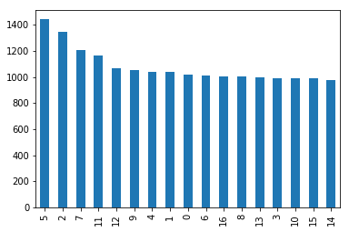
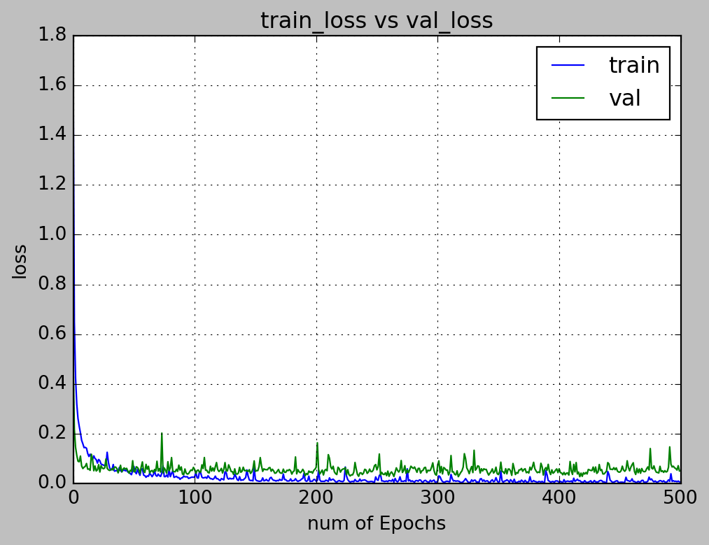
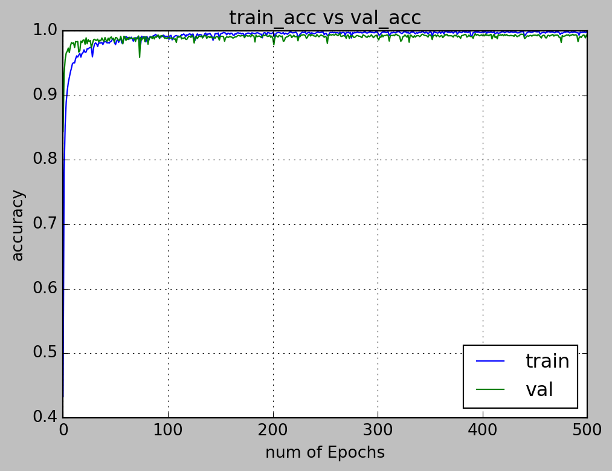

## My Grocery Finder  (myGF)


## 1. Problem Statement

Do you ever remember times where you have spent a large amount of time finding a grocery that you need at a particularly large supermarket? Groceries in a supermarket are organised into rows and categories. It is often difficult to pin point the exact location of the particular grocery that you need.  

In today's technologial landscape, we are able to leverage techniques such as **deep learning** to easily classify images or even speech. For this use case, we will make use of **Convolutional Neural Networks** (CNN) and transfer learning to help with the classification of groceries. This can then add value to supermarkets in the form of helping grocers find their groceries in a shorter time. A proposal might be to add kiosks around the supermarket with the image classifer. Grocers will only need to scan a photo or image of their grocery and the kiosk will return the row and column locations of the particular grocery.


Yay, candy can now be found easily!

### 1.1 Deep learning


Deep Learning is a subfield of machine learning concerned with algorithms inspired by the structure and function of the brain called artificial neural networks. For humans, images are first processed by our eyes and the signal gets passed through a series of neurons before reaching our brain. Our brain then consolidates the image information and presents it in an understandble format for us.

Similarly for deep learning in data science, data such as images are passed through layers that recognises salient features of that particular image. These features are then condensed and used to classify an image in our case. Specifically for this project, we will use a branch of deep learning - convolutional neural network to classify our groceries.

### 1.2 Convolutional Neural Networks

In machine learning, a convolutional neural network (CNN, or ConvNet) is a class of deep, feed-forward artificial neural networks where images are broken down into number matrices and fed through layers for analysis in a forward direction.  

CNN, in a nutshell, is made up of 4 main operations:
1. Convolution
2. Non Linearity (ReLU)
3. Pooling or Sub Sampling
4. Classification (Fully Connected Layer)


#### 1.2.1 Convolution
The reason why CNN are called as such is because of the Convolution function. Images are first processed into pixel values (red, green and blue colour in the range of 0 to 255 for each colour channel). Each image is simply converted into a matrix of numbers. 

We will next define a matrix of 3x3 size with arbitrarily assigned weights to be used to slide across our image matrix. Dot products of the matrices will then be computed and this effectively reduces our original matrix into a feature map. The animation below explains how the convolution is performed and how the output is computed:

 

Depending on the weights assigned, different feature maps will be obtained. These feature maps will then be used to classify our images.

#### 1.2.2 Recitfied Linear Unit (ReLU) Activation

An additional operation called ReLU has been used after every Convolution operation. ReLU stands for Rectified Linear Unit and is a non-linear operation. It simply replaces negative values with 0.

ReLU is an element wise operation (applied per pixel) and replaces all negative pixel values in the feature map by zero. The purpose of ReLU is to introduce non-linearity in our ConvNet. We would use ReLU for images as real world images consist of mostly non-linear features. The figure below illustrates the effect of ReLU activation on a processed image.


#### 1.2.3 Pooling

Image matrices tend to be large. We would often apply pooling techniques to reduce the dimension of our feature maps. Max pooling is the typical pooling method we would use. In max pooling, we will first set a window (2x2 in this case) to slide through our feature map. Max pooling will take only the largest element for every step. Visually, the figure below shows how max pooling is performed:


#### 1.2.4 Fully Connected Layer
The Fully Connected layer is a traditional Multi Layer Perceptron that uses a softmax activation function in the output layer. The term “Fully Connected” implies that every neuron in the previous layer is connected to every neuron on the next layer. The softmax activation function helps to reassign the computed values such that it adds up to 1, while highlighting the max value.  

Fully connected layers often occur toward the end of a ConvNet. This is due to the fact that the output layer (final classification step) must be connected to all neurons of the previous layer.

### 1.3 Training the ConvNet
The ConvNet model is trained according to the following schema:

- Step1: We initialize all filters and parameters / weights with random values

- Step2: The network takes a training image as input, goes through the forward propagation step (convolution, ReLU and pooling operations along with forward propagation in the Fully Connected layer) and finds the output probabilities for each class.
    - Lets say the output probabilities for the boat image above are [0.2, 0.4, 0.1, 0.3]
    - Since weights are randomly assigned for the first training example, output probabilities are also random.  
      
      
- Step3: Calculate the total error at the output layer (summation over all 4 classes)
    - Total Error = ∑  ½ (target probability – output probability) ²  
      
      
- Step4: Use Backpropagation to calculate the gradients of the error with respect to all weights in the network and use gradient descent to update all filter values / weights and parameter values to minimize the output error.
    - The weights are adjusted in proportion to their contribution to the total error.
    - When the same image is input again, output probabilities might now be [0.1, 0.1, 0.7, 0.1], which is closer to the target vector [0, 0, 1, 0].
    - This means that the network has learnt to classify this particular image correctly by adjusting its weights / filters such that the output error is reduced.
    - Parameters like number of filters, filter sizes, architecture of the network etc. have all been fixed before Step 1 and do not change during training process – only the values of the filter matrix and connection weights get updated.  
      
      
- Step5: Repeat steps 2-4 with all images in the training set.


The above steps train the ConvNet – this essentially means that all the weights and parameters of the ConvNet have now been optimized to correctly classify images from the training set.

Visually, the training and the architecture of the ConvNet are as such:


## 2. Dataset
The dataset used for this project is the GroZi-120 database from the University of California, San Diego. [Link to dataset](http://grozi.calit2.net/grozi.html). The database consists of photographs (training set) / google images of groceries. We will be building a ConvNet to classify 17 grocery items:
1. Wiggly double mint
2. Big red - gum
3. Lays classic chips
4. Pepperidge farm milano cookies
5. Starbucks frappucino
6. Oberto beef jerky
7. Honey nut cheerios
8. Tostitos scoops
9. Ruffles sour cream chips
10. Hersheys milk chocolate
11. Twix cookie bar
12. Snickers bar
13. Tic tac winter
14. Dentyne ice sweets
15. Starburst
16. Rockstar beer
17. Nestle crunch


### Packages used
1. pandas
2. numpy
3. os
4. cv2
5. matplotlib/seaborn
6. sci-kit learn
7. keras (tensorflow-gpu)

## 3. Preprocessing images
Images will have to be read in as a matrix. In order to increase computational efficiency and speed, images and downscaled to 128 x 128 pixels. 3 colour channels (red, green, blue) will be read into the matrix. Each image processed will result in a 128 x 128 x 3 matrix.  

Since each grocery has only 100+ images for training, which is insufficient for building a ConvNet, we will make use of keras' data generator function, to augment the images.


```python
# Image augmentation
datagen = ImageDataGenerator(
        rotation_range=40,
        width_shift_range=0.2,
        height_shift_range=0.2,
        shear_range=0.2,
        zoom_range=0.2,
        fill_mode='nearest')

class_size=1000
```


```python
it = 0
# Use counts for individual values, generate enough images till it hits roughly 1000
for count in label_counts.values:
    #nb of generations per image for this class label in order to make it size ~= class_size
    ratio=math.floor(class_size/count)-1
    print(count,count*(ratio+1))
    dest_lab_dir=os.path.join(dest_train_dir,str(label_counts.index[it]))
    src_lab_dir=os.path.join(src_train_dir,str(label_counts.index[it]))
    if not os.path.exists(dest_lab_dir):
        os.makedirs(dest_lab_dir)
    for file in os.listdir(src_lab_dir):
        img=load_img(os.path.join(src_lab_dir,file))
        #img.save(os.path.join(dest_lab_dir,file))
        x=img_to_array(img) 
        x=x.reshape((1,) + x.shape)
        i=0
        for batch in datagen.flow(x, batch_size=1,save_to_dir=dest_lab_dir, save_format='jpg'):
            i+=1
            if i > ratio:
                break 
    it=it+1
```

__Number of images per grocery after augmentation and generation__


```python
augcount = pd.DataFrame(aug_label)
augcount[0].value_counts().plot(kind='bar')
```





### 3.1 Generating matrix of images using cv2

We will use cv2's imread function to read in the images into matrices followed by a normalisation step of dividing each pixel value by 255. Since pixel values range between 0-255, the normalisation step serves to eliminate any scaling issues while building the model.


```python
# Training dataset
# Read image using cv2, then append matrix to list

img_data_list=[]

for dataset in data_dir_list:
    img_list=os.listdir(data_path+'/'+ dataset)
    print ('Loaded the images of dataset-'+'{}\n'.format(dataset))
    for img in img_list:
        input_img=cv2.imread(data_path + '/'+ dataset + '/'+ img )
        input_img_resize=cv2.resize(input_img,(128,128))
        img_data_list.append(input_img_resize)
```

```python
# Make matrix into arrays

img_data = np.array(img_data_list)
img_data = img_data.astype('float32')
img_data /= 255
print (img_data.shape)
```

    (18337, 128, 128, 3)
    

### 3.2 Shuffling then train test split the dataset

After reading in the images into matrices. The matrix is shuffled records-wise to reduce bias and split into training and test sets (70% training, 30% test split).


## 4. Building CovnNet using Keras tensorflow

A simple keras image classification workflow in python can be adapted from this github: [https://github.com/anujshah1003/own_data_cnn_implementation_keras](https://github.com/anujshah1003/own_data_cnn_implementation_keras)

### 4.1 Defining the ConvNet model architecture
 
Model architecture = Convolution > relu > Convolution > relu > Max pool (with drop out) > Convolution > relu > convolution > relu > Max pool (drop out) > fully connected with activation > drop out > softmax activation.  

Model is optimised using Adam (adaptive moment estimation):

- Adam is a replacement optimization algorithm for stochastic gradient descent for training deep learning models.
- Adam combines the best properties of the AdaGrad and RMSProp algorithms to provide an optimization algorithm that can handle sparse gradients on noisy problems.
- Adam is relatively easy to configure where the default configuration parameters do well on most problems.


```python
# Defining the model
input_shape= (128,128,3)

model = Sequential()

model.add(Convolution2D(32, 3,border_mode='same',input_shape=input_shape, dim_ordering="tf"))
model.add(Activation('relu'))
model.add(Convolution2D(32, 3))
model.add(Activation('relu'))
model.add(MaxPooling2D(pool_size=(2, 2)))
model.add(Dropout(0.3))

model.add(Convolution2D(64, 3,border_mode='same',input_shape=input_shape, dim_ordering="tf"))
model.add(Activation('relu'))
model.add(Convolution2D(64, 3))
model.add(Activation('relu'))
model.add(MaxPooling2D(pool_size=(2, 2)))
model.add(Dropout(0.3))


model.add(Flatten())
model.add(Dense(128))
model.add(Activation('relu'))
model.add(Dropout(0.5))
model.add(Dense(num_classes))
model.add(Activation('softmax'))

model.compile(loss='categorical_crossentropy', optimizer='adam',metrics=["accuracy"])
```

```python
# Viewing model_configuration

model.summary()
model.get_config()
model.layers[0].get_config()
model.layers[0].input_shape
model.layers[0].output_shape
model.layers[0].get_weights()
np.shape(model.layers[0].get_weights()[0])
model.layers[0].trainable
```

    _________________________________________________________________
    Layer (type)                 Output Shape              Param #   
    =================================================================
    conv2d_1 (Conv2D)            (None, 128, 128, 32)      896       
    _________________________________________________________________
    activation_1 (Activation)    (None, 128, 128, 32)      0         
    _________________________________________________________________
    conv2d_2 (Conv2D)            (None, 126, 126, 32)      9248      
    _________________________________________________________________
    activation_2 (Activation)    (None, 126, 126, 32)      0         
    _________________________________________________________________
    max_pooling2d_1 (MaxPooling2 (None, 63, 63, 32)        0         
    _________________________________________________________________
    dropout_1 (Dropout)          (None, 63, 63, 32)        0         
    _________________________________________________________________
    conv2d_3 (Conv2D)            (None, 63, 63, 64)        18496     
    _________________________________________________________________
    activation_3 (Activation)    (None, 63, 63, 64)        0         
    _________________________________________________________________
    conv2d_4 (Conv2D)            (None, 61, 61, 64)        36928     
    _________________________________________________________________
    activation_4 (Activation)    (None, 61, 61, 64)        0         
    _________________________________________________________________
    max_pooling2d_2 (MaxPooling2 (None, 30, 30, 64)        0         
    _________________________________________________________________
    dropout_2 (Dropout)          (None, 30, 30, 64)        0         
    _________________________________________________________________
    flatten_1 (Flatten)          (None, 57600)             0         
    _________________________________________________________________
    dense_1 (Dense)              (None, 128)               7372928   
    _________________________________________________________________
    activation_5 (Activation)    (None, 128)               0         
    _________________________________________________________________
    dropout_3 (Dropout)          (None, 128)               0         
    _________________________________________________________________
    dense_2 (Dense)              (None, 17)                2193      
    _________________________________________________________________
    activation_6 (Activation)    (None, 17)                0         
    =================================================================
    Total params: 7,440,689
    Trainable params: 7,440,689
    Non-trainable params: 0
    _________________________________________________________________
    


### 4.2 Callbacks
The use of callbacks in keras allows you to monitor a metric and save the weights of model while training is in progress.


```python
# Training with callbacks
from keras import callbacks

filename='model_train_new.csv'
csv_log=callbacks.CSVLogger(filename, separator=',', append=False)

# early_stopping=callbacks.EarlyStopping(monitor='val_loss', min_delta=0, patience=0, verbose=0, mode='min')

filepath="Best-weights-my_model-{epoch:03d}-{loss:.4f}-{acc:.4f}.hdf5"

checkpoint = callbacks.ModelCheckpoint(filepath, monitor='val_loss', verbose=1, save_best_only=True, mode='min')

callbacks_list = [csv_log,checkpoint]
```

## 5. ConvNet Training
Training set is trained over 500 epochs, with a batch size of 128.


```python
# Training

num_epoch = 500
hist = model.fit(X_train, Y_train, batch_size=128,
                 epochs=num_epoch, 
                 validation_data=(X_test, Y_test),
                 callbacks=callbacks_list)
```

    Train on 12835 samples, validate on 5502 samples
    Epoch 1/500
    12800/12835 [============================>.] - ETA: 0s - loss: 1.7270 - acc: 0.4321
    Epoch 00001: val_loss improved from inf to 0.50602, saving model to Best-weights-my_model-001-1.7246-0.4328.hdf5
    12835/12835 [==============================] - 56s 4ms/step - loss: 1.7246 - acc: 0.4328 - val_loss: 0.5060 - val_acc: 0.8442
    Epoch 2/500
    12800/12835 [============================>.] - ETA: 0s - loss: 0.6501 - acc: 0.7795
    Epoch 00002: val_loss improved from 0.50602 to 0.21648, saving model to Best-weights-my_model-002-0.6494-0.7797.hdf5
    12835/12835 [==============================] - 45s 3ms/step - loss: 0.6494 - acc: 0.7797 - val_loss: 0.2165 - val_acc: 0.9338
    Epoch 3/500
    12800/12835 [============================>.] - ETA: 0s - loss: 0.4238 - acc: 0.8534
    Epoch 00003: val_loss improved from 0.21648 to 0.14501, saving model to Best-weights-my_model-003-0.4239-0.8534.hdf5
    12835/12835 [==============================] - 45s 3ms/step - loss: 0.4239 - acc: 0.8534 - val_loss: 0.1450 - val_acc: 0.9553
    Epoch 4/500
    12800/12835 [============================>.] - ETA: 0s - loss: 0.3187 - acc: 0.8897
    Epoch 00004: val_loss improved from 0.14501 to 0.11273, saving model to Best-weights-my_model-004-0.3189-0.8895.hdf5
    12835/12835 [==============================] - 45s 3ms/step - loss: 0.3189 - acc: 0.8895 - val_loss: 0.1127 - val_acc: 0.9656
    Epoch 5/500
    12800/12835 [============================>.] - ETA: 0s - loss: 0.2605 - acc: 0.9072
    Epoch 00005: val_loss improved from 0.11273 to 0.08933, saving model to Best-weights-my_model-005-0.2607-0.9071.hdf5
    12835/12835 [==============================] - 45s 3ms/step - loss: 0.2607 - acc: 0.9071 - val_loss: 0.0893 - val_acc: 0.9684
    Epoch 6/500
    12800/12835 [============================>.] - ETA: 0s - loss: 0.2304 - acc: 0.9196
    Epoch 00006: val_loss improved from 0.08933 to 0.08702, saving model to Best-weights-my_model-006-0.2299-0.9198.hdf5
    12835/12835 [==============================] - 45s 3ms/step - loss: 0.2299 - acc: 0.9198 - val_loss: 0.0870 - val_acc: 0.9733
    Epoch 7/500
    12800/12835 [============================>.] - ETA: 0s - loss: 0.2037 - acc: 0.9280
    Epoch 00007: val_loss did not improve
    12835/12835 [==============================] - 45s 3ms/step - loss: 0.2036 - acc: 0.9282 - val_loss: 0.1100 - val_acc: 0.9664
    Epoch 8/500
    12800/12835 [============================>.] - ETA: 0s - loss: 0.1733 - acc: 0.9359
    Epoch 00008: val_loss improved from 0.08702 to 0.06998, saving model to Best-weights-my_model-008-0.1731-0.9360.hdf5
    12835/12835 [==============================] - 45s 3ms/step - loss: 0.1731 - acc: 0.9360 - val_loss: 0.0700 - val_acc: 0.9762
    Epoch 9/500
    12800/12835 [============================>.] - ETA: 0s - loss: 0.1596 - acc: 0.9422
    Epoch 00009: val_loss improved from 0.06998 to 0.05997, saving model to Best-weights-my_model-009-0.1595-0.9423.hdf5
    12835/12835 [==============================] - 45s 3ms/step - loss: 0.1595 - acc: 0.9423 - val_loss: 0.0600 - val_acc: 0.9818
    ...
    ...
    ...
    

### 5.1 Loss and accuracy visualisation

The loss and accuracy of our model is visualised using pyplot.


```python
num_epoch = 500
# visualizing losses and accuracy
train_loss=hist.history['loss']
val_loss=hist.history['val_loss']
train_acc=hist.history['acc']
val_acc=hist.history['val_acc']
xc=range(num_epoch)

plt.figure(1,figsize=(7,5))
plt.plot(xc,train_loss)
plt.plot(xc,val_loss)
plt.xlabel('num of Epochs')
plt.ylabel('loss')
plt.title('train_loss vs val_loss')
plt.grid(True)
plt.legend(['train','val'])
#print plt.style.available # use bmh, classic,ggplot for big pictures
plt.style.use(['classic'])
plt.savefig('dropall1.jpeg')

plt.figure(2,figsize=(7,5))
plt.plot(xc,train_acc)
plt.plot(xc,val_acc)
plt.xlabel('num of Epochs')
plt.ylabel('accuracy')
plt.title('train_acc vs val_acc')
plt.grid(True)
plt.legend(['train','val'],loc=4)
#print plt.style.available # use bmh, classic,ggplot for big pictures
plt.style.use(['classic'])
plt.savefig('dropall2.jpeg')
```








### 5.2 Model Evaluation
Our objective is to predict a class of grocery from its google images. We would thus, in the google images for model evaluation.  

We chose the model weights at epoch 202 as it is the best balance between loss and accuracy (i.e, the model is not overfitted to the training dataset).


### 5.3 Classification report


### 5.4 Confusion matrix


## 6. Transfer learning

Source: [https://codelabs.developers.google.com/codelabs/tensorflow-for-poets/](https://codelabs.developers.google.com/codelabs/tensorflow-for-poets/)

Transfer learning is the process of utilising knowledge from a particular task/domain to model for another task/domain.  


One approach of transfer learning is the use of pre-trained model. In this capstone project, we will utilise Google's mobilenet ConvNet model and retrain the last layer of the model to classify our 17 groceries. 

### 6.1 Retraining the pre-trained model
Retraining the model is as simple as loading up the model in your terminal, and specifying the images that you wish to classify.


```python
python -m scripts.retrain \
  --bottleneck_dir=tf_files/bottlenecks \
  --how_many_training_steps=500 \
  --model_dir=tf_files/models/ \
  --summaries_dir=tf_files/training_summaries/"${ARCHITECTURE}" \
  --output_graph=tf_files/retrained_graph.pb \
  --output_labels=tf_files/retrained_labels.txt \
  --architecture="${ARCHITECTURE}" \
  --image_dir=tf_files/grocery-photos
```

Next, we would define 2 functions to classify our image. We would define the first function, load_graph, to load our rerained model. The second function, read_tensor_from_image_file, will return the value of the class based on the model specified.


```python
from __future__ import absolute_import
from __future__ import division
from __future__ import print_function

import argparse

import numpy as np
import tensorflow as tf


def load_graph(model_file):
    graph = tf.Graph()
    graph_def = tf.GraphDef()

    with open(model_file, "rb") as f:
        graph_def.ParseFromString(f.read())
    with graph.as_default():
        tf.import_graph_def(graph_def)

    return graph


def read_tensor_from_image_file(file_name,
                                input_height=299,
                                input_width=299,
                                input_mean=0,
                                input_std=255):
    input_name = "file_reader"
    output_name = "normalized"
    file_reader = tf.read_file(file_name, input_name)
    if file_name.endswith(".png"):
        image_reader = tf.image.decode_png(
        file_reader, channels=3, name="png_reader")
    elif file_name.endswith(".gif"):
        image_reader = tf.squeeze(
        tf.image.decode_gif(file_reader, name="gif_reader"))
    elif file_name.endswith(".bmp"):
        image_reader = tf.image.decode_bmp(file_reader, name="bmp_reader")
    else:
        image_reader = tf.image.decode_jpeg(
        file_reader, channels=3, name="jpeg_reader")
    float_caster = tf.cast(image_reader, tf.float32)
    dims_expander = tf.expand_dims(float_caster, 0)
    resized = tf.image.resize_bilinear(dims_expander, [input_height, input_width])
    normalized = tf.divide(tf.subtract(resized, [input_mean]), [input_std])
    sess = tf.Session()
    result = sess.run(normalized)

    return result


def load_labels(label_file):
    label = []
    proto_as_ascii_lines = tf.gfile.GFile(label_file).readlines()
    for l in proto_as_ascii_lines:
        label.append(l.rstrip())
    return label
```

### 6.2 Load the graph (model) and labels for classification


```python
graph = load_graph('../tensorflow-for-poets-2/tf_files/retrained_graph.pb')
labels = load_labels('../tensorflow-for-poets-2/tf_files/retrained_labels.txt')
```


```python
input_height=128
input_width=128
input_mean=0
input_std=255
```


```python
input_layer = "input"
output_layer = "final_result"
```

### 6.3 Results
### Classification Report


### Confusion Matrix


## 7. Insights
1. Comparison between Transfer Learning and Keras  
    - Keras acheived an overall precision of 0.84 and recall of 0.58 as compared to the Transfer Learning model with an overall precision of 0.40 and recall of 0.49. 2 points can be discussed here. Point 1 being, as the support for grocery is low (about 5-6 images per grocery for classification), the recall will naturally be skewed greatly if 1 of 5 items is misclassified.    
    - To circumvent this, I suggest that we collect more data for the classification before proceeding to compute the confusion matrix and classification report.  
    - Also, for point 2, the transfer learning model only achieved ~ 0.4 precision and recall, which may be an indication that the model still has room for training. Since the number of iterations is only at 500, I suggest that we can retrain the model with more iterations (for example, 2000-5000 iterations). However, it must be performed with caution to prevent overfitting.  
    
2. Business use case
    Both the Transfer Learning model and Keras model have their pros and cons. Some of their advantages are as follows: 

2.1 ** Keras **
    - Full control of hyper-parameters
    - Full control of trainable features, depth and complexity of the model  

2.2 ** Transfer learning **
    - Easy to apply
    - Models from different domains may be applicable to business use cases from differing domains  
    
   From a business perspective, it is important to consider whether there is sufficient time to develop the model, or whether accuracy is preferred over speed and utility.
    
3. ** Other models **
    Support Vector Machines, Fuzzy measures and Genetic Algorithms exist to classify images. But due to the time constraints of the capstone project, we are only able to explore deep learning, which is by far, out performing the other algorithms according to various research papers. It is still important to give the other models a try for a more in-depth comparison.

## 8. Future work
1. Explore other techniques to classify images: Support Vector Machines, Fuzzy measures and Genetic Algorithms
2. Build application for image classification
