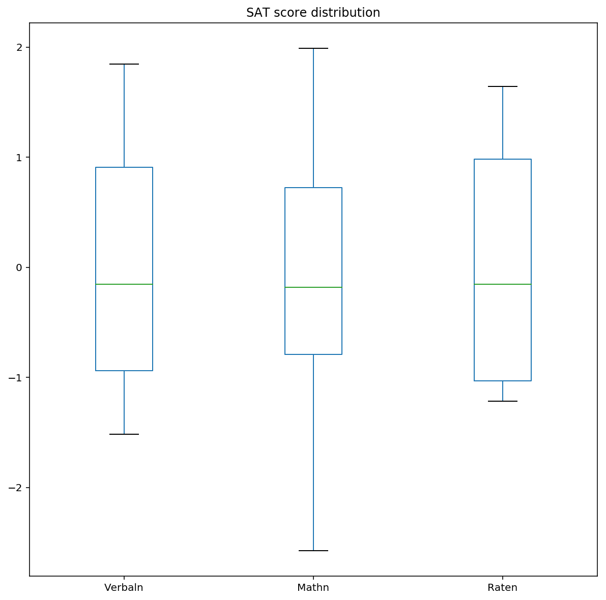

# Exploratory Data Analysis (EDA)  

---
### Problem Statement  

Your hometown mayor just created a new data analysis team to give policy advice, and the administration recruited _you_ via LinkedIn to join it. Unfortunately, due to budget constraints, for now the "team" is just you...

The mayor wants to start a new initiative to move the needle on one of two separate issues: high school education outcomes, or drug abuse in the community.

Also unfortunately, that is the entirety of what you've been told. And the mayor just went on a lobbyist-funded fact-finding trip in the Bahamas. In the meantime, you got your hands on two national datasets: one on SAT scores by state, and one on drug use by age. Start exploring these to look for useful patterns and possible hypotheses!

---
### Exploratory Data Analysis  

This project is focused on exploratory data analysis, aka "EDA". EDA is an essential part of the data science analysis pipeline. Using packages such as numpy, pandas, matplotlib and seaborn, data scientists are equipped with an array of tools to visualise data. EDA and visualisation serves as a starting point to analyse any dataset (refer to flow chart below).


Source: Transformation - Building a Data Science Capability  
[https://www.linkedin.com/pulse/transforamtion-building-data-science-capability-simon-jones](https://www.linkedin.com/pulse/transforamtion-building-data-science-capability-simon-jones)


## 1. Load the `sat_scores.csv` dataset and describe it

---
### 1.1 Describing dataset using pandas .describe() and .info()


```python
print datasat.info()
datasat.head()
```

    <class 'pandas.core.frame.DataFrame'>
    RangeIndex: 52 entries, 0 to 51
    Data columns (total 4 columns):
    State     52 non-null object
    Rate      52 non-null int64
    Verbal    52 non-null int64
    Math      52 non-null int64
    dtypes: int64(3), object(1)
    memory usage: 1.7+ KB
    None
    


<div>
<style>
    .dataframe thead tr:only-child th {
        text-align: right;
    }

    .dataframe thead th {
        text-align: left;
    }

    .dataframe tbody tr th {
        vertical-align: top;
    }
</style>
<table border="1" class="dataframe">
  <thead>
    <tr style="text-align: right;">
      <th></th>
      <th>State</th>
      <th>Rate</th>
      <th>Verbal</th>
      <th>Math</th>
    </tr>
  </thead>
  <tbody>
    <tr>
      <th>0</th>
      <td>CT</td>
      <td>82</td>
      <td>509</td>
      <td>510</td>
    </tr>
    <tr>
      <th>1</th>
      <td>NJ</td>
      <td>81</td>
      <td>499</td>
      <td>513</td>
    </tr>
    <tr>
      <th>2</th>
      <td>MA</td>
      <td>79</td>
      <td>511</td>
      <td>515</td>
    </tr>
    <tr>
      <th>3</th>
      <td>NY</td>
      <td>77</td>
      <td>495</td>
      <td>505</td>
    </tr>
    <tr>
      <th>4</th>
      <td>NH</td>
      <td>72</td>
      <td>520</td>
      <td>516</td>
    </tr>
  </tbody>
</table>
</div>


```python
datasat.describe()
```


<div>
<style>
    .dataframe thead tr:only-child th {
        text-align: right;
    }

    .dataframe thead th {
        text-align: left;
    }

    .dataframe tbody tr th {
        vertical-align: top;
    }
</style>
<table border="1" class="dataframe">
  <thead>
    <tr style="text-align: right;">
      <th></th>
      <th>Rate</th>
      <th>Verbal</th>
      <th>Math</th>
    </tr>
  </thead>
  <tbody>
    <tr>
      <th>count</th>
      <td>52.000000</td>
      <td>52.000000</td>
      <td>52.000000</td>
    </tr>
    <tr>
      <th>mean</th>
      <td>37.153846</td>
      <td>532.019231</td>
      <td>531.500000</td>
    </tr>
    <tr>
      <th>std</th>
      <td>27.301788</td>
      <td>33.236225</td>
      <td>36.014975</td>
    </tr>
    <tr>
      <th>min</th>
      <td>4.000000</td>
      <td>482.000000</td>
      <td>439.000000</td>
    </tr>
    <tr>
      <th>25%</th>
      <td>9.000000</td>
      <td>501.000000</td>
      <td>504.000000</td>
    </tr>
    <tr>
      <th>50%</th>
      <td>33.500000</td>
      <td>526.500000</td>
      <td>521.000000</td>
    </tr>
    <tr>
      <th>75%</th>
      <td>63.500000</td>
      <td>562.000000</td>
      <td>555.750000</td>
    </tr>
    <tr>
      <th>max</th>
      <td>82.000000</td>
      <td>593.000000</td>
      <td>603.000000</td>
    </tr>
  </tbody>
</table>
</div>


### 1.2 Summary
The sat scores contain 4 columns of information : 
1. State: Refers to states in the U.S.
2. Rate: A percentage possibly referring to SAT passing rate of children
3. Verbal: Verbal Scores in the range of 482 - 593
4. Math: Math Scores in the range of 439 - 603


## 2. Plot the data using seaborn

---

### 2.1 Using seaborn's `distplot`, plot the distributions for each of `Rate`, `Math`, and `Verbal`


```python
# Plot rate distplot

ratep = sns.distplot(datasat['Rate'], kde=False, bins=10)
ratep.set(xlabel='SAT passing rate')
ratep.set_title('Frequency distribution of SAT passing rate')

```


```python
# Plot math distplot

mathp = sns.distplot(datasat['Math'], kde=False,bins=20, color='blue')
mathp.set(xlabel='SAT Math Scores')
mathp.set_title('Frequency distribution of SAT Math Scores')

```


```python
# Plot verbal distplot

verbp = sns.distplot(datasat['Verbal'], kde=False,bins=20, color='orange')
verbp.set(xlabel='SAT Verbal Scores')
verbp.set_title('Frequency distribution of SAT Verbal Scores')

```


### 2.2 Using seaborn's `pairplot`, show the joint distributions for each of `Rate`, `Math`, and `Verbal`


```python
sns.pairplot(datasat, vars=['Rate', 'Math', 'Verbal'], hue='State')
```


## Interpretation of pair plot
**1. Rate seems to be negatively correlated with both math and verbal scores.**  
From plots 2 and 3 in the first row, as scores increase, rate decreases.

**2. Math and verbal appears to be positively correlated.**  
From plots (row 2, plot 3 and row 3, plot 2), as either variable increases, the other seems to increase as well.

**3. Adding hue dimension (assigned to state) may yield interesting information about the clustering of states according to SAT scores.**


## 3. Plot the data using built-in pandas functions.

---

### 3.1 Plot a stacked histogram with `Verbal` and `Math` using pandas


```python
datasat[['Verbal','Math']].plot.hist(stacked=True, alpha=0.5,figsize=(12,12), bins=20)
```


### 3.2 Plot `Verbal` , `Math` and `Rate` (normalised) on the same chart using boxplots  

Normalisation centers each variable so that differences in scale can be visualised.


```python
# divide each feature by its own mean, to normalise all features
datanorm = datasat.copy()
print datanorm.mean()

datanorm['Raten'] = datanorm['Rate'].map(lambda x: (x-37.153846)/np.std(datanorm['Rate']))
datanorm['Verbaln'] = datanorm['Verbal'].map(lambda x: (x-532.019231)/np.std(datanorm['Verbal']))
datanorm['Mathn'] = datanorm['Math'].map(lambda x: (x-531.5)/np.std(datanorm['Math']))
```

    Rate       37.000000
    Verbal    532.529412
    Math      531.843137
    dtype: float64
    


```python
datanormp = datanorm.sort_values(by=['Verbaln','Mathn']).plot(kind='box', y=['Verbaln','Mathn','Raten'], figsize=(10,10),title='SAT score distribution')
```





## 4. Examine summary statistics
---

Checking the summary statistics! Correlation matrices give a one stop view of how variables are related linearly to each other.


### 4.1 Create the correlation matrix of your variables (excluding `State`).


```python
datasat.corr()
```


<div>
<style>
    .dataframe thead tr:only-child th {
        text-align: right;
    }

    .dataframe thead th {
        text-align: left;
    }

    .dataframe tbody tr th {
        vertical-align: top;
    }
</style>
<table border="1" class="dataframe">
  <thead>
    <tr style="text-align: right;">
      <th></th>
      <th>Rate</th>
      <th>Verbal</th>
      <th>Math</th>
      <th>ver_diff</th>
    </tr>
  </thead>
  <tbody>
    <tr>
      <th>Rate</th>
      <td>1.000000</td>
      <td>-0.888121</td>
      <td>-0.773419</td>
      <td>-0.098671</td>
    </tr>
    <tr>
      <th>Verbal</th>
      <td>-0.888121</td>
      <td>1.000000</td>
      <td>0.899909</td>
      <td>0.044527</td>
    </tr>
    <tr>
      <th>Math</th>
      <td>-0.773419</td>
      <td>0.899909</td>
      <td>1.000000</td>
      <td>-0.395574</td>
    </tr>
    <tr>
      <th>ver_diff</th>
      <td>-0.098671</td>
      <td>0.044527</td>
      <td>-0.395574</td>
      <td>1.000000</td>
    </tr>
  </tbody>
</table>
</div>


Rate seems to have a negative correlation with the verbal and math variables.  
Verbal and math seems to be positively correlated.

### 4.2 Assign and print the _covariance_ matrix for the dataset

1. Covariance measures how 2 variables vary together while correlation measures how one variable is dependent on the other.
2. Correlation can be obtained by dividing the covariance with the product of standard deviation of the 2 variables.
3. Correlation will be able to tell us when a variable increases, whether the other increases or decreases.


```python
datasat.cov()
```


<div>
<style>
    .dataframe thead tr:only-child th {
        text-align: right;
    }

    .dataframe thead th {
        text-align: left;
    }

    .dataframe tbody tr th {
        vertical-align: top;
    }
</style>
<table border="1" class="dataframe">
  <thead>
    <tr style="text-align: right;">
      <th></th>
      <th>Rate</th>
      <th>Verbal</th>
      <th>Math</th>
      <th>ver_diff</th>
    </tr>
  </thead>
  <tbody>
    <tr>
      <th>Rate</th>
      <td>759.04</td>
      <td>-816.280000</td>
      <td>-773.220000</td>
      <td>-43.060000</td>
    </tr>
    <tr>
      <th>Verbal</th>
      <td>-816.28</td>
      <td>1112.934118</td>
      <td>1089.404706</td>
      <td>23.529412</td>
    </tr>
    <tr>
      <th>Math</th>
      <td>-773.22</td>
      <td>1089.404706</td>
      <td>1316.774902</td>
      <td>-227.370196</td>
    </tr>
    <tr>
      <th>ver_diff</th>
      <td>-43.06</td>
      <td>23.529412</td>
      <td>-227.370196</td>
      <td>250.899608</td>
    </tr>
  </tbody>
</table>
</div>


## 5. Performing EDA on "drug use by age" data.

---

### 5.1 EDA involves the cleaning of data, checking for null values, data types etc.


```python
df1 = pd.read_csv(drugcsv)

df1.head(1)
```


<div>
<style>
    .dataframe thead tr:only-child th {
        text-align: right;
    }

    .dataframe thead th {
        text-align: left;
    }

    .dataframe tbody tr th {
        vertical-align: top;
    }
</style>
<table border="1" class="dataframe" width="200px">
  <thead>
    <tr style="text-align: right;">
      <th></th>
      <th>age</th>
      <th>n</th>
      <th>alcohol-use</th>
      <th>alcohol-frequency</th>
      <th>marijuana-use</th>
      <th>marijuana-frequency</th>
      <th>cocaine-use</th>
      <th>cocaine-frequency</th>
      <th>crack-use</th>
      <th>crack-frequency</th>
      <th>heroin-use</th>
      <th>heroin-frequency</th>
      <th>hallucinogen-use</th>
      <th>hallucinogen-frequency</th>
      <th>inhalant-use</th>
      <th>inhalant-frequency</th>
      <th>pain-reliever-use</th>
      <th>pain-reliever-frequency</th>
      <th>oxycontin-use</th>
      <th>oxycontin-frequency</th>
      <th>tranquilizer-use</th>
      <th>tranquilizer-frequency</th>
      <th>stimulant-use</th>
      <th>stimulant-frequency</th>
      <th>meth-use</th>
      <th>meth-frequency</th>
      <th>sedative-use</th>
      <th>sedative-frequency</th>
    </tr>
  </thead>
  <tbody>
    <tr>
      <th>0</th>
      <td>12</td>
      <td>2798</td>
      <td>3.9</td>
      <td>3.0</td>
      <td>1.1</td>
      <td>4.0</td>
      <td>0.1</td>
      <td>5.0</td>
      <td>0.0</td>
      <td>-</td>
      <td>0.1</td>
      <td>35.5</td>
      <td>0.2</td>
      <td>52.0</td>
      <td>1.6</td>
      <td>19.0</td>
      <td>2.0</td>
      <td>36.0</td>
      <td>0.1</td>
      <td>24.5</td>
      <td>0.2</td>
      <td>52.0</td>
      <td>0.2</td>
      <td>2.0</td>
      <td>0.0</td>
      <td>-</td>
      <td>0.2</td>
      <td>13.0</td>
    </tr>
  </tbody>
</table>
</div>


```python
df1.isnull().sum()
```


    age                        0
    n                          0
    alcohol-use                0
    alcohol-frequency          0
    marijuana-use              0
    marijuana-frequency        0
    cocaine-use                0
    cocaine-frequency          0
    crack-use                  0
    crack-frequency            0
    heroin-use                 0
    heroin-frequency           0
    hallucinogen-use           0
    hallucinogen-frequency     0
    inhalant-use               0
    inhalant-frequency         0
    pain-reliever-use          0
    pain-reliever-frequency    0
    oxycontin-use              0
    oxycontin-frequency        0
    tranquilizer-use           0
    tranquilizer-frequency     0
    stimulant-use              0
    stimulant-frequency        0
    meth-use                   0
    meth-frequency             0
    sedative-use               0
    sedative-frequency         0
    dtype: int64


```python
df1.info()

```

    <class 'pandas.core.frame.DataFrame'>
    RangeIndex: 17 entries, 0 to 16
    Data columns (total 28 columns):
    age                        17 non-null object
    n                          17 non-null int64
    alcohol-use                17 non-null float64
    alcohol-frequency          17 non-null float64
    marijuana-use              17 non-null float64
    marijuana-frequency        17 non-null float64
    cocaine-use                17 non-null float64
    cocaine-frequency          17 non-null object
    crack-use                  17 non-null float64
    crack-frequency            17 non-null object
    heroin-use                 17 non-null float64
    heroin-frequency           17 non-null object
    hallucinogen-use           17 non-null float64
    hallucinogen-frequency     17 non-null float64
    inhalant-use               17 non-null float64
    inhalant-frequency         17 non-null object
    pain-reliever-use          17 non-null float64
    pain-reliever-frequency    17 non-null float64
    oxycontin-use              17 non-null float64
    oxycontin-frequency        17 non-null object
    tranquilizer-use           17 non-null float64
    tranquilizer-frequency     17 non-null float64
    stimulant-use              17 non-null float64
    stimulant-frequency        17 non-null float64
    meth-use                   17 non-null float64
    meth-frequency             17 non-null object
    sedative-use               17 non-null float64
    sedative-frequency         17 non-null float64
    dtypes: float64(20), int64(1), object(7)
    memory usage: 3.8+ KB
    

### 5.2 EDA also involves looking at an overview of the dataset (descriptive statistics like mean and standard deviation)


```python
pd.options.display.max_columns = 999
df1.describe(include='all')

```


<div>
<style>
    .dataframe thead tr:only-child th {
        text-align: right;
    }

    .dataframe thead th {
        text-align: left;
    }

    .dataframe tbody tr th {
        vertical-align: top;
    }
</style>
<table border="1" class="dataframe">
  <thead>
    <tr style="text-align: right;">
      <th></th>
      <th>age</th>
      <th>n</th>
      <th>alcohol-use</th>
      <th>alcohol-frequency</th>
      <th>marijuana-use</th>
      <th>marijuana-frequency</th>
      <th>cocaine-use</th>
      <th>cocaine-frequency</th>
      <th>crack-use</th>
      <th>crack-frequency</th>
      <th>heroin-use</th>
      <th>heroin-frequency</th>
      <th>hallucinogen-use</th>
      <th>hallucinogen-frequency</th>
      <th>inhalant-use</th>
      <th>inhalant-frequency</th>
      <th>pain-reliever-use</th>
      <th>pain-reliever-frequency</th>
      <th>oxycontin-use</th>
      <th>oxycontin-frequency</th>
      <th>tranquilizer-use</th>
      <th>tranquilizer-frequency</th>
      <th>stimulant-use</th>
      <th>stimulant-frequency</th>
      <th>meth-use</th>
      <th>meth-frequency</th>
      <th>sedative-use</th>
      <th>sedative-frequency</th>
    </tr>
  </thead>
  <tbody>
    <tr>
      <th>count</th>
      <td>17</td>
      <td>17.000000</td>
      <td>17.000000</td>
      <td>17.000000</td>
      <td>17.000000</td>
      <td>17.000000</td>
      <td>17.000000</td>
      <td>17.000000</td>
      <td>17.000000</td>
      <td>17.000000</td>
      <td>17.000000</td>
      <td>17.000000</td>
      <td>17.000000</td>
      <td>17.000000</td>
      <td>17.000000</td>
      <td>17.000000</td>
      <td>17.000000</td>
      <td>17.000000</td>
      <td>17.000000</td>
      <td>17.000000</td>
      <td>17.000000</td>
      <td>17.000000</td>
      <td>17.000000</td>
      <td>17.000000</td>
      <td>17.000000</td>
      <td>17.000000</td>
      <td>17.000000</td>
      <td>17.000000</td>
    </tr>
    <tr>
      <th>unique</th>
      <td>17</td>
      <td>NaN</td>
      <td>NaN</td>
      <td>NaN</td>
      <td>NaN</td>
      <td>NaN</td>
      <td>NaN</td>
      <td>NaN</td>
      <td>NaN</td>
      <td>NaN</td>
      <td>NaN</td>
      <td>NaN</td>
      <td>NaN</td>
      <td>NaN</td>
      <td>NaN</td>
      <td>NaN</td>
      <td>NaN</td>
      <td>NaN</td>
      <td>NaN</td>
      <td>NaN</td>
      <td>NaN</td>
      <td>NaN</td>
      <td>NaN</td>
      <td>NaN</td>
      <td>NaN</td>
      <td>NaN</td>
      <td>NaN</td>
      <td>NaN</td>
    </tr>
    <tr>
      <th>top</th>
      <td>22-23</td>
      <td>NaN</td>
      <td>NaN</td>
      <td>NaN</td>
      <td>NaN</td>
      <td>NaN</td>
      <td>NaN</td>
      <td>NaN</td>
      <td>NaN</td>
      <td>NaN</td>
      <td>NaN</td>
      <td>NaN</td>
      <td>NaN</td>
      <td>NaN</td>
      <td>NaN</td>
      <td>NaN</td>
      <td>NaN</td>
      <td>NaN</td>
      <td>NaN</td>
      <td>NaN</td>
      <td>NaN</td>
      <td>NaN</td>
      <td>NaN</td>
      <td>NaN</td>
      <td>NaN</td>
      <td>NaN</td>
      <td>NaN</td>
      <td>NaN</td>
    </tr>
    <tr>
      <th>freq</th>
      <td>1</td>
      <td>NaN</td>
      <td>NaN</td>
      <td>NaN</td>
      <td>NaN</td>
      <td>NaN</td>
      <td>NaN</td>
      <td>NaN</td>
      <td>NaN</td>
      <td>NaN</td>
      <td>NaN</td>
      <td>NaN</td>
      <td>NaN</td>
      <td>NaN</td>
      <td>NaN</td>
      <td>NaN</td>
      <td>NaN</td>
      <td>NaN</td>
      <td>NaN</td>
      <td>NaN</td>
      <td>NaN</td>
      <td>NaN</td>
      <td>NaN</td>
      <td>NaN</td>
      <td>NaN</td>
      <td>NaN</td>
      <td>NaN</td>
      <td>NaN</td>
    </tr>
    <tr>
      <th>mean</th>
      <td>NaN</td>
      <td>3251.058824</td>
      <td>55.429412</td>
      <td>33.352941</td>
      <td>18.923529</td>
      <td>42.941176</td>
      <td>2.176476</td>
      <td>7.411771</td>
      <td>0.294147</td>
      <td>12.382371</td>
      <td>0.352953</td>
      <td>68.970594</td>
      <td>3.394118</td>
      <td>8.411765</td>
      <td>1.388241</td>
      <td>5.794124</td>
      <td>6.270588</td>
      <td>14.705882</td>
      <td>0.935300</td>
      <td>13.941182</td>
      <td>2.805882</td>
      <td>11.735294</td>
      <td>1.917653</td>
      <td>31.147059</td>
      <td>0.382365</td>
      <td>31.735306</td>
      <td>0.282359</td>
      <td>19.382353</td>
    </tr>
    <tr>
      <th>std</th>
      <td>NaN</td>
      <td>1297.890426</td>
      <td>26.878866</td>
      <td>21.318833</td>
      <td>11.959752</td>
      <td>18.362566</td>
      <td>1.816765</td>
      <td>8.014113</td>
      <td>0.235733</td>
      <td>17.361519</td>
      <td>0.333749</td>
      <td>70.153279</td>
      <td>2.792506</td>
      <td>15.000245</td>
      <td>0.927273</td>
      <td>4.937283</td>
      <td>3.166379</td>
      <td>6.935098</td>
      <td>0.608206</td>
      <td>12.902128</td>
      <td>1.753379</td>
      <td>11.485205</td>
      <td>1.407665</td>
      <td>85.973790</td>
      <td>0.262744</td>
      <td>32.206411</td>
      <td>0.137988</td>
      <td>24.833527</td>
    </tr>
    <tr>
      <th>min</th>
      <td>NaN</td>
      <td>2223.000000</td>
      <td>3.900000</td>
      <td>3.000000</td>
      <td>1.100000</td>
      <td>4.000000</td>
      <td>0.000100</td>
      <td>0.000100</td>
      <td>0.000100</td>
      <td>0.000100</td>
      <td>0.000100</td>
      <td>0.000100</td>
      <td>0.100000</td>
      <td>2.000000</td>
      <td>0.000100</td>
      <td>0.000100</td>
      <td>0.600000</td>
      <td>7.000000</td>
      <td>0.000100</td>
      <td>0.000100</td>
      <td>0.200000</td>
      <td>4.500000</td>
      <td>0.000100</td>
      <td>2.000000</td>
      <td>0.000100</td>
      <td>0.000100</td>
      <td>0.000100</td>
      <td>3.000000</td>
    </tr>
    <tr>
      <th>25%</th>
      <td>NaN</td>
      <td>2469.000000</td>
      <td>40.100000</td>
      <td>10.000000</td>
      <td>8.700000</td>
      <td>30.000000</td>
      <td>0.500000</td>
      <td>5.000000</td>
      <td>0.000100</td>
      <td>2.000000</td>
      <td>0.100000</td>
      <td>35.500000</td>
      <td>0.600000</td>
      <td>3.000000</td>
      <td>0.600000</td>
      <td>3.000000</td>
      <td>3.900000</td>
      <td>12.000000</td>
      <td>0.400000</td>
      <td>5.000000</td>
      <td>1.400000</td>
      <td>6.000000</td>
      <td>0.600000</td>
      <td>7.000000</td>
      <td>0.200000</td>
      <td>10.500000</td>
      <td>0.200000</td>
      <td>6.500000</td>
    </tr>
    <tr>
      <th>50%</th>
      <td>NaN</td>
      <td>2798.000000</td>
      <td>64.600000</td>
      <td>48.000000</td>
      <td>20.800000</td>
      <td>52.000000</td>
      <td>2.000000</td>
      <td>5.000000</td>
      <td>0.400000</td>
      <td>6.000000</td>
      <td>0.200000</td>
      <td>50.000000</td>
      <td>3.200000</td>
      <td>3.000000</td>
      <td>1.400000</td>
      <td>4.000000</td>
      <td>6.200000</td>
      <td>12.000000</td>
      <td>1.100000</td>
      <td>12.000000</td>
      <td>3.500000</td>
      <td>10.000000</td>
      <td>1.800000</td>
      <td>10.000000</td>
      <td>0.400000</td>
      <td>24.000000</td>
      <td>0.300000</td>
      <td>10.000000</td>
    </tr>
    <tr>
      <th>75%</th>
      <td>NaN</td>
      <td>3058.000000</td>
      <td>77.500000</td>
      <td>52.000000</td>
      <td>28.400000</td>
      <td>52.000000</td>
      <td>4.000000</td>
      <td>7.000000</td>
      <td>0.500000</td>
      <td>15.000000</td>
      <td>0.600000</td>
      <td>66.500000</td>
      <td>5.200000</td>
      <td>4.000000</td>
      <td>2.000000</td>
      <td>5.500000</td>
      <td>9.000000</td>
      <td>15.000000</td>
      <td>1.400000</td>
      <td>17.500000</td>
      <td>4.200000</td>
      <td>11.000000</td>
      <td>3.000000</td>
      <td>12.000000</td>
      <td>0.600000</td>
      <td>46.000000</td>
      <td>0.400000</td>
      <td>17.500000</td>
    </tr>
    <tr>
      <th>max</th>
      <td>NaN</td>
      <td>7391.000000</td>
      <td>84.200000</td>
      <td>52.000000</td>
      <td>34.000000</td>
      <td>72.000000</td>
      <td>4.900000</td>
      <td>36.000000</td>
      <td>0.600000</td>
      <td>62.000000</td>
      <td>1.100000</td>
      <td>280.000000</td>
      <td>8.600000</td>
      <td>52.000000</td>
      <td>3.000000</td>
      <td>19.000000</td>
      <td>10.000000</td>
      <td>36.000000</td>
      <td>1.700000</td>
      <td>46.000000</td>
      <td>5.400000</td>
      <td>52.000000</td>
      <td>4.100000</td>
      <td>364.000000</td>
      <td>0.900000</td>
      <td>105.000000</td>
      <td>0.500000</td>
      <td>104.000000</td>
    </tr>
  </tbody>
</table>
</div>


```python
df2 = df1.iloc[:,[2,4,6,8,10,12,14,16,18,20,22,24,26]] # Split df1 into use columns

df3 = df1.iloc[:,[3,5,7,9,11,13,15,17,19,21,23,25,27]] # Split df1 into freq columns


matplotlib.pyplot.figure(figsize=(10,10))
sns.heatmap(df2.corr(), cmap="PiYG", center=0)

# Heatmap showing use correlations
```


```python
matplotlib.pyplot.figure(figsize=(10,10))
sns.heatmap(df3.corr(), cmap="PiYG", center=0)
```


```python
# Plotting drug use across age
f, ax = plt.subplots(figsize=(15, 15))

x = df1['age']

for col in df2.columns:
    y = df2[col]
    plt.plot(x, y)

f.suptitle('Drug use across age',fontsize = 20)
f.legend()
plt.xlabel('age')
plt.ylabel('usage')
```


## <span style="color:blue">Observations:</span>
The predominant drugs that are used across all age groups are the following:
1. Alcohol
2. Marijuana
3. Cocaine


```python
# Plotting drug use frequency across age
f, ax = plt.subplots(figsize=(15, 15))

x = df1['age']

for col in df3.columns:
    y = df3[col]
    plt.plot(x, y)

f.suptitle('Drug frequency across age',fontsize = 20)
f.legend()
plt.xlabel('age')
plt.ylabel('frequency')
```


## <span style="color:blue">Observations:</span>
Frequency of drug use does not follow a pattern but interestingly there are spikes in certain ages where frequency of a drug use is high.

### 5.3 Create a testable hypothesis about this data  

Test statistics like t-test may yield simple observations about the data. In this case, t test revealed that mean overall drug use for adolescents is not statistically different from mean drug use of non-adolescents.


```python
# perform t test
# Let null hypothesis be: The mean overall drug use for adolescents is equals to the mean overall drug use for non-adolescents

list1 = df2['mean_use'].tolist()
list2 = list1[-7:]
list3 = list1[0:10]

stats.ttest_ind(list3, list2)
```


    Ttest_indResult(statistic=-0.94213218959786749, pvalue=0.36105217344934259)


```python
# Visualisation of values using box plot
plt.subplots(figsize=(8,8))
ax = sns.boxplot(x='minor_label', y='mean_use', data=df2)
ax.set(xticklabels=['Non-minor (>21 y.o.)', 'Minor (<=21 y.o.)'], title='Box Plot of overall drug use')
```


## 6. Introduction to dealing with outliers

---

Rate does not seem to have outliers since it is a percentage range and most values fall between 1 to 100.

### Definition of outlier:  
An outlier is defined to be a value that is 1.5x interquartile range away from the first or third quartile.


```python
sns.boxplot(data=datasat)
# box plot shows that only ver_diff has outliers
```


```python
# Function to calculate +/- 1.5 IQR range for outliers , ie, values that fall beyond this range will be considered outliers
def iqr(series):
    q1 = datasat[series].quantile(0.25)
    q3 = datasat[series].quantile(0.75)
    iqr = q3 - q1
    out_range = [q1-1.5*iqr, q3+1.5*iqr]
    return out_range

```


```python
print 'outlier range for \'Rate\' is :', iqr('Rate')
print 'outlier range for \'Verbal\' is :', iqr('Verbal')
print 'outlier range for \'Math\' is :', iqr('Math')
print 'outlier range for \'ver_diff\' is :', iqr('ver_diff')
```

    outlier range for 'Rate' is : [-73.5, 146.5]
    outlier range for 'Verbal' is : [409.5, 653.5]
    outlier range for 'Math' is : [421.25, 639.25]
    outlier range for 'ver_diff' is : [-21.75, 20.25]
    

## <span style="color:blue">Observations:</span>
Since the 3 main columns (rate, verbal and math) fall within the outlier range of values, there are no outliers in these columns.  

For the ver_diff column, which is a difference in verbal and math scores, outliers may arise if the difference in the 2 columns is large. Thus, it will not be useful to remove the outliers in this column since this measures a difference, which may be a feature we might be interested in.
